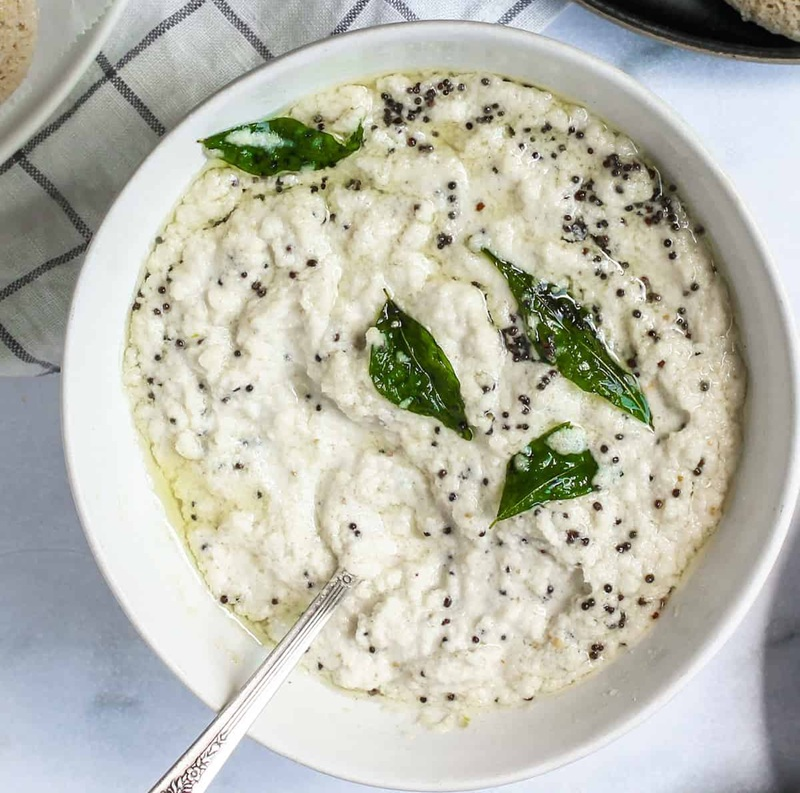

# Coconut Chutney

*The South Indian breakfast chutney: fresh coconut ground with green chilli, ginger and roasted gram, finished with a hot mustard-and-curry-leaf temper. Goes with dosa, idli and vada.*

**Serves:** 4 (as an accompaniment)

**Prep Time:** 10 minutes

**Cook Time:** 5 minutes

## Overview
The classic South Indian breakfast chutney and the traditional companion to dosa, idli and vada: freshly grated coconut ground smooth with green chilli, ginger, roasted gram dal and a splash of water into a pale ivory paste, finished with a hot tadka of mustard seeds, dried red chilli, curry leaves and asafoetida sizzled in oil and poured over the surface. The hot temper drops onto the cold chutney with a sharp sizzle and the kitchen fills with the smell of curry leaf and mustard popping; the contrast between the cool white paste and the dark spiced oil is half the pleasure. Fresh coconut is non-negotiable. Desiccated coconut gives a dry dusty result, and frozen grated coconut (from any South Asian grocer) is the closest practical substitute outside the tropics. Best eaten within hours of making; the chutney loses its bright sweetness in the fridge.

## Ingredients

### Chutney
- 100 g fresh grated coconut (or 80 g desiccated, rehydrated in 6 tablespoons of warm water)
- 2 tablespoons soaked cashews
- 2-3 green chillies
- 15 g fresh ginger
- A small handful of fresh coriander (optional)
- 1 teaspoon salt (to taste)
- 100 ml water (to grind)
- 1 teaspoon tamarind paste (or juice of ½ lime)

### Temper
- 1 tablespoon coconut oil (or sesame oil)
- 1 teaspoon black mustard seeds
- 1 dried red chilli (broken in half)
- 1 teaspoon urad dal (split black gram, white)
- 15 fresh curry leaves
- A pinch of asafoetida (hing)

## Method

### Stage 1 - Grind the chutney
1. Place the grated coconut, soaked cashews, green chillies, ginger, coriander (if using), salt and tamarind in a blender.
1. Add 100 ml of water.
1. Blend to a smooth paste; add another tablespoon or two of water if needed to keep the blade turning.
1. Taste and adjust salt and chilli.
1. Tip into a serving bowl.

### Stage 2 - Temper
1. Heat the coconut oil in a small pan over medium-high heat.
1. Add the mustard seeds; when they pop, add the dried red chilli and urad dal.
1. Cook for 30-40 seconds until the urad dal turns golden.
1. Pull from the heat; add the curry leaves and asafoetida (they'll crackle).

### Stage 3 - Combine
1. Pour the hot tempering oil over the white chutney.
1. Don't stir; let the diner mix the two with their first scoop.
1. Serve at room temperature with dosa, idli or vada.

## Notes
- **Fresh coconut beats desiccated:** The chutney loses some of its character with dried coconut, but rehydrating in warm water for 10 minutes before blending is the best compromise.
- **Urad dal in the temper:** This is the South Indian signature. The dal turns into tiny golden nuggets that pop when bitten.
- **Asafoetida at the end:** Always added off the heat. Direct contact with high heat turns it bitter.

## Storage
- Best eaten the day it's made.
- Refrigerate up to 2 days; the temper loses its crispness and the colour darkens, but the flavour holds.
