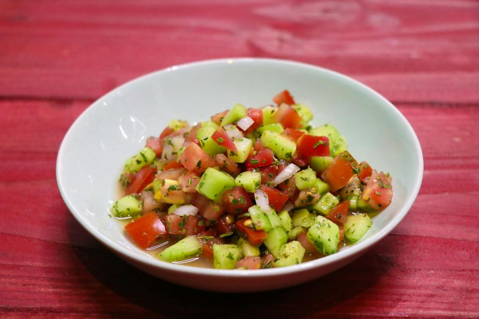

# Kachumber

*India's table salad: finely diced cucumber, tomato, onion and chilli dressed with lime, salt and roasted cumin. The cold counterpoint to anything saucy.*

**Serves:** 4 as a side

**Prep Time:** 10 minutes

**Cook Time:** 0 minutes

## Overview
A small dice of cucumber (seeds out), tomato (seeds out), red onion and green chilli, tossed with roasted cumin powder, lime juice and salt. A pinch of black pepper or chaat masala. Eaten within an hour, ideally within ten minutes.

## Ingredients

- 1 cucumber (large, deseeded; small dice)
- 3 ripe tomatoes (deseeded; small dice)
- 1 red onion (small, small dice)
- 1 green chilli (finely chopped, optional)
- 2 tablespoons fresh coriander (finely chopped)
- 1 tablespoon fresh mint (finely chopped, optional)
- 1 lime (juice)
- 1 teaspoon roasted cumin powder (see Notes)
- ½ teaspoon salt
- ¼ teaspoon [Chaat Masala](../Spice-Mixes/chaat-masala.md) (optional)
- ¼ teaspoon ground black pepper

## Method

### Stage 1 - Chop
1. Dice cucumber, tomato and onion to a similar small size (5-6 mm cubes).
1. Drain off any tomato juice that pools.
1. Finely chop the chilli and herbs.

### Stage 2 - Roast cumin (if not already done)
1. Toast 2 tablespoons of cumin seeds in a dry pan over medium heat 90 seconds until aromatic and slightly darker.
1. Grind to a powder. (Keep extra in a jar.)

### Stage 3 - Combine
1. Place cucumber, tomato, onion, chilli, coriander and mint in a serving bowl.
1. Squeeze over the lime; sprinkle with roasted cumin, salt, chaat masala, and pepper.
1. Toss gently.

### Stage 4 - Serve
1. Taste; adjust lime and salt. Eat within 30 minutes for the best crunch.

## Notes
- **Deseed everything:** Tomato seeds bleed water; cucumber seeds are watery. Removing them keeps the salad crisp rather than damp.
- **Roasted cumin powder:** Make a batch by toasting cumin seeds; grind; store in a jar. Hugely better than ground-and-bagged cumin powder; lasts 2 months in a sealed jar.
- **Chaat masala:** Adds the unmistakable Indian street-food tang from black salt, dried mango, cumin and ajwain. Optional but distinctive.

## Storage
- Eat fresh. Doesn't keep - the vegetables go soft within hours.
