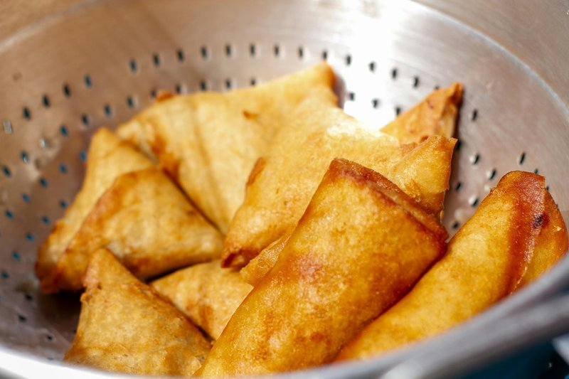

# Keema Samosa

*The meat samosa: triangular pastries filled with spiced lamb (or beef) mince cooked dry with onion, ginger, garlic, garam masala and peas, encased in a sturdy hand-rolled or spring-roll pastry, deep-fried until shatteringly golden. Eaten warm with tamarind or mint chutney. The traditional Indian, Pakistani, East African meat samosa - bigger and more substantial than its samusa cousins.*

**Serves:** 6 (makes 16)

**Prep Time:** 45 minutes

**Cook Time:** 25 minutes

## Overview
Lamb mince fries with onion, garlic, ginger and a spice mix of garam masala, cumin, coriander and chilli. Frozen peas thaw into the dry filling at the end; lemon juice and chopped coriander finish it. Cooled. Spring-roll pastry strips fold around a generous tablespoon of filling into triangular packets (flag-fold) and seal with flour paste. Deep-fried 175°C until deep gold.

## Ingredients

### Filling
- 500 g lamb mince (or beef)
- 3 tablespoons vegetable oil
- 1 large onion (very finely chopped)
- 4 garlic cloves (crushed)
- 1 thumb fresh ginger (grated)
- 2 green chillies (finely chopped)
- 1 ½ teaspoons garam masala
- 1 teaspoon ground cumin
- 1 teaspoon ground coriander
- 1 teaspoon Kashmiri chilli powder
- ½ teaspoon ground turmeric
- 150 g frozen peas
- 3 tablespoons fresh coriander (chopped)
- 2 tablespoons fresh mint (chopped)
- Juice of ½ lemon
- 1 teaspoon salt (to taste)
- ½ teaspoon ground black pepper

### Wrapping
- 16 spring-roll pastry sheets (cut into 8 x 25 cm strips)
- 2 tablespoons plain flour + 3 tablespoons water (paste)
- 1 litre vegetable oil for deep frying

### To serve
- 200 ml tamarind chutney or mint chutney
- Lemon wedges

## Method

### Stage 1 - Filling
1. Heat the oil in a wide heavy pan over medium-high.
1. Brown the lamb hard, breaking up clumps; pour off excess fat.
1. Add the onion; cook 6-7 minutes until soft.
1. Stir in garlic, ginger and green chilli; cook 1 minute.
1. Add all the dry spices; toast 30 seconds.
1. Splash in 100 ml water; simmer 5 minutes until almost dry.
1. Stir in peas, lemon juice, salt, pepper, fresh coriander and mint.
1. Spread on a tray; cool completely.

### Stage 2 - Fold
1. Take a pastry strip. Place a generous tablespoon of cool filling on the bottom-right corner.
1. Fold the corner up to the left edge to form a triangle.
1. Continue folding the triangle up the strip - flag-fold method.
1. At the tail, brush with flour paste; tuck and seal.

### Stage 3 - Fry
1. Heat the oil to 175°C in a deep pan.
1. Fry in batches of 4-5, 3-4 minutes total, turning, until deep gold and crisp.
1. Drain on kitchen paper.

### Stage 4 - Serve
1. Eat warm with tamarind or mint chutney and a lemon wedge.

## Notes
- **Cool the filling:** Crucial. Warm filling melts the pastry and breaks the seal. Cool fully - 30 minutes on a tray works.
- **Spring-roll vs samosa pastry:** Real samosa pastry is hand-rolled (flour, salt, oil, water) and is heavier and chewier. Spring-roll sheets give a quicker, crispier shell - widely accepted home shortcut.
- **Make ahead and freeze:** Fold; freeze on a tray; bag. Fry from frozen, adding 2 minutes to the cook time.

## Storage
- Refrigerate cooked samosa 2 days; re-crisp at 200°C 6 minutes.
- Freeze unfried 3 months.
