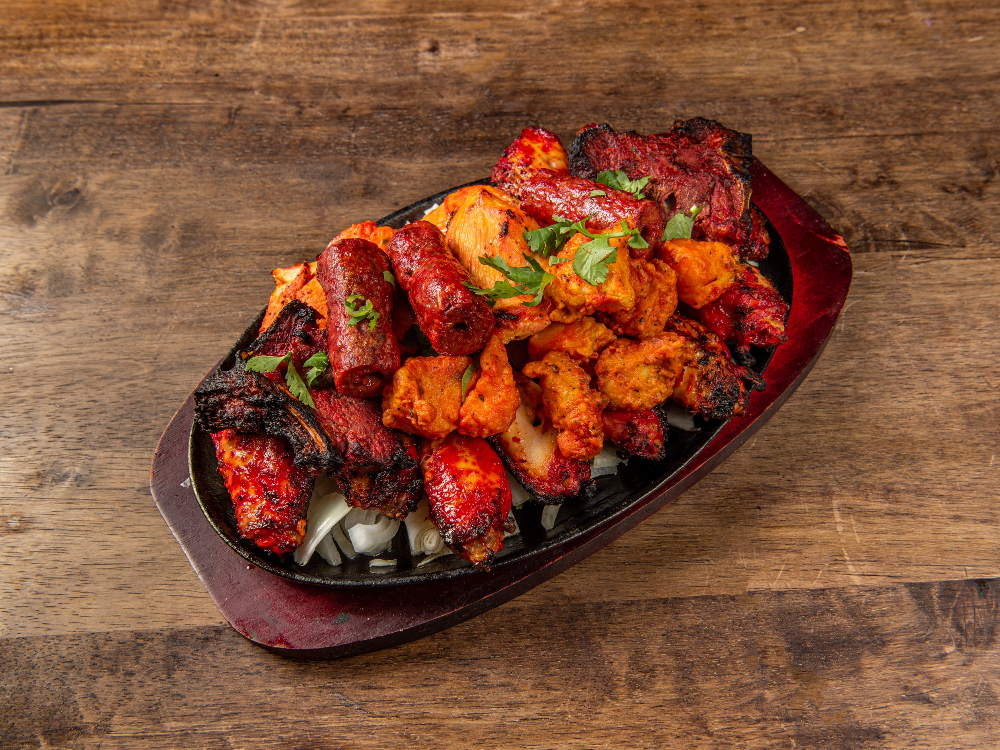

# Mixed Grill

*The curry-house assembly plate: three or four tandoori-grilled items together on a sizzler with sliced onion and lemon. The starter for groups, the meal for two.*

**Serves:** 2 as a meal, 4 as a starter

**Prep Time:** 15 minutes (assumes the marinated items are ready)

**Cook Time:** 12 minutes

## Overview
The British curry-house mixed grill is not a recipe so much as an assembly. The kitchen takes whatever it has marinated and ready for the tandoor (chicken tikka, lamb chops, sheek kebab, paneer tikka, sometimes tandoori king prawn), grills it all together on high heat, and lays it out on a hot cast-iron sizzler bedded with sliced onion, a wedge of lemon, a scattering of chopped coriander and a small bowl of mint raita. The plate arrives at the table hissing and steaming; it is genuinely theatrical.

The trick is to have the marinated items ready in advance. A mixed grill is a 12-minute job at the moment of service, not a from-scratch undertaking. Marinate everything the day before; cook everything together.

## Ingredients

### Items to grill (pick three or four; quantities are per item, scale to taste)
- 3-4 pieces [Tandoori Chicken Tikka](tandoori-chicken-tikka.md) per person
- 1 [Lamb Seekh Kebab](lamb-seekh-kebab.md) per person
- 1 lamb chop per person (marinated in red masala paste, 4 hours minimum)
- 4 cubes paneer tikka per person (paneer marinated in red masala paste, 30 minutes)
- 2 tandoori king prawns per person (marinated 30 minutes; do not over-marinate seafood)

### To assemble the plate
- 1 large red onion (sliced thin into rings)
- 1 lemon (cut into wedges)
- Small handful fresh coriander (chopped)
- Pinch of chaat masala (or a mixture of ground cumin + black salt + amchoor)
- Small bowl [Mint Raita](../sauces-pickles/mint-raita.md), to serve

## Method

### Stage 1 - Prepare items in advance
1. Marinate each of the chosen items separately. Most should sit overnight or at least 4 hours; paneer and prawn need only 30 minutes.
1. Bring everything to room temperature 30 minutes before cooking. Cold items steam rather than char on the grill.

### Stage 2 - Set up the grill
1. Heat the grill to full power.
1. Line a foil-covered baking tray with a wire rack to elevate the food, or a heavy oven tray you can blast under the grill.
1. Pre-heat a cast-iron sizzler plate or heavy serving dish in a 200°C oven for 15 minutes so it is ripping hot at the moment of service.

### Stage 3 - Grill
1. Arrange the items on the rack with space between them. Slower-cooking items (lamb chops, chicken tikka) go on first.
1. Grill chicken tikka 6-7 minutes a side, lamb chops 5-6 minutes a side (for medium), seekh kebab 4-5 minutes a side, paneer tikka 4-5 minutes a side, prawns 2-3 minutes a side.
1. The aim is char on the surface and just-cooked-through inside. Items should be lifted off as they finish, not held under the heat.
1. Stagger the timing so everything is ready at roughly the same moment.

### Stage 4 - Plate
1. Lift the hot cast-iron sizzler out of the oven and onto a wooden board.
1. Scatter the bottom with sliced onion. The hot pan will sear the onion as the meat lands.
1. Lay the grilled items on the onion in rough sections (chicken, lamb, paneer, prawn).
1. Squeeze a quarter-lemon over the top. Scatter fresh coriander and a pinch of chaat masala.
1. Carry to the table immediately. The pan will hiss and steam aromatically for several minutes; this is the point.

## Notes
- **Cast-iron sizzler is half the experience.** A wooden board works as a substitute but loses the audible drama and the secondary char on the onion. Sizzler plates are cheap to buy and last forever.
- **Marinate separately.** Each item has its own marinade. Combining them in one bowl bleeds flavours and gives you four versions of the same thing.
- **Items finish at different times.** Set a timer per item or stagger their start; the goal is everything just-cooked at the same minute.
- **Chaat masala on the finish.** The tangy-sour-funky chaat masala is what makes the plate taste like the curry house. Without it the plate is fine but flat.

## Serving
A mixed grill is its own course, served before the curry. Most people order it as a starter for the table and share. For a small group it can also be the main event with a couple of naans and bowls of rice.

Provide the mint raita on the side. A bowl of sliced cucumber finishes the cooling job. A wedge of lime alongside the lemon doesn't hurt.

## Storage
- Cooked items refrigerate 2 days. Reheat on a hot dry pan for 60 seconds a side; the microwave makes them rubbery.
- The grilled items also work cold in a sandwich with mint raita the next day.
