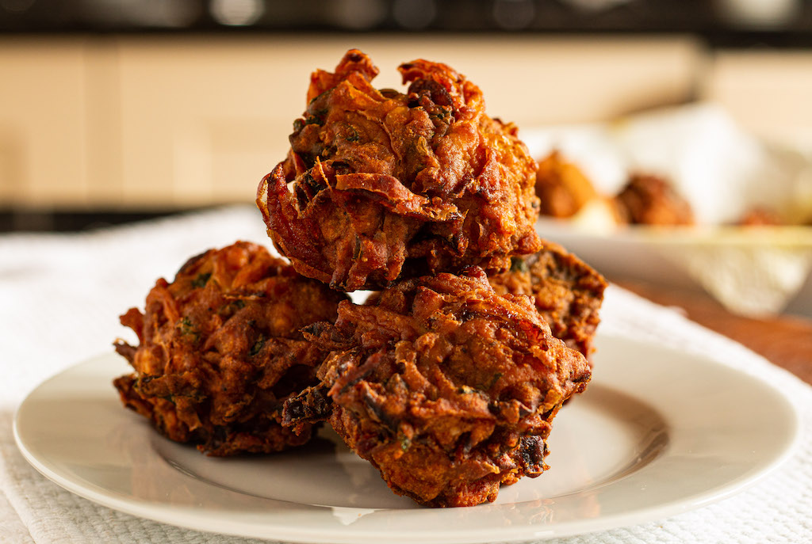

# Onion Bhaji

*Crisp, spiced chickpea-flour fritters of sliced onion, the opening act on every UK curry-house menu. Eat with mint raita and lime wedge.*

**Serves:** 4 (makes about 12 fritters)

**Prep Time:** 15 minutes

**Cook Time:** 10 minutes

## Overview
The British curry-house onion bhaji is a clumped fritter, not a smooth pakora. Three onions are sliced thin, salted to draw out moisture, then bound with a stiff chickpea-flour batter and dropped into hot oil in untidy nests. The salt-draw step is the trick: the onions release enough water that you barely need to add any to the batter, and what comes out fries crisp on the outside with a soft, almost steamed onion interior. Spicing is gentle by curry-house standards (the dipping raita carries the heat). Serve straight from the fryer with mint raita, mango chutney and a wedge of lime.

## Ingredients
- 3 large onions (about 600 g, sliced into thin half-moons)
- 1½ tsp fine salt
- 150 g chickpea (gram) flour
- 1 tsp ground cumin
- 1 tsp ground coriander
- ½ tsp ground turmeric
- 1 tsp Kashmiri chilli powder (or ½ tsp standard)
- ½ tsp baking powder
- 1 small green chilli (finely chopped, optional)
- Small handful fresh coriander (chopped)
- 2-3 tbsp cold water (only if the batter is dry)
- Neutral oil for deep-frying (about 1 litre)

## Method

### Stage 1 - Salt the onions
1. Toss the sliced onions with the salt in a wide bowl. Leave for 15 minutes, then squeeze handfuls firmly to release as much liquid as possible. Drain off the liquid; do not rinse.

### Stage 2 - Make the batter
1. Add the chickpea flour, cumin, coriander, turmeric, chilli powder and baking powder to the onions.
1. Add the chopped green chilli and fresh coriander.
1. Mix vigorously with your hands. The salted onions will release enough liquid to bring the flour into a thick, lumpy batter. Only add water (a tablespoon at a time) if the mixture refuses to come together. The batter should hold its shape when scooped, not pour.

### Stage 3 - Fry
1. Heat the oil in a deep pan or wok to 175°C (350°F). A pinch of batter should sizzle and rise immediately without browning instantly.
1. Take a heaped tablespoon of the mixture and ease it off a second spoon into the hot oil. Aim for untidy, lacy clumps rather than neat balls; the loose strands of onion are what crisp.
1. Fry in batches of 4 or 5. Each bhaji takes 4-5 minutes; turn once with a slotted spoon. The outside should be deep gold and crisp, the onion soft but still distinct.
1. Lift out onto kitchen paper.

## Notes
- **Chickpea flour, not plain flour:** the nutty, slightly bitter flavour of gram flour is what makes a bhaji taste right. Self-raising flour gives the wrong texture and the wrong taste.
- **Don't add water early:** the salted onions do almost all the binding. Liquid batter spreads in the oil and gives you a single greasy pancake instead of separate fritters.
- **The oil must be properly hot:** under 170°C and the bhaji soaks up oil and stays soft. Over 185°C and the outside burns before the inside cooks.

## Serving
Plate with [Mint Raita](../sauces-pickles/mint-raita.md), [Mango Chutney](../sauces-pickles/mango-chutney.md) and a wedge of lime. A scatter of chopped raw onion and fresh coriander on top of the plate finishes it the way the curry-house does.

## Storage
Best eaten straight from the fryer. Day-old bhajis revive under a hot grill or in an air fryer at 200°C for 3 minutes a side. Do not microwave; they steam soft.
