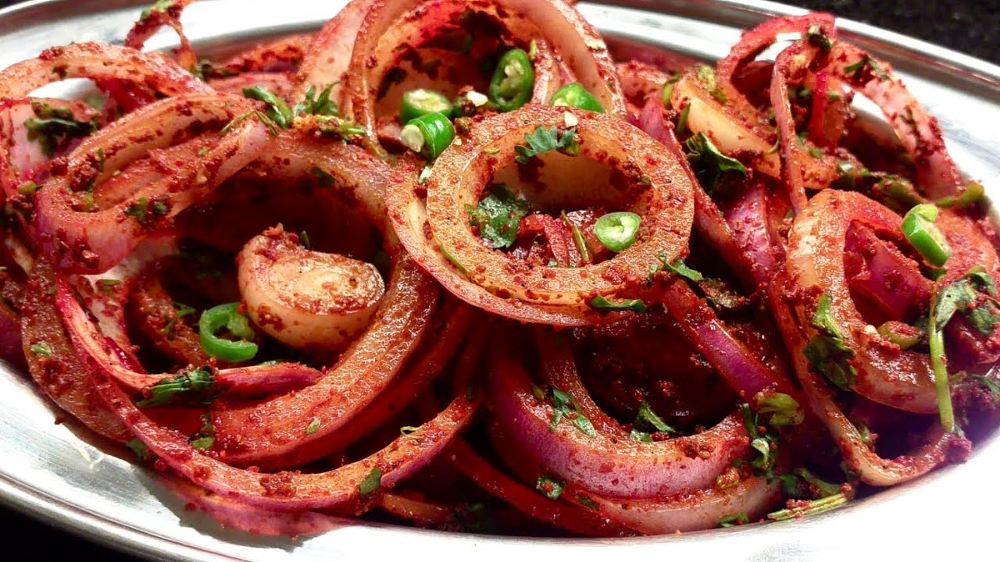

# Onion Salad

*The fourth small bowl on the curry-house papadum tray: sliced red onion, chopped tomato, fresh coriander, lemon and mint sauce. Sharper than it looks.*

**Serves:** 4 (the papadum-bowl portion)

**Prep Time:** 8 minutes

**Cook Time:** 0 minutes

## Overview
The British curry-house onion salad is one of the four small bowls that arrive with the papadum at the start of every meal. The job is to provide a sharp, raw, crunchy counterpoint to the rich curries that follow, and to refresh the palate between bites. It is not a mixed leaf salad; it is essentially raw onion tamed with tomato and lemon, finished with a green tinge of mint sauce. A diner takes a spoonful onto their plate or piles it on a shard of papadum.

The mint sauce is what makes it taste like the curry-house version rather than a generic onion-and-tomato. Most takeaway places use bottled mint sauce (the kind sold for roast lamb), thinned with yoghurt or a touch of water. Homemade is two minutes more and noticeably better.

## Ingredients

### The salad
- 1 large red onion (about 250 g, sliced into thin half-moons)
- 1 medium tomato (about 120 g, deseeded and finely chopped)
- Small handful fresh coriander (chopped, about 1 tbsp)
- ½ tsp fine salt
- 1 tsp lemon juice
- ½ tsp Kashmiri chilli powder (for colour, optional)

### The mint dressing
- 2 tbsp full-fat natural yoghurt
- 1 tbsp finely chopped fresh mint
- 1 tsp granulated sugar
- 1 tsp lemon juice
- Pinch of salt
- Pinch of ground cumin

## Method

### Stage 1 - Take the bite off the onion
1. Slice the red onion into thin half-moons.
1. Soak the sliced onion in a bowl of cold water with a pinch of salt for 5 minutes. This pulls some of the sulphur compounds out and stops the salad tasting harsh.
1. Drain and dry on kitchen paper.

### Stage 2 - Make the mint dressing
1. Whisk the yoghurt, chopped mint, sugar, lemon juice, salt and cumin together in a small bowl. Taste; adjust the sugar and lemon until the dressing is sharp and bright with a sweet edge.

### Stage 3 - Combine
1. Toss the drained onion with the chopped tomato, fresh coriander, salt and lemon juice in a small serving bowl.
1. Pour the mint dressing over the top and fold through. The salad should be lightly green-tinged but the onion should still show pink.
1. Dust with a pinch of Kashmiri chilli powder if using, for the curry-house look.

## Notes
- **Red onion, not white.** White onion is too harsh; red has the right balance of sweetness and bite, plus the pink colour that the dish needs.
- **Cold-water soak takes the edge off.** Skipping the soak gives a salad that tastes aggressive against milder curries. Five minutes is enough.
- **Deseed the tomato.** Tomato seeds release liquid that makes the salad weep within 20 minutes. Deseeding keeps it crunchy.
- **The dressing should be sharp.** A bland mint dressing makes a bland salad. Push the lemon, push the sugar; they cancel out and leave brightness.

## Variations
- **Without dressing:** the bare-bones version is just sliced onion, tomato, coriander, salt and lemon. Sharper, drier, more elemental.
- **With cucumber:** dice in a tablespoon of cucumber for a watery crunch. Reduces shelf life.
- **With green chilli:** finely slice a green chilli through the salad for assertive heat.

## Serving
Set out in a small ramekin alongside the papadums at the start of the meal. The other three bowls are [Mango Chutney](../sauces-pickles/mango-chutney.md), [Lime Pickle](../sauces-pickles/lime-pickle.md) and [Mint Raita](../sauces-pickles/mint-raita.md). One spoonful per diner is enough; refill if eaten before the starters arrive.

## Storage
- Best within 2 hours of making. After that the salt and lemon draw water from the onion and tomato and the salad goes limp.
- Make the dressing up to a day ahead; combine with the salad at the last moment.
