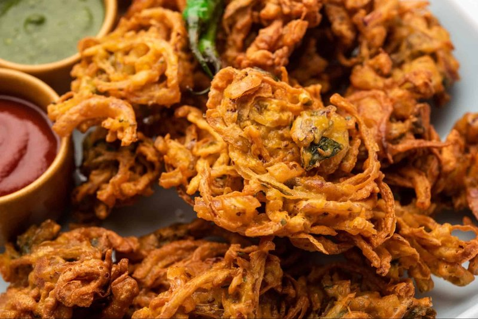

# Mixed Vegetable Pakora

*The rainy-day Indian snack: handfuls of onion, potato, cauliflower and spinach coated in a thick spiced gram-flour batter and deep-fried in lumpy clusters.*

**Serves:** 4 as a snack

**Prep Time:** 15 minutes

**Cook Time:** 25 minutes

## Overview
Mixed vegetable pakora is the rainy-day Indian snack, the dish that comes out of every Indian kitchen the moment the monsoon hits and a hot cup of masala chai feels essential: handfuls of onion, potato, cauliflower and spinach bound in a thick spiced gram-flour batter and deep-fried in lumpy ragged clusters. The dish belongs to the wider Indian pakora tradition (the same template that gives onion bhajis, paneer pakora and the South Indian bonda) but the mixed version is the home-cook favourite that uses up whatever's in the vegetable drawer. The batter needs to be properly thick (the consistency of double cream, not single); thin batter slides off the vegetables in the oil and the pakora come out pale and oil-logged. Rice flour blended with the gram flour is the technique that gives extra shatter to the crust; a pure-besan batter cooks crisp but goes leathery as it cools, where the rice-flour blend stays shatteringly crunchy. Ajwain (carom seed) gives the Punjabi aromatic signature. Eat the moment they come out of the oil, with mint chutney, tamarind chutney and a hot cup of chai.

## Ingredients

### Batter
- 200 g gram flour (besan / chickpea flour)
- 50 g rice flour (for extra crisp)
- 1 teaspoon ajwain (carom) seeds
- 1 teaspoon ground turmeric
- 2 teaspoons Kashmiri chilli powder
- 1 teaspoon ground cumin
- 1 teaspoon salt
- 1 small pinch baking soda
- 250 ml cold water (approximately)

### Vegetables
- 1 onion (large, halved, sliced thin)
- 1 potato (medium, peeled, small dice)
- 200 g cauliflower (cut into small florets, 2 cm)
- 100 g spinach leaves (washed, roughly torn)
- 2 green chillies (finely chopped, optional)
- 1 thumb fresh ginger (julienned)
- 3 tablespoons fresh coriander (chopped)

### To fry
- 1 litre vegetable oil

### To serve
- [Mint Chutney](../sauces-pickles/mint-chutney.md)
- [Tamarind Chutney](../sauces-pickles/tamarind-chutney.md)
- Lemon wedges

## Method

### Stage 1 - Batter
1. Whisk gram flour, rice flour, ajwain, turmeric, chilli powder, cumin, salt and baking soda in a wide bowl.
1. Pour in cold water gradually, whisking, to a thick batter (the consistency of double cream that just pours).
1. Rest 5 minutes.

### Stage 2 - Combine
1. Add all the prepared vegetables, green chillies, ginger and coriander to the batter.
1. Mix well with a spoon; everything should be thickly coated.
1. If the mix is too wet (vegetables release water), add a tablespoon more gram flour.

### Stage 3 - Fry
1. Heat the oil to 170°C in a deep wide pan.
1. Drop loose clusters (about a tablespoon each) into the hot oil using two spoons.
1. Fry in batches of 6-8, 3-4 minutes per side, until deep gold and crisp.
1. Lift onto a rack lined with kitchen paper.

### Stage 4 - Serve
1. Eat immediately with mint chutney, tamarind chutney and lemon wedges.

## Notes
- **Cold water batter:** Cold water keeps the gluten development minimal, gives crisp pakora. Warm water gives soft, bready ones.
- **Don't crowd the oil:** Six to eight at a time. Crowding drops the temperature and the pakoras go greasy.
- **Vegetable choice:** Almost anything works - onion alone is the most famous (kanda pakora); add or substitute aubergine, sweetcorn, chillies, paneer. The recipe is the technique, not the ingredient list.

## Storage
- Eat fresh. Cooked pakora keep 24 hours refrigerated; re-crisp at 200°C 4 minutes.
- The uncoated batter alone keeps 2 days refrigerated.
