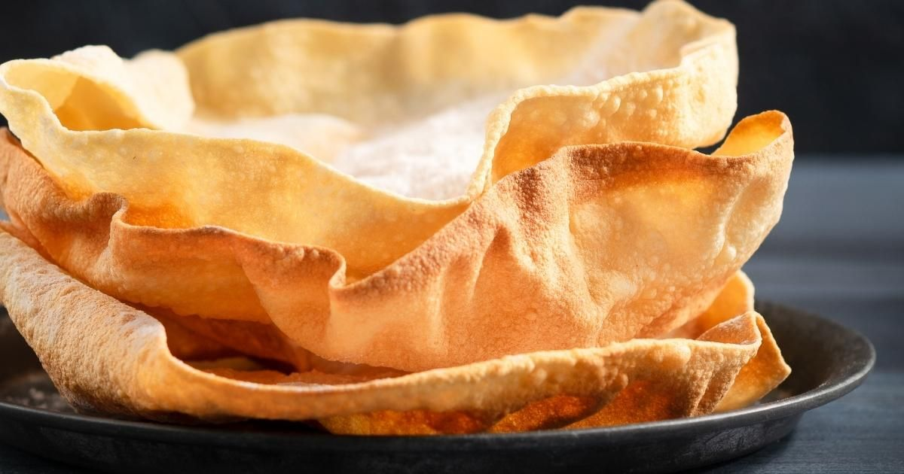

# Papadum

*The thin, blistered lentil-flour wafer that opens every curry-house meal. Cooked from shop-bought discs in 15 seconds; served with the four-bowl trio.*

**Serves:** 4 (8 papadums)

**Prep Time:** 2 minutes

**Cook Time:** 5 minutes

## Overview
A papadum (sometimes spelled papad or poppadom) is a thin, dried disc of lentil or chickpea flour, traditionally sun-dried in the Indian sun and then either fried, grilled or microwaved at the moment of serving. The dried discs are widely available; making them from scratch is a multi-day project that few home cooks attempt. The cooking step at home is short and forgiving. What matters is the accompaniment: papadums never arrive alone. The classic curry-house service is four small bowls (mango chutney, lime pickle, sliced raw onion salad, mint raita) and a heap of broken papadum shards to scoop with.

This recipe covers the standard frying method. A grill or microwave method follows in the notes.

## Ingredients
- 8 plain papadum discs (uncooked, shop-bought)
- 500 ml neutral oil for shallow frying (or a small bowl of oil for brushing if grilling)

### To serve (the classic trio plus raita)
- [Mango Chutney](../sauces-pickles/mango-chutney.md)
- [Lime Pickle](../sauces-pickles/lime-pickle.md)
- Sliced raw onion tossed with chopped tomato, fresh coriander, a squeeze of lemon and a pinch of salt
- [Mint Raita](../sauces-pickles/mint-raita.md)

## Method

### Frying (the proper way)
1. Heat the oil in a wide pan to 180°C (350°F). The oil should be 2 cm deep.
1. Hold a papadum disc with kitchen tongs and lower one edge into the oil.
1. The disc will start to puff and curl in 2-3 seconds. Push it gently under the oil and turn it once. Total cooking time: 5-8 seconds.
1. The papadum should be pale gold, crisp and roughly flat (or curled up at the edges). Dark gold means overcooked and bitter.
1. Lift onto kitchen paper. Repeat with the rest. Stack while warm.

### Grill method (lighter and quicker, no deep oil)
1. Brush each papadum lightly with oil on both sides.
1. Place under a hot grill (or in an air fryer at 200°C). Watch closely; it puffs and crisps in 30-40 seconds. Turn once. Lift off the moment it crisps; it goes bitter fast.

### Microwave method (easiest, slightly less crisp)
1. Place a single papadum on a plate. Cook on full power for 35-45 seconds. It will puff and crisp without oil. Watch for the colour shift to deep gold; it overcooks in a single beep.

## Notes
- **Papadums must be fresh-cooked at the table.** Cooked papadums hold their crispness for 20 minutes; after that they soften and get leathery. Cook just before sitting down.
- **Shop-bought discs are the only realistic option.** The drying step at home requires consecutive sunny days and proper rice flour. Buy them; Patak and Lijjat are both reliable brands.
- **Plain versus spiced:** the standard discs are plain. Black pepper, cumin or chilli versions exist; these are good with a milder curry that won't fight the spice on the papadum.

## Serving
- Stack the cooked papadums on a small plate at the centre of the table. Surround with four small ramekins of the trio plus mint raita. Diners break the papadums into shards and scoop. Refill as needed before the starters arrive.

## Storage
Cooked papadums do not store well. Store uncooked discs in a sealed bag in the cupboard for a year. Once a packet is open, transfer to an airtight tin; if they go floppy, they have absorbed humidity and need a quick low-oven dry-out (100°C for 5 minutes) before cooking.
