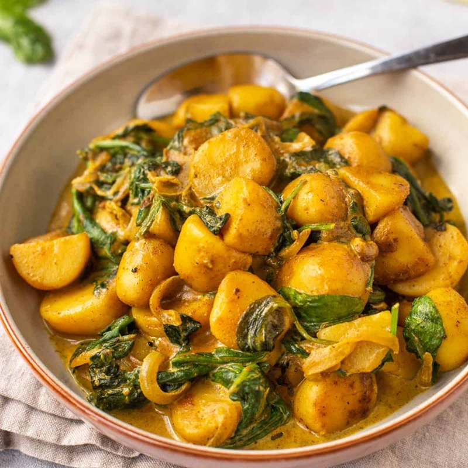

# Saag Aloo

*Spinach and potato, spiced with cumin, ginger and green chilli. A North Indian everyday dish; eaten with chapati or alongside a heavier meat curry.*

**Serves:** 4

**Prep Time:** 15 minutes

**Cook Time:** 30 minutes

## Overview
Potato cubes are par-boiled separately so the dish comes together quickly in the pan. A tempered base of cumin seeds, onion, garlic, ginger and green chilli is built, the potato is browned briefly, then chopped spinach is wilted through in two batches with turmeric, ground coriander and a small dash of water. The potato carries the spice; the spinach keeps the colour.

## Ingredients
- 500 g waxy potatoes (peeled, cut into 2 cm cubes)
- 400 g fresh spinach (roughly chopped, or 250 g frozen spinach, thawed and squeezed)
- 3 tablespoons ghee (or oil)
- 1 teaspoon cumin seeds
- 1 onion (small, finely chopped)
- 4 garlic cloves (finely chopped)
- 25 g fresh ginger (finely grated)
- 2 green chillies (slit lengthways)
- ½ teaspoon turmeric
- 1 teaspoon ground coriander
- ½ teaspoon Kashmiri chilli powder
- 1 teaspoon salt (to taste)
- ½ teaspoon [Garam Masala](../Spice-Mixes/garam-masala.md)
- ½ lemon (juice)

### To serve
- A wedge of lemon
- Chapati (or paratha)

## Method

### Stage 1 - Par-boil the potato
1. Place the diced potato in a saucepan with cold salted water.
1. Bring to a boil and cook for 5 minutes (the potato should still have firmness in the middle).
1. Drain and pat dry on kitchen paper.

### Stage 2 - Temper and build the base
1. Heat 2 tablespoons of the ghee in a wide pan over medium heat.
1. Add the cumin seeds and let sizzle for 15 seconds.
1. Add the chopped onion and a pinch of salt; cook for 6 minutes until golden.
1. Stir in the garlic, ginger and green chilli; cook for 1 minute.

### Stage 3 - Brown the potato
1. Push the onion to one side and add the remaining tablespoon of ghee.
1. Tip in the par-boiled potato.
1. Sprinkle the turmeric, ground coriander, Kashmiri chilli and salt over.
1. Toss and cook for 6-8 minutes, turning occasionally, until the potato edges colour and the spices coat each piece.

### Stage 4 - Wilt the spinach
1. Add half the chopped spinach to the pan with 2 tablespoons of water.
1. Stir until wilted, about 2 minutes.
1. Add the second half and continue stirring until all the spinach has wilted, 3-4 minutes more.

### Stage 5 - Finish
1. Stir in the garam masala and lemon juice.
1. Taste and adjust salt.

### Stage 6 - Serve
1. Transfer to a serving bowl and bring to the table with a wedge of lemon and warm chapati.

## Notes
- **Don't overcook the potato:** Par-boil to half-cooked; the pan finishes it. Fully cooked potato falls apart and the dish ends up mashed.
- **Wilt in batches:** Spinach holds a lot of water. Adding the full amount at once steams the dish; two batches with a stir between keeps it dry and integrated.
- **Frozen spinach:** Works perfectly here. Squeeze hard before adding.

## Storage
- Refrigerate up to 3 days; reheats well, though the spinach colour dulls.
- Doesn't freeze well (the potato turns mealy).
