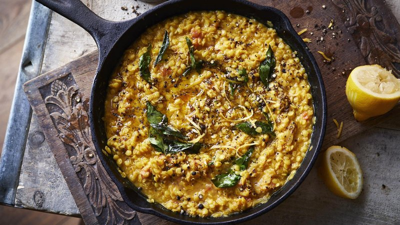

# Tarka Dal

*Every North Indian kitchen's dal: split yellow lentils cooked soft with turmeric, then crowned with a sputtering tarka of ghee, cumin, garlic and chilli.*

**Serves:** 4 as a side

**Prep Time:** 5 minutes

**Cook Time:** 40 minutes

## Overview
Split yellow moong dal (or toor dal) cooks with turmeric, salt and water for 25 minutes until soft and breaking down. A small whisk smooths it into a creamy dal. Just before serving, ghee heats until shimmering; cumin seeds, garlic, dried chilli and asafoetida sizzle for 30 seconds; the whole sputtering mix is poured straight onto the dal. Fresh coriander, a wedge of lemon.

## Ingredients

### Dal
- 250 g split yellow moong dal (or toor dal / channa dal mix)
- 1.2 litres water
- 1 teaspoon ground turmeric
- 1 ½ teaspoons salt (to taste)
- 1 tomato (small, chopped, optional)
- 1 green chilli (small, slit, optional)

### Tarka (tempering)
- 4 tablespoons ghee
- 1 teaspoon cumin seeds
- ½ teaspoon black mustard seeds
- 1 pinch asafoetida (hing)
- 6 garlic cloves (sliced thin)
- 2 dried Kashmiri chillies (broken)
- 1 small piece fresh ginger (julienned, optional)
- 1 teaspoon Kashmiri chilli powder
- 1 small handful curry leaves (fresh)

### To finish
- 2 tablespoons fresh coriander (chopped)
- Juice of ½ lemon (at the table)

## Method

### Stage 1 - Wash dal
1. Rinse the dal in 3 changes of water until the water runs clear.

### Stage 2 - Cook dal
1. Place the dal in a wide pot with the water, turmeric, salt, tomato and green chilli.
1. Bring to a boil; skim any foam.
1. Reduce to a gentle simmer; cover partially; cook 25-30 minutes until the dal is soft and starting to break down. Stir occasionally to prevent sticking.
1. Whisk briefly to break up the lentils into a creamy dal - thick but pourable.
1. Adjust salt; add a splash of water if too thick.
1. Keep warm over the lowest heat.

### Stage 3 - Tarka
1. In a small heavy pan, heat the ghee over medium-high until shimmering.
1. Add cumin and mustard seeds; sizzle 5 seconds.
1. Add asafoetida; sizzle 1 second.
1. Add sliced garlic; fry 30-40 seconds until just turning gold.
1. Add dried chillies, ginger (if using) and curry leaves; sizzle 5 seconds.
1. Sprinkle in the chilli powder; sizzle 2 seconds.
1. Immediately - while everything is still sputtering - pour the entire contents of the tarka pan over the warm dal.

### Stage 4 - Serve
1. Stir once gently to swirl the tarka through.
1. Scatter coriander; bring to the table with lemon wedges.
1. Eat with rice or roti.

## Notes
- **Tarka timing:** The garlic should be just gold, not brown. Brown garlic is bitter. The whole tempering takes 60 seconds; have everything to hand before you start.
- **Pour while sputtering:** The sound of the hot tarka hitting the dal is the dish's signature. The visual steam is half the appeal.
- **Asafoetida:** A pinch of this sulphurous gum adds digestibility and a savoury onion-garlic note that's unmistakable in Indian home cooking. Don't skip - hing is sold in any Indian shop.

## Storage
- Refrigerate 4 days. Reheat with a splash of water; if you can be bothered, make a fresh tarka rather than reheating the old one - it perks the dal back up.
- Freezes 3 months.
