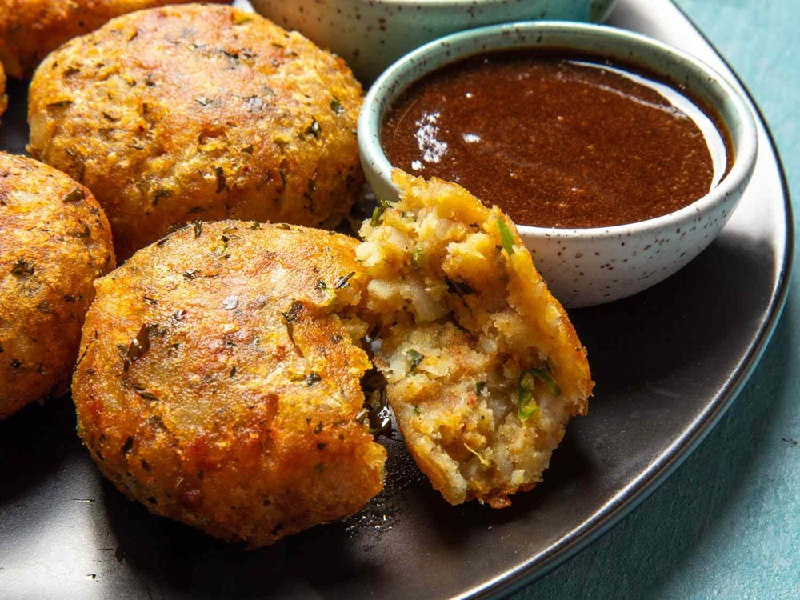

# Aloo Tikki

*Delhi's chaat staple: shallow-fried spiced potato patties with a crisp lacquered crust and a soft herb-fragrant centre. Eaten with tamarind and mint.*

**Serves:** 4 (makes 8 tikkis)

**Prep Time:** 25 minutes (plus 30 min chilling)

**Cook Time:** 15 minutes

## Overview
Floury potatoes boil in their skins, then mash dry. A spice paste of green chilli, ginger and roasted cumin folds in with chopped coriander, mint and amchur for sourness. Cornflour and gram flour bind without making the tikki gummy. Patties form, chill to firm up, then shallow-fry in shallow oil on a flat pan for 4-5 minutes per side until deep gold and crisp with a soft interior. The chilled rest is what stops them falling apart.

## Ingredients

### Tikki
- 700 g floury potatoes (Maris Piper or King Edward)
- 2 tablespoons cornflour
- 2 tablespoons gram flour (besan)
- 1 green chilli (small, finely chopped)
- 1 tablespoon ginger (finely grated)
- 1 small handful coriander leaves (chopped)
- 1 tablespoon fresh mint (chopped) or 1 teaspoon dried mint
- 1 teaspoon cumin seeds (toasted, lightly crushed)
- ½ teaspoon Kashmiri chilli powder
- 1 teaspoon [Garam Masala](../Spice-Mixes/garam-masala.md)
- 1 teaspoon amchur (dried mango powder)
- ½ teaspoon black pepper
- 1 ¼ teaspoons salt

### To pan-fry
- 4-6 tablespoons vegetable oil (or ghee)

### To serve (chaat style)
- 4 tablespoons thick yoghurt (whisked with a pinch of sugar and salt)
- 3 tablespoons [Tamarind Chutney](../sauces-pickles/tamarind-chutney.md)
- 3 tablespoons mint-coriander chutney
- 1 red onion (small, finely chopped)
- 2 tablespoons pomegranate seeds (optional)
- 1 teaspoon [Chaat Masala](../Spice-Mixes/chaat-masala.md)
- A small handful sev (crisp chickpea noodles; optional)

## Method

### Stage 1 - Potato base
1. Boil the potatoes in their skins in well-salted water until a knife slides in cleanly, 25-30 minutes.
2. Drain; cool slightly; peel; pass through a ricer or mash thoroughly - no lumps.
3. Spread on a tray; cool fully (a wet warm mash gives wet tikkis).

### Stage 2 - Bind
1. Add the cornflour, gram flour, green chilli, ginger, coriander leaves, mint, cumin seeds, chilli powder, garam masala, amchur, black pepper and salt to the cool potato.
2. Mix lightly with a fork or your hands - don't overwork or the tikkis go gluey.
3. Taste; adjust salt and amchur (the mix should taste vivid and a touch over-salted - frying mutes it).

### Stage 3 - Shape and chill
1. Divide into 8 equal balls.
2. Flatten into 7 cm discs, 1 ½ cm thick.
3. Smooth the edges to stop them cracking.
4. Place on a tray; chill 30 minutes (the cold firm-up is what stops them disintegrating in the pan).

### Stage 4 - Pan-fry
1. Heat 2 tablespoons of the oil in a wide non-stick or cast-iron pan over medium heat.
2. Place 4 tikkis in the pan; cook undisturbed 4-5 minutes until deep gold and crisp.
3. Flip; press gently with a spatula; cook the second side 4-5 minutes.
4. Lift onto kitchen paper.
5. Wipe the pan; add the rest of the oil; cook the remaining 4 tikkis.

### Stage 5 - Plate (chaat style)
1. Place 2 hot tikkis per plate.
2. Crush each slightly with the back of a spoon.
3. Spoon over the whisked yoghurt, then the tamarind chutney, then the mint chutney.
4. Scatter chopped onion, pomegranate seeds, a pinch of chaat masala and a handful of sev.
5. Eat immediately while the tikki is still hot and the toppings cold.

## Notes
- **Floury potato matters:** Waxy potatoes (Charlotte, new potatoes) leak water and the tikki falls apart. Maris Piper or King Edward only.
- **Dry mash:** Cool the mashed potato fully before adding the spice and flour. Warm potato wet-binds; the tikkis go gummy.
- **Don't disturb in the pan:** The first 4 minutes is when the crust forms. Flipping or pressing too soon strips it off.
- **Amchur is signature:** The sour-fruity note is what marks aloo tikki out from a plain potato cake. Worth sourcing.

## Variations
**Stuffed tikki:** Press 2 teaspoons of green-pea-and-paneer filling into each disc before sealing.
**Ragda pattice:** Serve the tikki swimming in a thin white-pea curry (ragda) for the Mumbai version.
**Air fryer:** Brush both sides with oil; air-fry at 200°C for 10 minutes a side. Lighter but the crust is less crisp.

## Serving
Serve as: chaat with full toppings (lunch / snack); plain with tamarind chutney (tea-time); or in a soft bun with chutneys as a tikki burger.
Temperature: tikki hot, chutneys and yoghurt cold (the contrast is the point).

## Storage
- Best within 1 hour of frying.
- Shaped raw tikkis keep 2 days refrigerated on a tray under cling film; fry from cold.
- Fried tikkis reheat at 200°C oven for 6 minutes; never microwave.
- Topping ingredients (chutneys, sev, pomegranate) are added only at the moment of serving.
