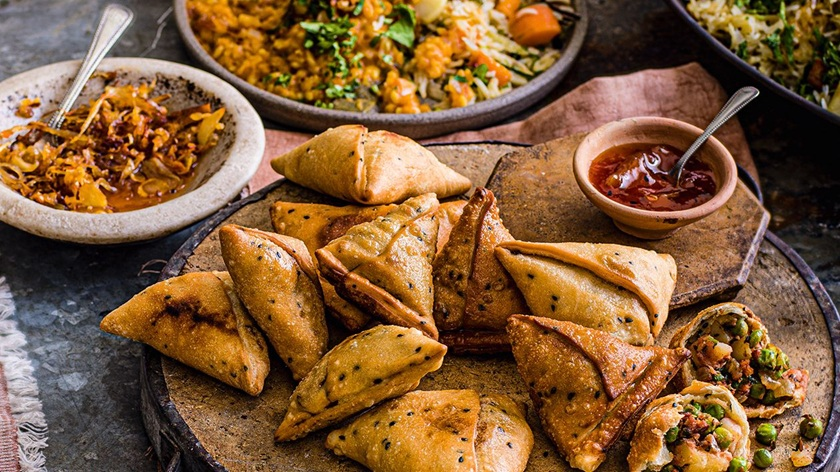

# Samosa

*India's iconic tea-time triangle: a crisp pastry pocket stuffed with spiced potato and peas, deep-fried golden. Served with tamarind and mint.*

**Serves:** 6 (makes 12 samosas)

**Prep Time:** 45 minutes (plus 30 min dough rest)

**Cook Time:** 25 minutes

## Overview
A stiff oil-rich plain-flour dough (maida) rolls thin and crisps in the fryer with the characteristic blistered surface. The filling is dry: boiled potato, peas, ginger, green chilli, cumin, coriander seed, garam masala and amchur (dried mango powder) for sourness. The pastry is rolled into ovals, halved into semicircles, formed into cones, stuffed, sealed and fried in two stages: low-temperature first to set the pastry without browning, then a hot finish to blister and crisp.

## Ingredients

### Pastry
- 300 g plain flour
- 4 tablespoons ghee (or vegetable oil)
- 1 teaspoon ajwain (carom) seeds
- ¾ teaspoon salt
- 120 ml cold water (approximately)

### Filling
- 500 g floury potatoes (Maris Piper or King Edward; boiled in skins, peeled, roughly crushed)
- 100 g frozen peas (thawed)
- 2 tablespoons vegetable oil
- 1 teaspoon cumin seeds
- 1 tablespoon ginger (finely grated)
- 2 green chillies (finely chopped)
- 1 teaspoon coriander seeds (lightly crushed)
- 1 teaspoon ground cumin
- 1 teaspoon [Garam Masala](../Spice-Mixes/garam-masala.md)
- ½ teaspoon ground turmeric
- 1 ½ teaspoons amchur (dried mango powder)
- ½ teaspoon Kashmiri chilli powder
- 1 teaspoon salt
- 1 small handful coriander leaves (chopped)
- ½ lemon (juice)

### To fry
- 1 litre vegetable oil (or sunflower oil)

## Method

### Stage 1 - Pastry
1. Combine the flour, ajwain and salt in a bowl.
2. Rub in the ghee with your fingertips until the mixture resembles coarse breadcrumbs and clumps when squeezed.
3. Add the cold water a tablespoon at a time, mixing to a stiff, firm dough (much firmer than chapati dough).
4. Knead for 2 minutes until smooth.
5. Wrap in cling film; rest 30 minutes at room temperature.

### Stage 2 - Filling
1. Heat the oil in a wide pan over medium heat.
2. Add the cumin seeds; sizzle 10 seconds.
3. Add the ginger and green chilli; cook 30 seconds.
4. Add the coriander seeds, ground cumin, turmeric and chilli powder; stir 20 seconds.
5. Add the crushed potato and peas; mix to coat in the spices; cook 3-4 minutes.
6. Stir in the garam masala, amchur, salt, lemon juice and coriander leaves.
7. Taste, adjust salt and amchur (the filling should be vivid, slightly sour, salty).
8. Cool completely before filling (warm filling tears the pastry).

### Stage 3 - Shape
1. Divide the dough into 6 equal balls.
2. Roll one ball into a thin oval, about 18 cm long, 12 cm wide, 2 mm thick.
3. Cut in half across the middle to make 2 semicircles.
4. Brush the straight edge with a little water.
5. Bring the two corners of the straight edge together to form a cone; press to seal the seam (the seam must be tight or filling escapes).
6. Hold the cone open; spoon in 2 tablespoons of filling; press down to compact.
7. Brush the open edge with water; pinch closed in a flat seam, pressing firmly.
8. Press the top seam flat in a small pleat or fold to give the classic ridge.
9. Repeat with the rest. Rest the formed samosas 10 minutes on a tray.

### Stage 4 - Fry
1. Heat the oil to 140°C in a deep heavy pan (lower than usual; this is critical for blistering).
2. Lower 4 samosas in at a time.
3. Fry slowly 8-10 minutes at this gentle heat - they should not colour, only set and lightly puff.
4. Raise the heat to 180°C.
5. Fry another 2-3 minutes until deep golden and crisp with the classic blistered surface.
6. Lift onto kitchen paper.

## Notes
- **Two-stage frying:** The low-temperature first fry sets the pastry and develops the blistered ridges. Frying hot from the start gives a smooth, soft, pale samosa.
- **Ajwain is signature:** The carom seeds give the unmistakable bitter-thymey note of samosa pastry. Don't skip them.
- **Stiff dough:** A wet, soft dough fries soggy. The dough should be firmer than bread dough, almost like pasta dough.
- **Amchur substitute:** If you can't get amchur, use 1 tablespoon lemon juice extra; the flavour is slightly different but acceptable.

## Variations
**Keema samosa:** Replace half the potato with 250 g lamb mince browned with onion, ginger and the same spices.
**Baked samosa:** Brush with oil; bake at 200°C for 25 minutes, turning halfway. Lighter but the pastry is bread-like, not blistered.

## Serving
Serve with: tamarind chutney, mint-coriander chutney, sliced raw onion, lemon wedges.
Temperature: hot, freshly fried.
Drink: masala chai.

## Storage
- Best eaten within 30 minutes of frying.
- Unfried, formed samosas freeze 2 months on a tray then bagged; fry from frozen at 140°C for 12 minutes, then 180°C for 3 minutes.
- Cooked samosas reheat at 180°C oven for 8 minutes; never microwave (the pastry goes leathery).
