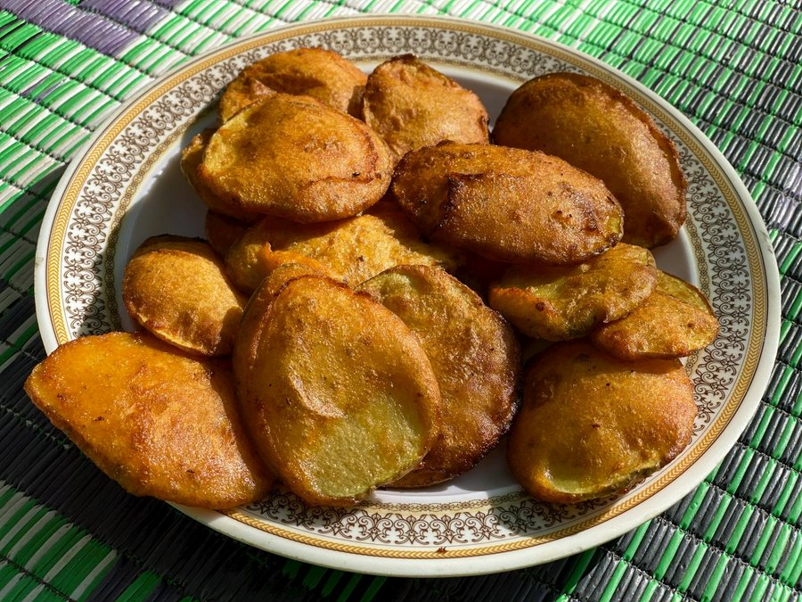

# Vegetable Pakora

*North India's monsoon snack: mixed seasonal vegetables dipped in a spiced gram-flour batter and deep-fried into irregular crispy clusters.*

**Serves:** 6

**Prep Time:** 20 minutes

**Cook Time:** 20 minutes

## Overview
Vegetable pakora is the North Indian monsoon snack and the dish that comes out of every Indian kitchen the moment the rain starts: mixed seasonal vegetables dipped in a spiced gram-flour batter and deep-fried into irregular crispy clusters that get eaten standing at the kitchen counter with a hot cup of masala chai. The dish sits in the same pakora family as onion bhaji but uses a mixed-vegetable scatter rather than a single ingredient, so each bite gives a different combination. The batter is the key. Gram flour combined with rice flour gives a crisper crust than gram flour alone (the rice flour is the curry-house trick that domestic versions often skip), and a pinch of baking soda gives the airy lift that distinguishes a great pakora from a dense fritter. Ajwain (carom seed) folded through carries the Punjabi aromatic signature. The double-fry is non-negotiable. A first fry sets the structure, a second hotter fry gives the deep-fried lacquered crunch that stays crisp through the chai. Eat hot with mint chutney and tamarind chutney.

## Ingredients

### Vegetables (use any mix totalling about 500 g)
- 1 onion (medium, thinly sliced)
- 1 potato (medium, peeled, cut into 4 mm thick batons)
- 150 g cauliflower (broken into small florets)
- 1 small handful spinach (roughly chopped)
- 1 green chilli (small, finely chopped)
- 1 tablespoon ginger (finely grated)
- 1 small handful coriander leaves (chopped)

### Batter
- 150 g gram flour (besan)
- 30 g rice flour
- 1 teaspoon Kashmiri chilli powder
- ½ teaspoon ground turmeric
- ½ teaspoon ajwain seeds
- 1 teaspoon cumin seeds
- 1 teaspoon coriander seeds (lightly crushed)
- ¼ teaspoon bicarbonate of soda
- 1 ¼ teaspoons salt
- 1 teaspoon amchur (dried mango powder; optional)
- 160-180 ml cold water (approximately)

### To fry
- 1 litre vegetable oil (or sunflower oil)

## Method

### Stage 1 - Batter
1. Whisk the gram flour, rice flour, chilli powder, turmeric, ajwain, cumin seeds, coriander seeds, bicarbonate of soda, salt and amchur in a large bowl.
2. Add the water gradually, whisking, to a thick coating batter - it should drop off a spoon in a slow, heavy ribbon, not run.
3. Rest 5 minutes (the gram flour hydrates).

### Stage 2 - Mix vegetables
1. Add the onion, potato, cauliflower, spinach, green chilli, ginger and coriander leaves to the batter.
2. Mix gently; the batter should coat the vegetables in a thin, sticky layer (add a tablespoon more flour if too loose, water if too stiff).

### Stage 3 - First fry
1. Heat the oil to 160°C in a deep heavy pan.
2. Drop in clusters of vegetable-batter using two spoons, gathering a heaped tablespoon per pakora.
3. Fry 5-6 at a time, 3-4 minutes, turning, until pale gold and just cooked through.
4. Lift onto kitchen paper. Rest 5 minutes (or up to 1 hour).

### Stage 4 - Second fry
1. Raise the oil to 185°C.
2. Return the pakora to the oil 4 at a time.
3. Fry 1-2 minutes until deep gold and the surface is hard-crisp.
4. Lift onto kitchen paper; salt lightly while hot.

## Notes
- **Two-stage frying:** The first fry cooks the vegetables; the second fry, at higher heat, crisps and lacquers. This is what gives Indian pakora their signature crunch, separate from a one-fry fritter.
- **Rice flour:** Adds the extra crispness that gram flour alone can't deliver. Cornflour is a tolerable substitute.
- **Cold water:** Batter mixed with cold water (and not over-whisked) gives an open, light texture. Warm water leads to a dense, doughy coating.
- **Don't overcrowd:** The oil temperature drops too far. Six small clusters maximum per batch.

## Variations
**Onion pakora (kanda bhajia):** Use only onion (300 g sliced) and skip the other vegetables. The Mumbai street version.
**Paneer pakora:** 250 g paneer cubed 2 cm; coat in the batter; one-stage fry at 175°C for 3 minutes. Serve with chaat masala sprinkled on top.
**Palak pakora:** Whole spinach leaves dipped in batter, fried flat. Eaten as a starter.

## Serving
Serve with: mint-coriander chutney, tamarind chutney, tomato ketchup (the casual choice), or a wedge of lemon.
Temperature: hot, just-fried.
Drink: masala chai or salty lassi.

## Storage
- Eat within 30 minutes; the texture softens fast.
- Reheat at 200°C oven for 6-8 minutes to restore crispness; never microwave.
- Batter doesn't keep; mix fresh.
