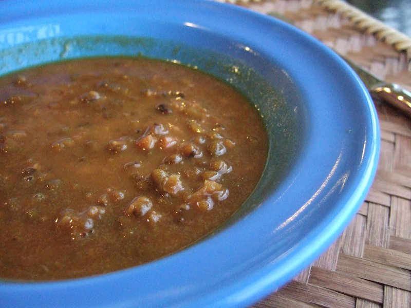

# Bubur Kacang Hijau (Mung Bean Coconut Porridge)

*Indonesia's warm sweet porridge: split mung beans slow-cooked with palm sugar, pandan and ginger, finished with thick coconut milk.*

**Serves:** 6

**Prep Time:** 5 minutes (plus 4 hours soaking, optional)

**Cook Time:** 1 hour

## Overview
Split mung beans (the green hulled kind) soak optionally 4 hours (cuts cooking time in half but not essential). Beans simmer in water with knotted pandan leaves, sliced ginger and a pinch of salt for 35-45 minutes until soft and split. Palm sugar dissolves in; cooks another 5 minutes. To serve: ladle into bowls; pour thick warm coconut milk over the top. Optional toppings: a sprinkle of fried shallots, a spoon of toasted black sesame, or chunks of toasted sweet bread (the Surabaya street-cart way).

## Ingredients

### Porridge
- 300 g whole green mung beans (the small green ones, hulled or unhulled both work)
- 1 ½ litres water (plus more as needed)
- 3 pandan leaves (knotted; or 1 teaspoon pandan paste if unavailable)
- 25 g fresh ginger (sliced thin)
- ½ teaspoon salt
- 200 g palm sugar (gula merah), chopped
- 2 tablespoons caster sugar (for balance)

### Coconut milk topping
- 300 ml thick coconut milk
- 1 pandan leaf (knotted)
- 1 pinch salt

### To serve (optional)
- Fried shallots (bawang goreng)
- A spoon of toasted black sesame
- A few chunks of toasted sweet bread

## Method

### Stage 1 - Soak (optional but speeds cooking)
1. Rinse the mung beans in 2 changes of cold water.
1. Soak in plenty of cold water for 4 hours or overnight.
1. Drain.

### Stage 2 - Cook the beans
1. In a heavy pot, combine the mung beans, 1 ½ L water, knotted pandan leaves, sliced ginger and salt.
1. Bring to a boil; reduce to a gentle simmer.
1. Cook 35-45 minutes (or 25-30 if soaked), stirring occasionally, until the beans are very soft and starting to split open.
1. The texture should be loose-stew (not soupy, not stiff).
1. Add more water if it gets too thick.

### Stage 3 - Sweeten
1. Add the chopped palm sugar and the 2 tablespoons caster sugar to the pot.
1. Stir until dissolved.
1. Simmer 5 more minutes.
1. Remove pandan leaves and ginger slices.

### Stage 4 - Coconut milk
1. In a small saucepan, gently warm the coconut milk with a pandan leaf and a pinch of salt over low heat - do not boil (coconut milk splits).
1. Heat until just steaming.
1. Remove the pandan leaf.

### Stage 5 - Serve
1. Ladle the warm bean porridge into bowls.
1. Pour 50 ml of coconut milk over each bowl.
1. Top with optional fried shallots or sesame.
1. Eat warm (or chill 30 minutes for a thicker, cooler version).

## Notes
- **Whole mung beans, not yellow split mung:** the green ones split during cooking and keep more texture. Yellow split mung becomes baby food.
- **Palm sugar is the soul:** caster-sugar-only versions taste flat. The caramelly notes of gula merah are essential. Asian groceries sell it in disc form.
- **Don't boil the coconut milk:** keeps it creamy. Boiling splits the fat out and the topping turns greasy.
- **Eat warm OR cold, your choice:** both are correct in Indonesia. Some prefer it iced as a hot-weather treat.

## Storage
- Keeps 4 days refrigerated.
- Thickens significantly when cold; reheat with a splash of water and gently warm.
- Freezes 2 months without the coconut milk; thaw in the fridge, reheat, add fresh coconut milk at serving.
