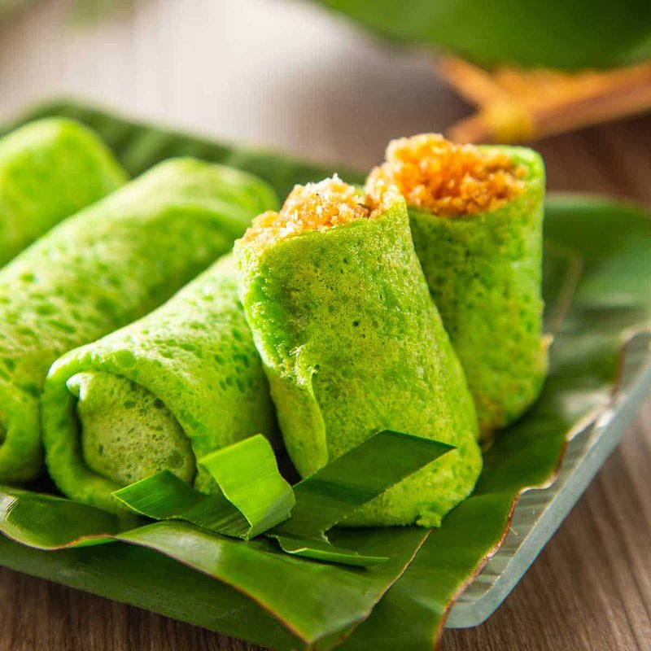

# Dadar Gulung

*Indonesia's green pandan crepes: rolled around a sticky filling of fresh grated coconut cooked with palm sugar. A sweet, fragrant cigar.*

**Serves:** Makes 12 rolls

**Prep Time:** 30 minutes (plus 30 minutes batter resting)

**Cook Time:** 30 minutes

## Overview
Dadar gulung is the Indonesian rolled coconut crêpe, a soft pandan-green pancake wrapped around a sticky filling of palm sugar and grated coconut, eaten with afternoon tea across Java and Sumatra. The crêpe batter (rice flour, plain flour, eggs, coconut milk, water, salt and pandan extract) whisks smooth and rests for half an hour. The filling (unti): palm sugar dissolves in a little water with a pandan leaf; fresh grated coconut stirs in; cooks for five minutes until just-absorbed and sticky. Cool. Crêpes cook for one minute per side in a small pan. Each crêpe takes a heaped tablespoon of unti at one end; folds in the sides; rolls up like a cigar. Eat at room temperature with sweet tea.

## Ingredients

### Crepe batter
- 100 g rice flour
- 100 g plain flour
- 2 eggs (large)
- 250 ml coconut milk
- 250 ml water
- ½ teaspoon salt
- 1 ½ tablespoons caster sugar
- 1 ½ teaspoons pandan paste (or 3 tablespoons fresh pandan juice)
- A few drops green food colouring (optional)
- 1 tablespoon melted butter (for the batter)
- Extra butter (or oil for the pan)

### Filling (unti kelapa)
- 200 g palm sugar (gula merah / gula jawa), chopped
- 3 tablespoons water
- 1 pandan leaf (knotted, or a pinch of salt if unavailable)
- 200 g fresh grated coconut (or rehydrated desiccated, see klepon recipe)
- 1 pinch salt

## Method

### Stage 1 - Batter
1. In a wide bowl, whisk the rice flour, plain flour, salt and sugar.
1. In a jug, whisk the eggs, coconut milk, water and pandan paste / juice.
1. Pour wet into dry; whisk until smooth.
1. Stir in the melted butter and food colouring (if using).
1. Rest 30 minutes (the gluten relaxes; the colour deepens).

### Stage 2 - Filling
1. In a small pan, combine the chopped palm sugar, water and pandan leaf.
1. Heat over medium-low until the sugar dissolves.
1. Add the grated coconut and a pinch of salt.
1. Cook 4-6 minutes, stirring, until the mixture is sticky-sweet and the liquid is mostly absorbed (still slightly moist, not bone dry).
1. Remove the pandan leaf; cool to room temperature.

### Stage 3 - Crepes
1. Heat a small non-stick pan (16-18 cm) over medium heat.
1. Brush lightly with butter or oil.
1. Pour about 60 ml of batter into the centre; tilt the pan to coat the bottom in a thin even circle.
1. Cook 1 minute; the top should look set and the bottom pale green-gold.
1. Flip with a thin spatula; cook 20 seconds on the second side.
1. Slide onto a plate; stack as you cook the rest.

### Stage 4 - Fill and roll
1. Lay a crepe flat on the work surface.
1. Place 1 heaped tablespoon of cool filling along one edge in a 8 cm line.
1. Fold the two short sides over the filling.
1. Roll up tightly from the filled edge to make a cigar shape.
1. Place seam-down on a platter.
1. Repeat for the rest.

### Stage 5 - Serve
1. Stack the rolls neatly on a serving plate.
1. Serve at room temperature with hot strong coffee or tea.

## Notes
- **Cool the filling:** warm filling makes the crepes go limp and they tear during rolling.
- **Pandan paste vs fresh:** fresh pandan juice (blend 4-5 pandan leaves with 100 ml water and strain) has the truest flavour, but bottled pandan paste is a fair shortcut. Use one or the other, both makes it taste perfumey.
- **Don't make the filling too dry:** if you cook the unti to bone-dry it crumbles out of the crepe. Slightly moist is correct.
- **Thin crepes, not thick:** dadar gulung crepes are like a French crepe in thickness, thinner than American pancakes.

## Storage
- Best on the day of making.
- Keep 24 hours at cool room temperature; the crepe slightly stiffens but is still good.
- Don't refrigerate, the rice flour seizes up. Eat at room temp.
