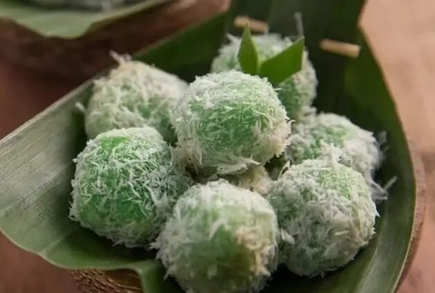

# Klepon

*Indonesia's bite-sized sweet: bright-green pandan glutinous rice balls with a molten palm-sugar centre, rolled in fresh grated coconut.*

**Serves:** Makes 20 balls (serves 4)

**Prep Time:** 30 minutes

**Cook Time:** 15 minutes

## Overview
Glutinous rice flour mixes with hot pandan-tinted water to a smooth dough; rests 10 minutes. Palm sugar chops fine. A small ball of dough flattens between palms; a teaspoon of palm sugar nestles in; the dough closes over and rolls to a smooth sphere. Boils briefly in water until they bob to the surface and feel done (about 3 minutes). Drains; rolls in salted fresh grated coconut. Eats cool.

## Ingredients

### Dough
- 250 g glutinous rice flour
- 20 g plain rice flour (for slight bite)
- ½ teaspoon salt
- 200 ml hot water (just-boiled)
- 1 teaspoon pandan paste (or 2 tablespoons fresh pandan/suji-leaf juice)
- A few drops of green food colouring (optional, for vibrant colour)

### Filling
- 120 g palm sugar (gula merah / gula jawa), finely chopped or grated

### Coating
- 150 g fresh grated coconut (or rehydrated desiccated coconut, see below)
- ½ teaspoon salt
- 1 pandan leaf (knotted, optional)

## Method

### Stage 1 - Prep coconut
1. If using fresh grated coconut: toss with the salt and the pandan leaf (knotted) in a wide shallow bowl; rest 10 minutes; remove the leaf.
1. If using desiccated coconut: pour 4 tablespoons boiling water over 150 g, stir, rest 5 minutes till rehydrated; toss with salt.

### Stage 2 - Dough
1. In a wide bowl, whisk both rice flours and salt.
1. Whisk the pandan paste / juice and food colouring into the hot water.
1. Pour the hot pandan water into the flour gradually, stirring with a wooden spoon until you have a soft pliable dough (you may not need all the water).
1. Knead briefly until smooth; cover; rest 10 minutes.

### Stage 3 - Fill and shape
1. Divide the dough into 20 balls (about 25 g each).
1. Work one at a time, keeping the rest under a damp cloth.
1. Press a ball flat between your palms (5 cm disc).
1. Place ½ teaspoon of chopped palm sugar in the centre.
1. Gather the edges up and over; pinch to seal.
1. Roll between palms to a smooth sphere (about 3 cm).
1. Place on a tray dusted with rice flour.

### Stage 4 - Boil
1. Bring a wide pot of water to a rolling boil.
1. Drop the klepon in (10 at a time so they don't crowd).
1. Boil 2-3 minutes; they will sink, then bob up to the surface.
1. Once at the surface, give another 30 seconds; lift with a slotted spoon directly into a bowl of room-temperature water for 5 seconds (stops the cooking and prevents stickiness).

### Stage 5 - Coat
1. Lift the cooled klepon onto the coconut bed.
1. Roll to coat all over.
1. Place on a serving platter.

### Stage 6 - Serve
1. Eat at room temperature, ideally within an hour.
1. Bite carefully - the palm sugar inside is hot/sticky.

## Notes
- **Seal the dough tight:** any gap and the palm sugar leaks out into the boiling water during cooking. Pinch firmly.
- **Hot water for the dough:** glutinous rice flour needs hot water to hydrate properly. Cold water gives a crumbly dough that won't seal.
- **Salt the coconut:** the contrast between salty coconut and sweet palm-sugar interior is the whole point. Unsalted coconut tastes flat.
- **Fresh grated coconut is dramatically better:** desiccated rehydrated works in a pinch but lacks the moist tender chew. Asian grocers sell frozen grated coconut.

## Storage
- Best within 2 hours of making.
- Keeps 1 day in an airtight container at cool room temperature; the dough firms slightly but is still good.
- Don't refrigerate - glutinous rice flour goes rock-hard in the fridge.
- Doesn't freeze well.
