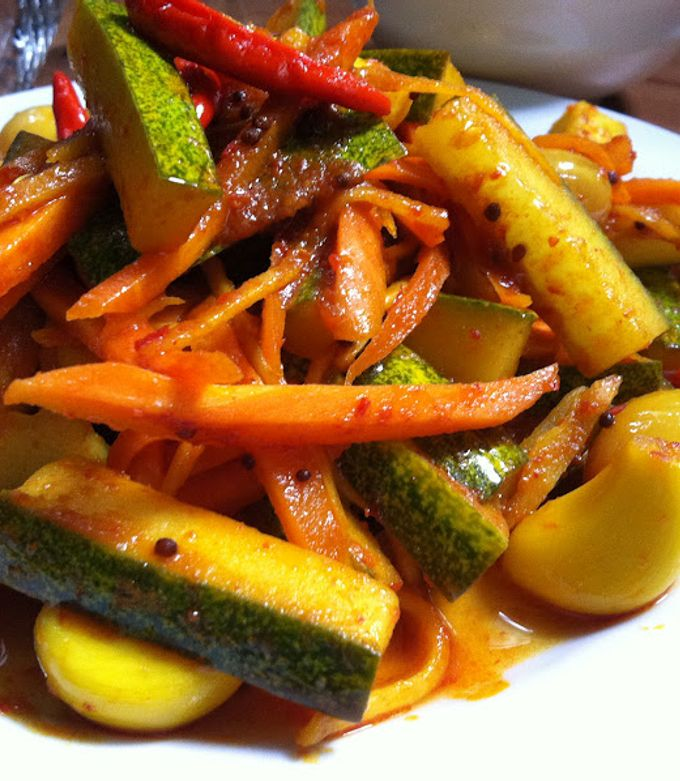

# Acar Timun

*The crisp, sour, fresh Indonesian quick-pickle: cucumber, carrot, shallot and red chilli tossed in white-wine vinegar, sugar, salt, and a sliver of fresh ginger. Eats alongside grilled meat (sate, ayam bakar), nasi goreng, mee goreng, or anything rich and saucy. Different from a long-fermented pickle - acar lives 24 hours. The point is freshness and bright crunch, not depth.*

**Serves:** 4-6 as a side

**Prep Time:** 10 minutes

**Cook Time:** 0 minutes (rests 1 hour)

## Overview
Cucumber, carrot, shallot, chilli prep into thin slices or matchsticks. Salt rests 10 minutes to draw moisture, drains. A simple dressing of vinegar, sugar, water and ginger whisks together. Vegetables toss with the dressing; rest 1 hour at room temperature. Eats cool - never refrigerated cold; the texture suffers.

## Ingredients
- 2 small cucumbers (about 300 g)
- 1 medium carrot
- 4 shallots (or ½ small red onion)
- 2 fresh red chillies (1 hot, 1 mild - adjust to taste)
- 30 g fresh ginger (peeled, julienned)
- 1 teaspoon salt (for the draw)

### Dressing
- 6 tablespoons white-wine vinegar (or rice vinegar)
- 3 tablespoons caster sugar
- 4 tablespoons water
- ½ teaspoon salt

## Method

### Stage 1 - Prep
1. Halve the cucumbers lengthways; scoop out the seeds with a teaspoon; slice into 3 mm half-moons.
1. Peel and julienne the carrot.
1. Slice the shallots into thin rings.
1. Slice the chillies into thin rounds (deseed if you want less heat).

### Stage 2 - Draw moisture
1. Toss the cucumbers with 1 teaspoon salt in a colander.
1. Rest 10 minutes; squeeze gently to release water; rinse briefly under cold water.

### Stage 3 - Dressing
1. In a small bowl, whisk the vinegar, sugar, water, salt and julienned ginger until the sugar dissolves.

### Stage 4 - Combine
1. In a serving bowl, combine the drained cucumber, carrot matchsticks, shallot, chilli.
1. Pour the dressing over.
1. Toss; rest 1 hour at room temperature.

### Stage 5 - Serve
1. Lift the vegetables into a serving bowl with tongs (leave behind most of the liquid).
1. Serve cool but not cold, alongside grilled meat, nasi goreng or sate.

## Notes
- **Salt and drain cucumbers:** otherwise the dressing dilutes within an hour and the pickle turns watery.
- **Don't refrigerate cold:** chilled acar tastes muted; room temp is sharper and brighter.
- **Eat within 24 hours:** acar isn't a preserve. After a day the cucumbers soften and the texture is lost.

## Storage
- Keeps 24 hours at room temperature (or 36 hours refrigerated, brought back to room temp before serving).
- The dressing alone keeps 2 weeks refrigerated - make a batch and dress fresh vegetables on demand.
