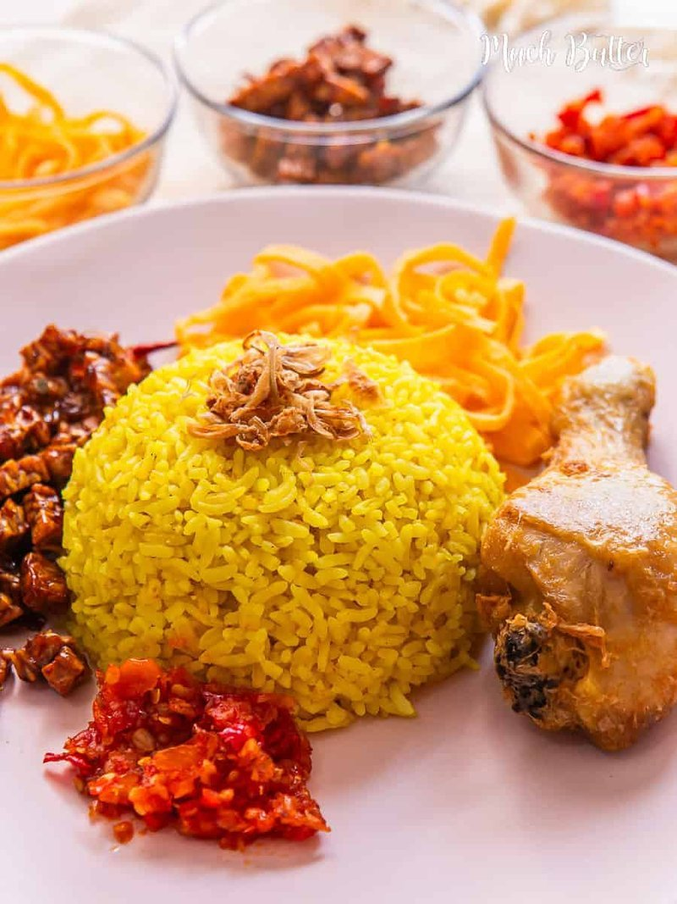

# Nasi Kuning (Yellow Rice)

*Coconut-and-turmeric rice, the centrepiece of Indonesian celebrations - birthdays, weddings, school graduations, anything worth marking. Long-grain rice cooks in coconut milk steeped with fresh turmeric, lemongrass, kaffir lime leaf, salt and a knob of butter. Comes out a stained mustard-yellow, fragrant, faintly rich. Traditionally moulded into a cone shape (tumpeng) and surrounded with side dishes; weekday home version skips the cone and serves it in a bowl.*

**Serves:** 6

**Prep Time:** 10 minutes (plus 30 minutes rice soaking)

**Cook Time:** 20 minutes

## Overview
Jasmine or basmati rice rinses, soaks 30 minutes. Coconut milk, water, fresh turmeric (grated or pulped), lemongrass (bashed), kaffir lime leaves, salt and a knob of butter heat to a simmer. Rice drains; tips into the simmering coconut milk; absorbs the liquid over 18 minutes covered on low heat. Rests 5 minutes off heat. Fluffed; lemongrass and lime leaves removed. Serves with sambal, fried egg, fried shallots.

## Ingredients
- 400 g long-grain rice (jasmine or basmati)
- 400 ml coconut milk (1 standard tin)
- 200 ml water
- 30 g fresh turmeric (peeled, finely grated) - substitute 1 ½ teaspoons ground turmeric
- 2 lemongrass stalks (bashed with the back of a knife, knotted)
- 4 kaffir lime leaves (torn, central rib removed)
- 1 ½ teaspoons salt
- 30 g unsalted butter
- 1 bay leaf (or 2 Indonesian salam leaves if you have them)

### To serve (typical accompaniments)
- Fried shallots (bawang goreng - sold ready)
- A fried egg per person
- Sambal terasi or sambal oelek
- Cucumber slices

## Method

### Stage 1 - Prep rice
1. Rinse the rice in 3 changes of cold water until the runoff is clear.
1. Soak in cold water 30 minutes; drain.

### Stage 2 - Aromatic coconut milk
1. In a heavy pot, combine the coconut milk, water, grated fresh turmeric, lemongrass, lime leaves, salt, butter and bay/salam leaf.
1. Heat to a simmer, stirring occasionally to dissolve the turmeric.

### Stage 3 - Cook
1. Add the drained rice; stir once.
1. Cover; reduce heat to low; cook 18 minutes.
1. Don't lift the lid during cooking.

### Stage 4 - Rest
1. Remove from heat; rest covered 5 minutes.
1. Uncover; fluff with a fork.
1. Remove the lemongrass, lime leaves and bay.

### Stage 5 - Serve
1. Mound into a serving bowl (or shape into a small cone for tumpeng presentation).
1. Top with a generous scatter of fried shallots.
1. Serve with sambal, a fried egg per person, and slices of cucumber.

## Notes
- **Fresh turmeric for the best colour:** ground turmeric works but the colour is more muted and the flavour less zingy. Fresh turmeric is sold at any Asian grocer and looks like a small ginger root with bright orange flesh inside.
- **Wear gloves if grating fresh turmeric:** it stains skin, clothes and chopping boards yellow for days.
- **Don't stir during cooking:** stirring releases starch and the rice goes stodgy. Tip the rice into the simmering liquid once and leave alone.
- **Knot the lemongrass:** prevents the bashed stalks unfurling into shreds during cooking.

## Storage
- Best the day of cooking.
- Keeps 2 days refrigerated; reheat covered with 2 tablespoons of water in a 160°C oven 15 minutes.
- Freezes 1 month in portion bags; the texture is acceptable but slightly drier on reheat.
