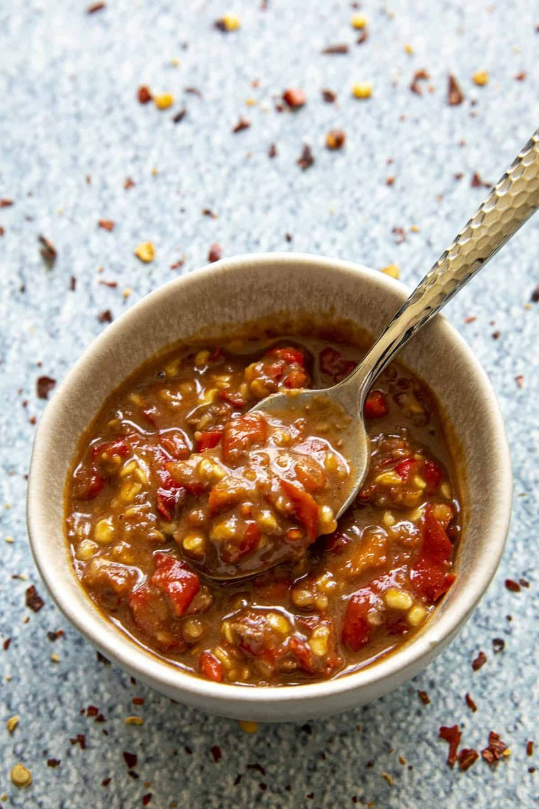

# Sambal Terasi

*Indonesia's defining chilli sauce: chillies, garlic, shallot and tomato pounded with a lump of fermented shrimp paste, fried glossy and dark.*

**Serves:** Makes 250 ml (about 12 servings)

**Prep Time:** 15 minutes

**Cook Time:** 15 minutes

## Overview
Sambal terasi is the Indonesian fermented-shrimp-paste sambal, the spoonful of red fire that lives in a small dish beside every Indonesian meal and elevates anything plain. Red chillies, garlic, shallots and tomato roast briefly under a grill until softened and slightly charred. Terasi (Indonesian shrimp paste) toasts in a dry pan for a minute until intensely fragrant (open a window). All ingredients pound or pulse to a coarse paste; the paste then fries in oil for eight to ten minutes until deep red, fragrant and the oil separates at the edges. Salt and a touch of palm sugar balance. Serve hot or cool with rice, grilled fish, fried tofu, or anything that wants a hit of heat.

## Ingredients
- 12 red chillies (10 hot bird's-eye + 2 mild large red, adjust ratio to taste)
- 6 garlic cloves
- 4 shallots
- 2 ripe tomatoes (about 200 g)
- 15 g terasi (Indonesian fermented shrimp paste, substitute Malaysian belacan or Thai gapi)
- 3 tablespoons neutral oil
- 1 teaspoon palm sugar (gula merah) or dark brown sugar
- 1 teaspoon salt
- 1 tablespoon lime juice

## Method

### Stage 1 - Pre-cook
1. Heat the grill to maximum, or heat a heavy dry skillet over high heat.
1. Place the whole chillies, garlic (skin on), shallots (skin on) and tomatoes on a baking tray or in the pan.
1. Char 6-8 minutes, turning, until the skins blister and blacken in patches.
1. Cool 5 minutes; peel the garlic and shallots (skins slip off); deseed chillies if you want less heat.

### Stage 2 - Toast the terasi
1. Wrap the terasi in foil; place in a dry pan over medium heat 2 minutes per side until intensely fragrant (or directly grill over flame on a metal skewer).
1. The smell will be powerfully shrimp-funk, this is correct.

### Stage 3 - Pound or process
1. Pound everything together in a mortar (the traditional way): start with terasi, garlic, shallot, then add chilli and tomato.
1. **Processor method:** pulse everything together to a coarse paste (not a smooth purée, texture matters).

### Stage 4 - Fry
1. Heat the oil in a wide pan over medium heat.
1. Scrape the paste in; stir-fry 8-10 minutes.
1. The colour deepens to a glossy mahogany red; oil pools at the edges; the smell mellows from raw-funky to deeply fragrant.

### Stage 5 - Balance
1. Stir in the palm sugar and salt.
1. Cook 1 more minute; taste.
1. Off heat; stir in the lime juice.

### Stage 6 - Serve
1. Spoon into a small bowl.
1. Serve at any temperature, hot on rice, room temp on grilled meat, cool as a dipping condiment.

## Notes
- **Terasi is non-negotiable:** without it sambal terasi is just chilli paste. Indonesian/Malaysian/Thai shrimp paste varies in intensity; start with less if your terasi is very pungent.
- **Toast the terasi:** raw terasi tastes harshly fishy; toasted it transforms to a deep umami funk.
- **Char the vegetables:** raw sambal has a sharp edge; charred vegetables soften and sweeten the base.
- **Coarse paste, not smooth:** Indonesian sambal has visible texture. A baby-food purée reads wrong.

## Storage
- Keeps 1 week refrigerated in a sealed jar with a thin film of oil on top.
- The colour darkens further over 24 hours, improves rather than degrades.
- Freeze in ice-cube portions for 3 months; thaw at room temperature.
