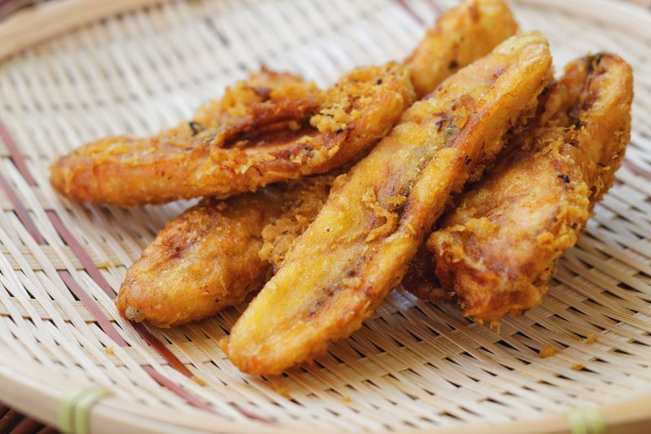

# Pisang Goreng (Indonesian Banana Fritters)

*Indonesia's eternal street snack: saba bananas dipped in rice-flour batter and deep-fried into golden fritters with a glassy crisp shell.*

**Serves:** 4 (makes 8-10 fritters)

**Prep Time:** 15 minutes

**Cook Time:** 15 minutes

## Overview
Saba bananas (or under-ripe regular bananas) peel and halve lengthways. Batter: rice flour, plain flour, sugar, baking powder, salt mixed with cold water and a touch of vanilla to a thick pancake-batter consistency. Bananas dip into the batter to coat; lower into hot oil (175°C); fry for 4-5 minutes turning, until deep gold and crisp. Drain on a rack. Eats hot, sometimes dusted with icing sugar or drizzled with palm-sugar syrup.

## Ingredients

### Bananas
- 6 saba bananas (or 6 firm under-ripe regular bananas)

### Batter
- 100 g rice flour
- 50 g plain flour
- 2 tablespoons caster sugar
- 1 teaspoon baking powder
- ½ teaspoon salt
- 1 teaspoon vanilla extract
- 180 ml cold sparkling water (or plain cold water)

### Frying
- 600 ml neutral oil

### To finish (optional)
- Icing sugar
- Palm-sugar syrup (gula merah dissolved in a little water)
- Grated mature cheese (the Indonesian way - sounds weird, works brilliantly)

## Method

### Stage 1 - Prep bananas
1. Peel the bananas.
1. If using saba: halve lengthways down the long axis; cut each half across the middle.
1. If using regular: halve crossways, then halve each piece lengthways.

### Stage 2 - Batter
1. In a wide bowl, whisk the rice flour, plain flour, sugar, baking powder and salt.
1. Whisk in the cold sparkling water and vanilla until smooth.
1. The batter should coat the back of a spoon - thick but pourable.

### Stage 3 - Fry
1. Heat the oil to 175°C.
1. Dip a banana piece into the batter; let excess drip off briefly.
1. Lower into the oil.
1. Fry 4-5 banana pieces at a time (don't crowd); cook 4-5 minutes, turning, until deep gold and crisp.
1. Lift onto a wire rack with tongs.

### Stage 4 - Serve
1. Pile hot fritters on a platter.
1. Dust with icing sugar, drizzle with palm-sugar syrup, or top with grated cheese.
1. Eat immediately - the crisp shell softens within 20 minutes.

## Notes
- **Saba bananas are the authentic choice:** denser, less sweet, hold shape during frying. Look for short stubby green-yellow bananas at Asian groceries.
- **Cold sparkling water:** bubbles aerate the batter and the crisp goes thinner and crackier. Plain cold water works; sparkling is better.
- **Hot oil, not just warm:** below 170°C the batter absorbs oil and the fritter is greasy. A thermometer helps.
- **Cheese on top sounds wrong:** but mild grated cheese on hot pisang goreng is a beloved Indonesian (and Filipino) combo. Try it.

## Storage
- Best within 15 minutes of frying.
- Don't refrigerate - the batter goes soggy.
- Cooked fritters re-crisp briefly (3 minutes) in a hot 200°C oven but freshness is the magic.
