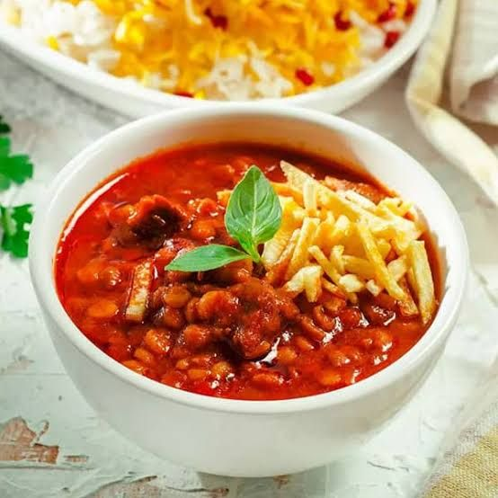

<!-- TODO: hero image undersized, refresh from Pexels or hand-curate -->
# Gheymeh

*Persia's split-pea stew: cubed lamb simmered with yellow split peas, tomato, dried lime, turmeric and cinnamon, finished with crisp matchstick potatoes.*

**Serves:** 4

**Prep Time:** 20 minutes

**Cook Time:** 1 hour 45 minutes

## Overview
Gheymeh is the Persian split-pea-and-dried-lime stew, a sour-savoury Persian classic crowned with a heap of matchstick-fried potatoes, often made for funeral wakes and Muharram observances in the Shia tradition. Onion fries dark gold in oil; turmeric, cinnamon and cubed lamb or beef brown in next. Tomato puree, hot stock, dried Persian limes (limu omani, the source of the dish's deep sourness) and presoaked split peas join the pot. Simmers for ninety minutes until both meat and peas are tender. Matchstick potatoes deep-fry separately and pile generously on top at serving. Eat with saffron rice; the dish improves with a day's rest in the fridge.

## Ingredients

- 700 g lamb shoulder (or beef chuck) - 3 cm cubes
- 3 tablespoons vegetable oil
- 2 onions (large, chopped)
- 1 teaspoon ground turmeric
- ½ teaspoon ground cinnamon
- 1 teaspoon ground black pepper
- 3 tablespoons tomato puree
- 4 dried black limes (loomi, pierced)
- 1 large pinch saffron threads (bloomed in 2 tablespoons hot water)
- 1.2 litres hot stock
- 1 ½ teaspoons salt (to taste)
- 200 g yellow split peas (soaked 1 hour, drained)

### Matchstick potatoes
- 2 potatoes (large, peeled, cut into 4 mm matchsticks)
- 500 ml vegetable oil for frying
- Salt for finishing

### To serve
- 4 servings cooked chelo rice
- Lemon wedges
- Fresh herbs (sabzi khordan)

## Method

### Stage 1 - Onion
1. Heat oil in a wide heavy pot.
1. Soften onion 12 minutes until deep gold.

### Stage 2 - Spices and meat
1. Add turmeric, cinnamon, pepper; cook 30 seconds.
1. Add lamb cubes; brown 6 minutes.
1. Stir in tomato puree; cook 3 minutes.

### Stage 3 - Simmer
1. Add pierced dried limes, saffron-water, hot stock, salt.
1. Bring to a simmer; cover; cook on low 50 minutes.

### Stage 4 - Split peas
1. Add the drained split peas.
1. Cook another 35-45 minutes until both meat and peas are tender. Top up stock if needed.
1. The sauce should be thick and rich; uncover for the last 10 minutes if loose.
1. Taste; adjust salt. Squeeze the limes against the pot side.

### Stage 5 - Matchstick potatoes
1. Heat oil to 180°C.
1. Pat potato matchsticks very dry.
1. Fry in batches 3-4 minutes until deep gold and crisp.
1. Drain on kitchen paper; salt.

### Stage 6 - Serve
1. Ladle stew over chelo rice.
1. Top generously with crisp matchstick potatoes.
1. Lemon wedge and fresh herbs on the side.

## Notes
- **Soak the peas:** Without soaking they take double the time and stay tough. 1 hour minimum.
- **Matchstick potatoes on top:** The Persian signature - the crisp contrast against the soft stew. Don't skip; eat with the stew.
- **Loomi at the start:** Pierce them once; they perfume the entire pot. Squeeze at the end.

## Storage
- Refrigerate 4 days; better next day. Matchstick potatoes fry fresh.
- Freezes 3 months (without potatoes).
