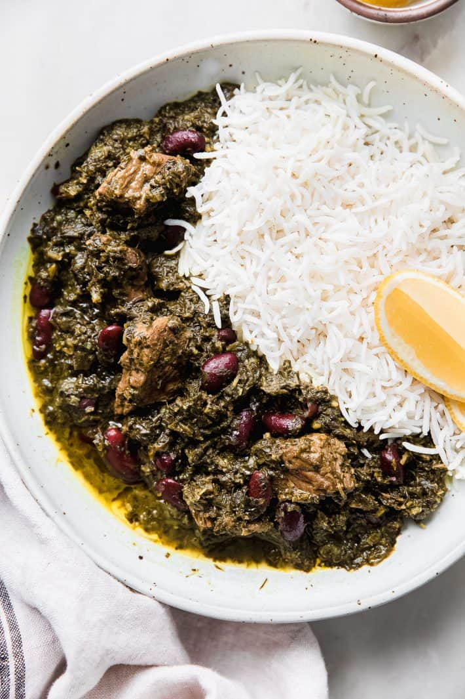

# Ghormeh Sabzi

*Iran's quietly contested national dish: lamb slow-cooked with mountains of fresh herbs, dried limes and red kidney beans. Served over plain chelo rice.*

**Serves:** 4

**Prep Time:** 25 minutes

**Cook Time:** 2 hours 30 minutes

## Overview
Onion fries deep golden in oil; turmeric and a touch of cinnamon toast in. Cubed lamb browns alongside. Herbs (huge quantities, 6 cups chopped) fry hard in their own pan in oil for 20 minutes until very dark. Everything combines with dried limes and stock; simmers for 90 minutes. Soaked kidney beans go in for the last 30 minutes.

## Ingredients

- 800 g lamb shoulder (or beef chuck) - 3 cm cubes
- 4 tablespoons vegetable oil (split)
- 2 onions (large, chopped)
- 1 teaspoon ground turmeric
- ¼ teaspoon ground cinnamon
- 1 teaspoon ground black pepper
- 1 ½ teaspoons salt
- 4 dried black limes (loomi - pierced, whole)
- 1 litre hot stock
- 1 (400 g) tin red kidney beans (drained, or 100 g dried, soaked overnight and pre-cooked)

### Herbs (fry separately)
- 200 g fresh parsley (leaves and tender stems, chopped fine)
- 200 g fresh coriander (chopped fine)
- 100 g chives (or spring onion greens, chopped fine)
- 30 g dried fenugreek leaves (kasuri methi, or 50 g fresh fenugreek if available)
- 4 tablespoons vegetable oil (for frying herbs)

### To serve
- 4 servings cooked chelo (Persian white rice - see tahdig recipe for technique)
- 1 lime (to finish, juice)

## Method

### Stage 1 - Brown
1. Heat 2 tablespoons oil in a wide heavy pot.
1. Soften onion 10 minutes until deep gold.
1. Add turmeric, cinnamon, pepper; cook 30 seconds.
1. Add lamb; brown 6-7 minutes.
1. Add salt, pierced limes, hot stock.
1. Bring to a simmer; cover; cook on low 1 hour.

### Stage 2 - Fry the herbs
1. In a separate wide pan, heat 4 tablespoons oil over medium.
1. Add all the chopped herbs and dried fenugreek.
1. Cook 15-20 minutes, stirring often, until the herbs turn very dark green (almost black) and smell deeply aromatic. Don't burn - adjust heat down if catching.

### Stage 3 - Combine
1. Add the fried herbs to the lamb pot.
1. Cook another 45 minutes on low.

### Stage 4 - Beans
1. Add the kidney beans.
1. Cook 20-30 more minutes, lid off for the last 10 if too loose. Sauce should be thick.
1. Squeeze the limes with the back of a spoon against the pot side to release juice.
1. Taste; adjust salt; add fresh lime juice if it needs lifting.

### Stage 5 - Serve
1. Spoon over chelo rice in deep bowls. The herb-meat stew should pool around a mound of rice.

## Notes
- **Herbs are not optional:** The dish lives or dies on the quantity. 6+ cups raw chopped herbs is right; they reduce dramatically.
- **Fry the herbs hard:** The dark cooked-down character is the dish. Underdone herbs taste grassy.
- **Loomi:** Pierce them once or twice with a knife and add whole. Squeeze against the pot side at the end to release more juice.

## Storage
- Refrigerate 4 days. Better next day.
- Freezes 3 months.
