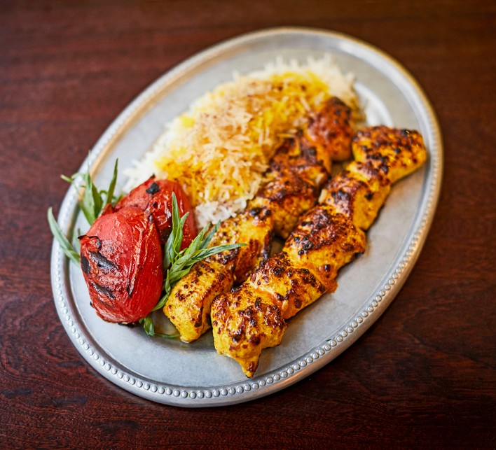

# Joojeh Kabab

*Iran's saffron chicken kebab: thigh marinated overnight in yogurt, saffron, onion juice and lemon, grilled hot over charcoal. Served with chelo rice.*

**Serves:** 4

**Prep Time:** 20 minutes (plus 6 hours marinating)

**Cook Time:** 15 minutes

## Overview
Saffron blooms in hot water. Onion grates fine and squeezes through a sieve to release juice. Marinade: yogurt, saffron, onion juice, lemon, olive oil, salt, pepper. Cubed chicken thigh marinates for 6 hours minimum. Skewered and grilled hot 4 minutes per side. Brushed with saffron-butter at the table.

## Ingredients

### Marinade
- 1 kg boneless chicken thigh (cut into 4 cm pieces)
- 1 large pinch saffron threads
- 2 tablespoons hot water
- 1 onion (large, grated, juice squeezed out - discard the pulp, use the juice)
- 250 ml plain yogurt
- 1 lemon (juice)
- 3 tablespoons olive oil
- 1 ½ teaspoons salt
- 1 teaspoon ground black pepper

### To grill
- 8 cherry tomatoes (or 4 medium tomatoes halved)
- 1 lemon (cut into wedges)

### Saffron butter (for finishing)
- 50 g unsalted butter
- Small pinch saffron threads
- 1 tablespoon hot water

## Method

### Stage 1 - Bloom saffron
1. Crush saffron with a pinch of salt in a mortar.
1. Pour over hot water; leave 10 minutes.

### Stage 2 - Marinate
1. Whisk saffron-water, onion juice, yogurt, lemon, olive oil, salt and pepper in a wide bowl.
1. Add the chicken pieces; turn to coat.
1. Cover; refrigerate 6 hours, ideally overnight.

### Stage 3 - Skewer
1. Thread chicken onto long flat metal skewers, 4-5 pieces per skewer.
1. Thread tomatoes onto separate skewers.

### Stage 4 - Grill
1. Heat a charcoal grill until coals are ashed over, or a gas grill / oven grill to high.
1. Grill chicken skewers 4 minutes per side over direct heat - the surface should char in spots, the inside stay juicy.
1. Grill tomato skewers 2-3 minutes per side until lightly charred and softening.

### Stage 5 - Saffron butter
1. Melt butter in a small pan; add saffron and hot water; stir 30 seconds.

### Stage 6 - Plate
1. Slide chicken off skewers onto warm chelo rice; pour saffron butter over.
1. Place grilled tomatoes alongside; lemon wedges; a plate of fresh sabzi khordan (mint, basil, tarragon, spring onions) and bread on the side.

## Notes
- **Onion juice not chunks:** Persian marinades use the juice. Grate, then squeeze through muslin or a fine sieve.
- **Saffron quality:** A pinch of good saffron beats a teaspoon of bad. Look for deep-red, dry threads. Spanish or Iranian.
- **Flat skewers:** Wide metal skewers keep the chicken from spinning when you turn them. Wooden skewers should be soaked 30 minutes.

## Storage
- Marinated chicken keeps 48 hours raw.
- Cooked: 2 days refrigerated; reheat gently.
