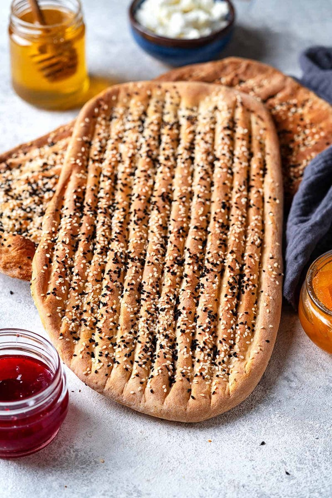

# Barbari

*Iran's breakfast bread: a long flat oval loaf with deep parallel ridges and a scatter of sesame and nigella, baked at extreme heat against a tandoor wall.*

**Serves:** 4 (makes 2 long flatbreads)

**Prep Time:** 20 minutes (plus 2 hours rising)

**Cook Time:** 20 minutes (with a hot stone)

## Overview
Barbari is the Persian morning flatbread, long oval loaves with deep parallel ridges down the surface and a sesame-and-nigella seed crown, sold from neighbourhood bakeries across Iran from sunrise to mid-morning. A wet yeasted dough, high hydration (75%) of strong flour, yeast, salt, water and a touch of oil. Long first rise. Two portions; each stretches to a 40-50 cm long oval on an oiled work surface. A flour-water paste (roomal) brushes over the top to give the signature glossy crust. Deep parallel ridges press down with fingertips along the length. Sesame and nigella seeds scatter generously. Bake at maximum heat for five to seven minutes on a screaming-hot stone. Eat warm, torn by hand, with feta cheese, walnuts and fresh herbs for the proper Persian breakfast.

## Ingredients

### Dough
- 500 g strong white bread flour
- 1 sachet (7 g) fast-action yeast
- 1 ½ teaspoons salt
- 1 tablespoon caster sugar
- 2 tablespoons olive oil
- 375 ml warm water

### Roomal (glaze)
- 2 tablespoons plain flour
- 200 ml cold water
- ½ teaspoon baking soda

### Topping
- 1 tablespoon sesame seeds
- 1 tablespoon nigella seeds

## Method

### Stage 1 - Dough
1. Whisk flour, yeast, salt and sugar.
1. Add oil and warm water; mix to a wet sticky dough.
1. Knead 10 minutes in a stand mixer (the dough is too wet for hand-kneading easily) until smooth and elastic.
1. Cover; rise 1 hour 30 minutes to 2 hours until doubled and bubbly.

### Stage 2 - Roomal
1. Whisk flour, water and baking soda in a small pan.
1. Heat over medium until it thickens to a glossy paste, about 2 minutes.
1. Cool to lukewarm.

### Stage 3 - Heat oven
1. Place a baking stone or upturned heavy tray on the top rack.
1. Heat oven to maximum (250°C+) for 30 minutes.

### Stage 4 - Shape
1. Divide the dough into 2 portions.
1. Oil the work surface and your hands generously.
1. Press one portion into a long oval; stretch by hand to 40-50 cm long and 15 cm wide.
1. With 4 fingertips together, press 4 parallel ridges (deep grooves) down the length of the dough - almost to the surface but not through.

### Stage 5 - Glaze
1. Brush the roomal generously over the top.
1. Scatter sesame and nigella seeds.

### Stage 6 - Bake
1. Slide onto the hot stone using a peel or upturned tray.
1. Bake 5-7 minutes until deep gold and the surface is shiny.
1. If your oven has a grill, briefly hit the top under the grill 30 seconds.

### Stage 7 - Stack
1. Stack baked breads under a clean tea towel.

### Stage 8 - Serve
1. Eat warm with feta, herbs, walnuts and tea at breakfast, or alongside kababs and stews.

## Notes
- **High hydration matters:** The 75% wet dough is what gives the open chewy crumb. A drier dough makes a different bread.
- **Roomal is the gloss:** Skipping the flour-water paste gives a matte bread. The roomal is what makes barbari look glossy and the surface crisp.
- **Maximum oven heat:** Without it the bread doesn't crust right. Pre-heat the stone for 30+ minutes.

## Storage
- Best fresh, eaten warm.
- Keep wrapped in foil 24 hours.
- Freeze 1 month.
