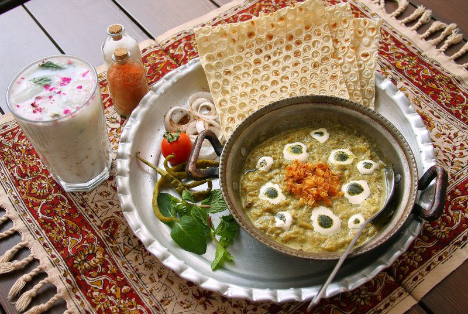

# Kashk-E-Bademjan

*A classic Persian starter: roasted aubergine mashed with caramelised onion, garlic, walnut, dried mint and kashk (fermented whey, very sour and salty). Topped with crisp fried onion, more kashk drizzle, dried mint sizzled in oil and toasted walnut. Eaten scooped with warm bread. Rich, salty, deeply layered.*

**Serves:** 4 as a starter

**Prep Time:** 15 minutes

**Cook Time:** 45 minutes

## Overview
Kashk-e bademjan is the Persian aubergine-and-fermented-whey dip, a smoky-savoury spread of mashed aubergine, caramelised onion and tangy kashk, the meze-board signature that turns up at every Persian sofreh. Aubergines roast or pan-fry until soft and silky. The flesh mashes with caramelised onion and garlic into a soft paste. Kashk (fermented whey) thins with a splash of water and folds through. The dish plates in a wide bowl, scored with the back of a spoon. Top with crispy fried shallots, dried mint sizzled in oil, swirls of more kashk, and chopped toasted walnut. Eat warm with sangak or barbari for scooping.

## Ingredients

- 2 aubergines (large, about 700 g)
- 4 tablespoons olive oil (split, for the aubergine)
- 1 onion (large, sliced thin)
- 4 garlic cloves (crushed)
- 1 teaspoon ground turmeric
- ½ teaspoon ground black pepper
- ½ teaspoon salt (to taste)
- 80 g kashk (Iranian whey paste - sold in jars in Middle Eastern shops; substitute thick Greek yogurt mixed with 1 tsp salt and 1 tsp lemon juice if unavailable)
- 50 ml water
- 50 g walnut halves (toasted, half chopped, half whole)

### Topping
- 3 tablespoons crispy fried shallots (packet, or home-fried)
- 1 teaspoon dried mint
- 2 tablespoons olive oil
- 1 tablespoon kashk (extra, to drizzle)

## Method

### Stage 1 - Aubergine
1. Halve aubergines lengthways.
1. Heat 3 tablespoons oil in a wide pan; place aubergines cut-side down; cover; cook 12 minutes until very soft.
1. Flip; cook another 6 minutes.
1. (Alternative: roast cut-side up at 220°C for 35 minutes.)
1. Scoop the flesh from the skins; chop roughly.

### Stage 2 - Onion and garlic
1. In the same pan, heat the remaining 1 tablespoon oil.
1. Add onion; cook 12-15 minutes until very deep gold.
1. Add garlic, turmeric, pepper; cook 1 minute.

### Stage 3 - Combine
1. Add the aubergine flesh to the onion pan; mash with a fork or potato masher to a chunky paste.
1. Add salt; taste.
1. Whisk 60 g of the kashk with 50 ml water to a pourable cream; fold most of it into the aubergine, reserving 1 tablespoon for the top.
1. Fold in the chopped walnut halves.

### Stage 4 - Plate
1. Tip into a wide warm shallow bowl.
1. Score the top with the back of a spoon.

### Stage 5 - Topping
1. In a small pan, warm the 2 tablespoons of olive oil; add dried mint; sizzle 10 seconds.
1. Drizzle the mint oil over the dish.
1. Drizzle the reserved kashk in stripes.
1. Scatter crispy fried shallots and whole walnuts.

### Stage 6 - Serve
1. Eat warm with warm flatbread.

## Notes
- **Kashk:** Iranian whey paste - strongly sour and salty. Substitute Greek yogurt + lemon + salt if you can't find it; flavour is close but less deep.
- **Brown the onion hard:** The deep caramelisation is half the dish's flavour. Don't rush.
- **Eat warm:** Best within 30 minutes of plating. Cold kashk-e-bademjan loses its softness.

## Storage
- Refrigerate 3 days; reheat gently. The toppings garnish fresh.
