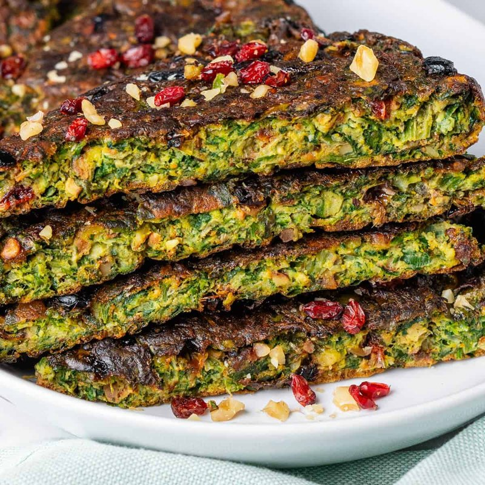

# Kuku Sabzi

*Persian herb frittata: an extraordinary quantity of fresh chopped herbs (parsley, coriander, chives, dill, leek) bound with eggs, a little flour, turmeric, walnut and barberries, baked or pan-cooked into a deep-green slice that looks like cake. Eaten warm or at room temperature with yogurt and bread; central to the Nowruz (Persian New Year) table.*

**Serves:** 6

**Prep Time:** 30 minutes

**Cook Time:** 40 minutes

## Overview
Herbs chop finely - really finely - to a green confetti. Eggs whisk with flour, baking powder, turmeric, salt and pepper. Walnut pieces and barberries fold through. Mixture pours into a buttered round baking dish or wide pan; baked at 180°C 35-40 minutes until set and deep green-gold on top. Cuts into wedges or squares.

## Ingredients

- 100 g fresh parsley (40 g leaves and tender stems)
- 100 g fresh coriander (leaves and tender stems)
- 50 g fresh chives or spring onion greens
- 50 g fresh dill
- 30 g fresh fenugreek leaves (or 1 tablespoon dried)
- 1 medium leek (white and pale green only - finely sliced)
- 8 large eggs
- 3 tablespoons plain flour
- 1 teaspoon baking powder
- 1 teaspoon ground turmeric
- 1 ½ teaspoons salt
- 1 teaspoon ground black pepper
- 50 g walnut halves (lightly toasted, chopped)
- 3 tablespoons dried barberries (zereshk - rinsed; or substitute dried cranberries chopped fine)
- 4 tablespoons olive oil (split)

### To serve
- 200 g thick Greek yogurt
- Warm flatbread
- Lemon wedges

## Method

### Stage 1 - Chop herbs
1. Wash and dry the herbs thoroughly.
1. Finely chop the parsley, coriander, chives, dill and leek (a food processor saves time but pulse rather than purée).

### Stage 2 - Pre-cook leek
1. Heat 1 tablespoon oil in a wide pan over medium.
1. Add the chopped leek; soften 4 minutes.
1. Cool slightly.

### Stage 3 - Wet mix
1. Whisk eggs, flour, baking powder, turmeric, salt and pepper in a large bowl.
1. Stir in all chopped herbs, softened leek, walnut and barberries.
1. Mix thoroughly.

### Stage 4 - Bake
1. Heat oven to 180°C (160°C fan).
1. Heat the remaining 3 tablespoons of oil in a 24 cm round ovenproof pan (or pour into a buttered baking dish).
1. Pour the mixture in; smooth the top.
1. Bake 35-40 minutes until set and the top is deep green-gold.

### Stage 5 - Cool slightly
1. Cool 10 minutes in the pan.

### Stage 6 - Serve
1. Cut into wedges or squares.
1. Plate with yogurt, warm flatbread and lemon wedges.

## Notes
- **Volume of herbs is the dish:** Don't reduce. It should look more herb than egg when you mix it.
- **Barberries:** Sold dried in Middle Eastern shops as "zereshk". They give a sweet-sour pop. Substitute very finely chopped dried cranberries.
- **Eat at any temperature:** Warm out of the oven, room temperature at a picnic, cold from the fridge in a wedge.

## Storage
- Refrigerate 4 days. Travels well in a sandwich.
- Doesn't freeze well - egg texture goes off.
