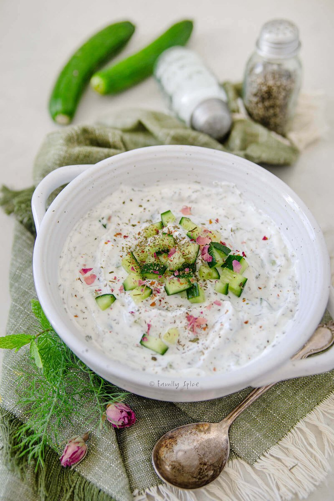

# Mast-O-Khiar

*Persian yogurt-cucumber side: thick strained yogurt with finely-diced cucumber, dried mint, walnut pieces, raisins, dried rose petals and a pinch of salt and pepper. Eaten as a side to any Persian meal or as a starter with bread. Less garlicky than its Greek cousin tzatziki, more about herbs, nuts and dried fruit.*

**Serves:** 4 as a side

**Prep Time:** 12 minutes

**Cook Time:** 0 minutes

## Overview
Mast-o-khiar is the Persian cucumber-and-yogurt salad, more than a tzatziki, less than a dip, the side dish that lives in a small bowl beside every Persian dinner from the everyday to the celebratory. Cucumber dices fine and salts briefly to lose its water (drains in a sieve for ten minutes; keeps the salad from going wet). Folds into thick Greek yogurt with chopped walnuts, raisins, dried mint, salt and pepper. Garnish with more walnuts, dried mint, dried rose petals (if available), and a drizzle of olive oil. Eat cold from the fridge alongside any Persian rice dish or kebab.

## Ingredients

- 500 g thick strained Greek yogurt
- 1 cucumber (large, deseeded, very finely diced)
- ½ teaspoon salt (for sweating cucumber)
- 50 g walnut halves (lightly toasted, chopped)
- 3 tablespoons raisins (or sultanas)
- 1 teaspoon dried mint
- ¼ teaspoon salt (to taste)
- ¼ teaspoon ground black pepper

### To finish
- 1 tablespoon walnut pieces (extra, for garnish)
- 1 teaspoon dried mint (extra)
- 1 teaspoon dried rose petals (optional)
- 1 tablespoon olive oil

## Method

### Stage 1 - Sweat the cucumber
1. Place diced cucumber in a sieve over a bowl; sprinkle with ½ teaspoon salt.
1. Leave 10 minutes; press gently to remove water.

### Stage 2 - Combine
1. In a wide bowl, fold together yogurt, drained cucumber, chopped walnuts, raisins, dried mint, salt, pepper.
1. Taste; adjust salt.

### Stage 3 - Garnish
1. Tip into a serving bowl.
1. Scatter extra walnuts, dried mint and rose petals.
1. Drizzle with olive oil.

### Stage 4 - Serve
1. Eat cold with bread or alongside grilled meats and rice.

## Notes
- **Strained yogurt is essential:** Regular yogurt gives a watery dip; strained (or thick Greek) gives the right body.
- **Toast the walnuts:** 4 minutes in a 180°C oven. Refreshes their flavour.
- **Rose petals:** Iranian rose petals (sold dried in Middle Eastern shops) are a beautiful garnish. Skip if unavailable.

## Storage
- Refrigerate 3 days. The cucumber softens; flavour deepens.
