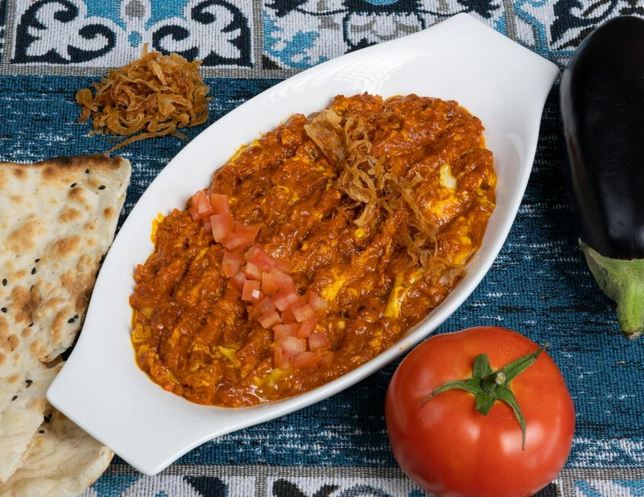

# Mirza Ghasemi

*A smoky Northern Iranian (Gilan) side: roasted aubergine smashed with fried garlic, tomato, turmeric, salt and a scrambled egg folded through. Eaten with bread or rice. The smoke from the aubergine - properly charred over flame or under a hot grill - is the dish's signature.*

**Serves:** 4 as a side

**Prep Time:** 15 minutes

**Cook Time:** 35 minutes

## Overview
Aubergines are charred over an open gas flame (or under a very hot grill) until the skin is black and the flesh collapses inside. The smoky flesh is scooped out and chopped coarse. A pan with oil, generous garlic, turmeric and a quick tomato sauce. The aubergine joins; cooks for 10 minutes. A whisked egg is poured in and scrambled into the mix. Served warm in a wide dish.

## Ingredients

- 2 aubergines (large, about 700 g)
- 4 tablespoons olive oil
- 6 garlic cloves (crushed)
- 1 teaspoon ground turmeric
- 3 fresh tomatoes (grated, skins discarded) or 200 ml passata
- 1 tablespoon tomato puree
- 1 teaspoon salt (to taste)
- ½ teaspoon ground black pepper
- 3 eggs (large, beaten)

### To finish
- 1 tablespoon olive oil (to drizzle)
- 2 tablespoons fresh parsley (chopped)
- Warm flatbread

## Method

### Stage 1 - Char the aubergine
1. Set the aubergines directly on a gas flame (or under a very hot grill / outdoor grill).
1. Rotate every 4-5 minutes until the skin is uniformly black and the flesh is completely soft (15-20 minutes total).
1. Place in a bowl; cover; leave 10 minutes to steam.

### Stage 2 - Prep the flesh
1. Peel off the burnt skin (it slides off); discard.
1. Chop the smoky flesh coarsely.

### Stage 3 - Garlic and spice
1. Heat the oil in a wide pan over medium.
1. Add crushed garlic; cook 2 minutes until aromatic and just pale gold (not brown).
1. Stir in turmeric; toast 10 seconds.

### Stage 4 - Tomato
1. Add tomato and tomato puree; cook 5 minutes to a thick sauce.

### Stage 5 - Aubergine
1. Add the chopped smoky aubergine; mash and stir.
1. Season with salt and pepper.
1. Cook 10 minutes, stirring, until the mixture is thick and the oil splits.

### Stage 6 - Egg
1. Push the mixture to one side of the pan.
1. Pour the beaten eggs into the cleared half; lightly scramble 30 seconds.
1. Fold the scramble through the aubergine - leaves visible streaks of yellow.

### Stage 7 - Plate
1. Tip into a wide warm shallow dish.
1. Drizzle with extra olive oil; scatter parsley.

### Stage 8 - Serve
1. Eat warm with warm flatbread or as a side to rice.

## Notes
- **Open flame is the dish:** Roasting in the oven gives a passable but inferior result. A direct flame (gas hob or charcoal grill) gives the proper smoky character.
- **Don't burn the garlic:** Pale gold only. Brown garlic is bitter against the delicate aubergine.
- **Egg streaks visible:** The point is folded-through, not blended. Leave yellow streaks against the smoky green-brown background.

## Storage
- Refrigerate 3 days; reheat gently.
