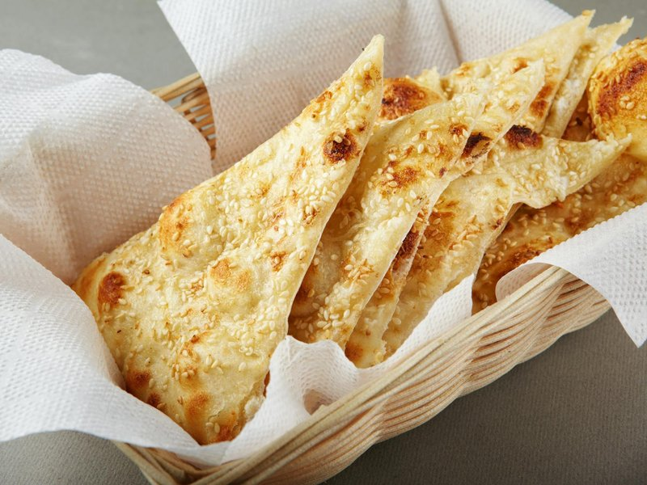

# Sangak

*Iran's most ancient bread: a long whole-wheat flatbread traditionally baked on a bed of hot pebbles. Slightly tangy, deeply chewy, nutty. Eaten with feta.*

**Serves:** 4 (makes 2 long flatbreads)

**Prep Time:** 20 minutes (plus 4 hours rising)

**Cook Time:** 20 minutes

## Overview
Sangak is the Persian stone-baked flatbread, long oval loaves with a dimpled surface from small pebbles on the baking stone, the everyday bread of Iran for over a thousand years. A wholemeal-heavy dough (70% wholemeal, 30% white) with a long ferment, three to four hours at room temperature or overnight in the fridge. Stretches into a 40-50 cm long oval, about 5 mm thick. Press onto a hot baking tray scattered with small smooth pebbles (or stones from the garden, well-washed). Bake at maximum heat for six to eight minutes; the dough conforms to the pebbles, giving the dimpled bottom that defines sangak. Eat warm, torn by hand, with feta, walnuts, fresh herbs and a glass of doogh.

## Ingredients

- 350 g wholemeal flour
- 150 g plain white flour
- 1 sachet (7 g) fast-action yeast (or 5 g for slower ferment)
- 1 ½ teaspoons salt
- 1 tablespoon olive oil
- 380 ml warm water
- 500 g small smooth river pebbles (washed, oven-safe - see Notes)
- Cornmeal (or extra flour, for dusting)

## Method

### Stage 1 - Dough
1. Whisk wholemeal flour, white flour, yeast, salt.
1. Add olive oil and warm water; mix to a wet sticky dough.
1. Knead 8 minutes in a stand mixer.
1. Cover; rise 3-4 hours at room temperature (or overnight in the fridge) until doubled.

### Stage 2 - Prep pebbles
1. Spread pebbles on a sturdy heavy baking tray in a single layer.
1. Place in the oven; heat oven to maximum (250°C+) for 30-40 minutes to thoroughly heat the pebbles.

### Stage 3 - Shape
1. Tip the dough onto a generously floured surface.
1. Divide in half.
1. Press the first half into a long oval; stretch by hand to a 40-50 cm long, 15 cm wide flat - about 5 mm thick.
1. Slide carefully onto a peel (or upturned tray) dusted with cornmeal.

### Stage 4 - Bake
1. Open the oven; carefully slide the dough onto the hot pebble bed (the pebbles press into the dough from below, creating the signature dimpled bottom).
1. Bake 6-8 minutes until deep gold.

### Stage 5 - Lift
1. Lift the bread off the pebbles with tongs and a metal spatula (the pebbles stay on the tray).
1. Shake off any pebbles that stuck (rare if the surface is well-floured).

### Stage 6 - Second loaf
1. Repeat with the second half of dough. The pebbles are still hot.

### Stage 7 - Serve
1. Eat warm with feta, walnuts, fresh mint and basil, and a glass of black tea.

## Notes
- **Pebbles:** Use small, smooth, oven-safe river stones - washed, dried. Pottery beads, baking weights, or coarse rock salt also work. Don't use pea gravel (too sharp).
- **Don't have pebbles?** Bake on a hot stone or steel - you'll get a flat (not dimpled) sangak. Still delicious; just not the traditional shape.
- **Long ferment:** The flavour depth comes from a long rise. Overnight in the fridge gives the best sourdough-like character.

## Storage
- Best fresh, eaten warm.
- Wrapped in foil at room temperature 24 hours.
- Freeze 1 month.
