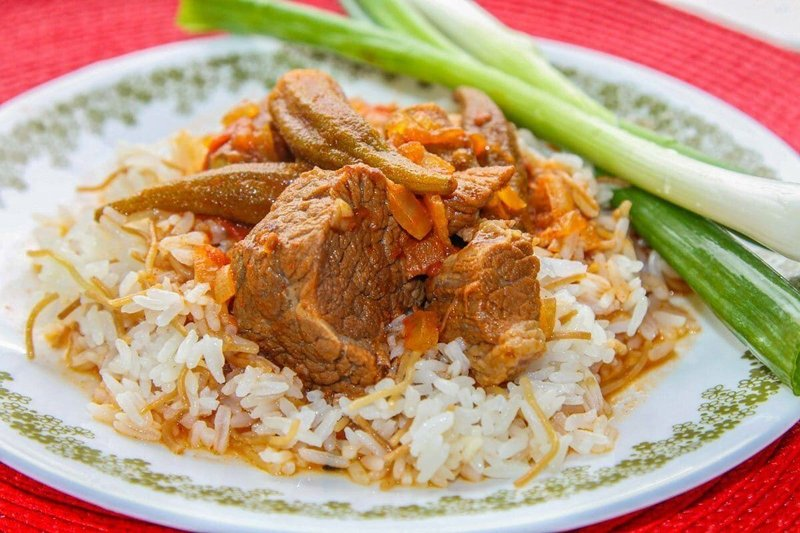

# Bamia Iraqi

*Iraq's lamb-and-okra stew: small whole okra slow-cooked with cubed lamb in a tomato-and-tamarind broth sharpened with dried lime, finished with crushed garlic and coriander sizzled in oil (taqliya). Served over fluffy timman ahmar (Iraqi red rice). A weekday dinner, deeply savoury, classically Iraqi.*

**Serves:** 4

**Prep Time:** 15 minutes

**Cook Time:** 1 hour 45 minutes

## Overview
Lamb shoulder is browned hard; onion is softened; garlic, baharat and tomato paste join. Stock, tamarind, dried lime and tinned tomato deglaze. The lamb is braised for 75 minutes. Small whole okra goes in the last 25 minutes (long enough to soften, short enough not to disintegrate). Taqliya, crushed garlic and coriander sizzled in oil, is drizzled over at the end.

## Ingredients

- 700 g lamb shoulder (cut into 4 cm chunks)
- 3 tablespoons vegetable oil (or samna)
- 2 onions (chopped)
- 8 garlic cloves (split: 4 crushed for the stew, 4 finely chopped for taqliya)
- 2 tablespoons [Baharat](../../base-ingredients/spices/baharat.md) (or 1 tsp each: ground cumin, coriander, allspice, black pepper, cinnamon)
- 2 tablespoons tomato puree
- 1 (400 g) tin chopped tomatoes
- 2 tablespoons tamarind paste
- 2 dried black limes (loomi, pierced)
- 1 ½ teaspoons salt (to taste)
- ½ teaspoon ground black pepper
- 600 ml hot stock
- 600 g small whole okra (fresh or frozen, no need to thaw)

### Taqliya
- 3 tablespoons samna (or butter)
- 4 garlic cloves (very finely chopped)
- 1 small bunch fresh coriander (chopped)

### To serve
- 4 servings cooked timman ahmar (Iraqi red rice) or plain basmati
- Lemon wedges

## Method

### Stage 1 - Brown
1. Pat lamb dry; salt lightly.
1. Heat 2 tablespoons oil in a heavy pot; brown lamb in batches.

### Stage 2 - Base
1. Soften the onion 8 minutes.
1. Add 4 crushed garlic cloves; cook 30 seconds.
1. Add baharat; toast 30 seconds.
1. Stir in tomato puree and tinned tomato; reduce 5 minutes.

### Stage 3 - Slow cook
1. Return the lamb. Add tamarind, dried limes, salt, pepper, hot stock.
1. Cover; simmer on low 1 hour 15 minutes until lamb is tender.

### Stage 4 - Okra
1. Add okra whole, push into the sauce.
1. Cook uncovered 20-25 minutes until okra is tender but holds shape; sauce reduces and clings.

### Stage 5 - Taqliya
1. Heat the 3 tablespoons samna in a small pan over medium.
1. Add the chopped 4 garlic cloves; sizzle 30 seconds (gold, not brown).
1. Off heat, stir in chopped coriander.

### Stage 6 - Serve
1. Spoon stew over rice; drizzle the taqliya straight from the pan over the top.
1. Lemon wedges alongside.

## Notes
- **Small whole okra:** Sliced okra gets slimy; whole pods stay firm. Look for finger-length okra.
- **Tamarind + loomi:** The dish's identity. Iraq's signature sour notes.
- **Taqliya last-second:** Pour while still sizzling for the aroma hit at the table.

## Storage
- Refrigerate 4 days; reheats well.
- Freezes 3 months.
