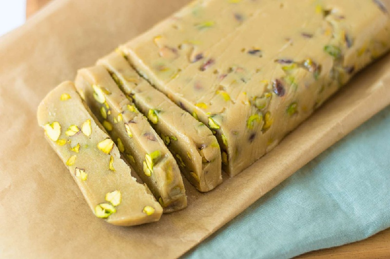

# Halwa Tahini

*The Iraqi tahini halva: sesame paste set with hot sugar syrup, perfumed with cardamom and rose water, studded with whole pistachios. Eaten in small slabs.*

**Serves:** 12 (makes about 700 g; a 20 cm square block)

**Prep Time:** 15 minutes

**Cook Time:** 15 minutes (plus 8 hours setting)

## Overview
Sugar and water dissolve, then boil to the soft-ball stage (118°C). Off the heat, the syrup is whisked into well-stirred tahini with cardamom and rose water; pistachios fold in. The mix pours into a lined tin; sets in the fridge overnight. The crystallisation of the sugar against the sesame fat gives halva its signature flaky-melting bite. Slabs cut into thick squares or fingers. Eat with strong coffee; never warm (it goes oily).

## Ingredients

- 400 g good-quality tahini (well-stirred; the oil should be fully incorporated, not separated)
- 350 g caster sugar
- 100 ml water
- 1 teaspoon ground cardamom
- 1 ½ teaspoons rose water
- 80 g shelled pistachios (lightly toasted, roughly chopped; a handful kept whole for the top)
- A pinch of salt
- 1 tablespoon glucose syrup (or honey, optional; helps prevent crystallisation)

### To garnish
- 2 tablespoons whole pistachios
- A few dried rose petals (optional)

## Method

### Stage 1 - Prep tin
1. Line a 20 cm square tin with greaseproof paper, leaving overhang on two sides (for lifting out).
2. Place the tahini, cardamom, salt and 60 g of the chopped pistachios in a wide heatproof bowl.
3. Whisk briefly to combine and make sure the tahini is smooth and well-stirred (separated tahini gives an oily halva).

### Stage 2 - Make syrup
1. Combine the sugar, water and glucose (if using) in a heavy small pan.
2. Stir gently over medium heat until the sugar fully dissolves.
3. Stop stirring; clip on a sugar thermometer.
4. Boil steadily 6-8 minutes until the syrup reaches 118°C (the soft-ball stage; a drop of syrup in cold water forms a soft pliable ball).
5. Don't go above 122°C; the halva will set too hard.

### Stage 3 - Combine
1. Pour the hot syrup in a slow steady stream onto the tahini, whisking constantly with a sturdy wooden spoon or spatula.
2. Add the rose water.
3. Mix vigorously 30-60 seconds; the mixture will thicken and start to look slightly grainy as the sugar begins to crystallise - this is correct.
4. Don't overmix. The moment the mix turns from glossy to matte and starts pulling away from the sides of the bowl, stop.

### Stage 4 - Set
1. Scrape the mixture into the lined tin.
2. Press flat with a spatula or the back of a damp spoon.
3. Press the remaining chopped pistachios and the whole pistachios into the surface.
4. Scatter rose petals (if using).
5. Cover loosely; chill at least 8 hours, ideally overnight.

### Stage 5 - Serve
1. Lift the block out of the tin using the paper overhang.
2. Cut into 12 thick squares or fingers with a sharp knife (a serrated knife sawing gently works best).
3. The cut surface should show the characteristic flaky striations of crystallised halva.
4. Serve at cool room temperature with strong coffee.

## Notes
- **Tahini quality:** This recipe lives or dies on the tahini. Use a good Middle Eastern or Lebanese tahini, well-stirred. Industrial mass-market tahini is too watery or too bitter.
- **Thermometer is essential:** Halva is a sugar-syrup recipe and the temperature window is tight. Under 116°C and the halva is soft and oily; over 122°C and it sets glass-hard.
- **Don't overmix:** The flaky texture comes from controlled crystallisation. Overmixing destroys the structure and the result is dense and rubbery.
- **Cool serving:** Halva at room temperature is right. Warm halva goes oily; fridge-cold halva is too dense to bite cleanly.

## Variations
**Pistachio halva:** Double the pistachios and skip the rose water for a deeper nutty version.
**Chocolate marbled:** Drizzle 50 g melted dark chocolate over the pressed halva and swirl with a skewer before chilling.
**Almond halva:** Replace pistachios with toasted blanched almonds; add ½ teaspoon almond extract instead of rose water.

## Serving
Serve with: strong Iraqi cardamom coffee, sweetened black tea, or simply a glass of cold water.
As a snack: a small square is plenty; halva is dense and very sweet.
Occasion: Eid, Ramadan iftar, after a heavy meal, with afternoon tea.

## Storage
- Keeps 1 month in an airtight tin at cool room temperature; do not refrigerate (the texture goes dry and dense).
- Freezes 6 months wrapped tightly; defrost at room temperature for 2 hours.
- The flavour deepens over the first week.
