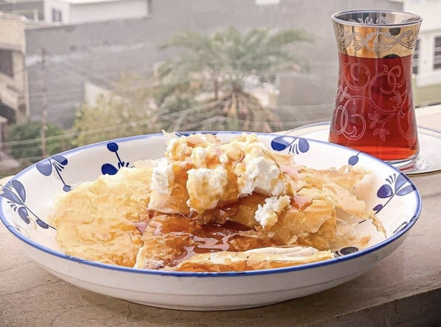

# Kahi

*Iraq's syrup-soaked breakfast pastry: paper-thin layers of dough brushed with samna and soaked in saffron-rose syrup. Topped with geymar and honey.*

**Serves:** 4 (makes 6 pieces)

**Prep Time:** 40 minutes (plus 30 minutes resting)

**Cook Time:** 25 minutes

## Overview
A simple flour-and-water dough rests for 30 minutes. Stretches paper-thin on an oiled surface (filo-style). Brushed with melted samna; folded into a long strip; coiled into a flat round; rolled flat. Pan-baked or oven-baked at 200°C until darkly gold. Plunged briefly into hot saffron-cardamom-rose sugar syrup. Topped with thick clotted cream (geymar, or substitute Devonshire / Cornish clotted cream).

## Ingredients

### Dough
- 400 g plain flour
- 1 teaspoon salt
- 2 tablespoons vegetable oil
- 250 ml warm water (approximately)
- 200 g samna (or melted unsalted butter, for brushing)

### Sugar syrup
- 300 g caster sugar
- 200 ml water
- 1 tablespoon lemon juice
- 1 large pinch saffron threads
- 4 cardamom pods (bruised)
- 1 tablespoon rose water
- 1 teaspoon orange blossom water (optional)

### To finish
- 200 g geymar (Iraqi clotted cream) or substitute Devonshire / Cornish clotted cream
- 2 tablespoons clear honey (to drizzle)

## Method

### Stage 1 - Dough
1. Whisk flour and salt.
1. Add oil and warm water; mix to a soft dough.
1. Knead 8 minutes until very smooth and elastic.
1. Cover; rest 30 minutes.

### Stage 2 - Syrup
1. Combine sugar, water, lemon juice, saffron and cardamom in a small pan.
1. Bring to a boil; reduce; simmer 10-12 minutes until slightly thickened (coats the back of a spoon).
1. Off heat, stir in rose water and orange blossom water.
1. Keep warm but not boiling.

### Stage 3 - Shape
1. Divide the dough into 6 portions.
1. Oil the work surface and your hands generously.
1. Take one portion; press into a flat round; stretch by hand to paper-thin (40 cm wide).
1. Brush with melted samna.
1. Fold into a long thin strip (sides folded over).
1. Coil the strip into a flat spiral; press flat to a 12 cm round, 8 mm thick.
1. Brush both sides with more samna.
1. Repeat for all 6 portions.

### Stage 4 - Bake
1. Heat oven to 200°C (180°C fan).
1. Place the rounds on a lined baking tray.
1. Bake 18-20 minutes until deep gold and crisp.

### Stage 5 - Syrup soak
1. While still hot, drop each kahi into the warm syrup for 10 seconds.
1. Lift onto a wire rack.

### Stage 6 - Plate
1. Place each kahi on a plate.
1. Spoon a generous mound of clotted cream on top.
1. Drizzle with honey.

### Stage 7 - Serve
1. Eat immediately with hot sweet black tea (chai).

## Notes
- **Stretch don't roll:** Kahi is built on filo-thin stretched dough. A rolling pin gives a different texture (thicker, less layered).
- **Brief syrup dip:** Too long and it's soggy; too short and the syrup doesn't penetrate. 10 seconds is right.
- **Geymar:** The Iraqi buffalo-milk clotted cream is unique. Devonshire / Cornish clotted cream is the closest UK substitute. Mascarpone in a pinch.

## Storage
- Best fresh. Refrigerate components 1 day; assemble fresh.
