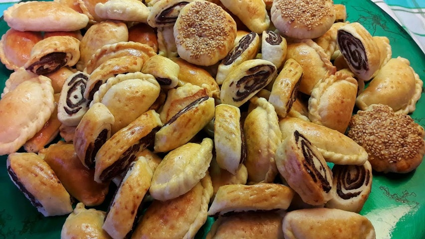

# Klicha

*Iraq's national cookie: a cardamom-scented dough wrapped around a spiced date paste, scored or moulded and baked pale gold.*

**Serves:** 8 (makes 30 cookies)

**Prep Time:** 45 minutes (plus 30 min resting)

**Cook Time:** 25 minutes

## Overview
Klicha are the Iraqi date-filled cookies of Eid, buttery cardamom-and-nigella dough wrapped around a spiced date paste, pressed into a patterned mould and baked pale gold, the cookies every Iraqi grandmother makes by the tin-load for the holidays. A buttery cardamom-and-nigella dough enriched with milk and a touch of yeast (the yeast gives a tender bite, not a rise) wraps around a soft date paste cooked down with butter, cardamom, cloves and cinnamon. Walnut-sized balls flatten, fill, fold and press into a klaicha mould (or score the top with the back of a fork in a herringbone pattern). Brush with egg yolk and sprinkle with sesame seeds. Bake at 180°C until pale gold (not brown; Iraqi klicha stay light, almost biscuit-coloured). Eat with cardamom tea or strong coffee.

## Ingredients

### Dough
- 500 g plain flour
- 200 g unsalted butter (softened)
- 100 g caster sugar
- 1 teaspoon ground cardamom
- ½ teaspoon ground nigella seeds (optional but classic)
- 1 teaspoon active dry yeast
- 200 ml whole milk (warm)
- 1 egg (large)
- ¼ teaspoon salt

### Date filling
- 400 g pitted dates (Iraqi or Medjool; chopped)
- 50 g unsalted butter
- 1 teaspoon ground cardamom
- ½ teaspoon ground cloves
- ½ teaspoon ground cinnamon
- 2 tablespoons sesame seeds (optional)

### Glaze
- 1 egg yolk (large, beaten with 1 tablespoon milk)
- 1 tablespoon sesame seeds (white or mixed white and black)

## Method

### Stage 1 - Date filling
1. Combine the dates, butter, cardamom, cloves and cinnamon in a small heavy pan over low heat.
2. Cook 5-8 minutes, mashing with a fork, until the dates are soft and the mixture is a smooth, thick paste.
3. Stir in the sesame seeds (if using). Cool.

### Stage 2 - Dough
1. Whisk the warm milk with the yeast and a pinch of the sugar; rest 5 minutes until frothy.
2. Cream the butter with the rest of the sugar in a large bowl until light.
3. Add the cardamom, nigella, salt and egg; beat to combine.
4. Pour in the milk-yeast mixture; stir.
5. Add the flour gradually, mixing to a soft, smooth dough (don't over-knead; just bring it together).
6. Cover; rest 30 minutes at warm room temperature.

### Stage 3 - Shape
1. Heat the oven to 180°C (160°C fan).
2. Divide the dough into 30 walnut-sized balls.
3. On a lightly floured surface, flatten each ball into a 7-8 cm disc.
4. Place a teaspoon of cooled date paste in the centre.
5. Bring the edges up and over the filling; pinch closed; smooth the seam.
6. Roll back into a ball; flatten gently to a 4 cm thick disc.
7. Press a klaicha mould onto the smooth side, or score the top in a herringbone pattern with the back of a fork or a small knife.

### Stage 4 - Bake
1. Place on lined baking sheets, 3 cm apart.
2. Brush the patterned tops with the egg-yolk glaze; sprinkle with sesame seeds.
3. Bake 18-22 minutes until pale gold (not browned; Iraqi klicha should look just-cooked, not deep amber).
4. Cool on the tray 5 minutes; transfer to a wire rack.

### Stage 5 - Serve
1. Eat warm or at room temperature with tea, coffee or a glass of cold milk.

## Notes
- **Date paste consistency:** Should be soft and spreadable, not stiff or crumbly. If the dates are dry, add a splash of milk while cooking.
- **Pale, not golden:** Klicha are baked light. Deep golden tops mean overbaked, dry cookies. The pattern is what catches the eye, not the colour.
- **Yeast not for rise:** The teaspoon of yeast tenderises the crumb; the cookie doesn't rise visibly. Don't skip it; the texture is markedly different without.
- **Mould or fork:** A traditional wooden klaicha mould gives the iconic Iraqi pattern; failing that, a small knife scoring a herringbone or grid pattern is the home alternative.

## Variations
- **Walnut filling (klicha bil-jouz):** Replace dates with 200 g finely chopped walnuts, 100 g sugar, 1 teaspoon cardamom and 1 tablespoon rose water. Festival version.
- **Coconut filling:** 200 g desiccated coconut, 100 g sugar, 4 tablespoons milk, 1 teaspoon cardamom, cooked to a sticky paste.
- **Ring shape (klicha aysh):** Form the dough into rings around the filling for a different traditional shape.

## Serving
- Serve with: cardamom tea (chai hel), Iraqi coffee, or a glass of cold milk.
- Occasion: Eid al-Fitr, Eid al-Adha, weddings, family tea-time, Ramadan iftar.
- Temperature: room temperature, or warmed for 1 minute in the oven.

## Storage
- Keeps 2 weeks in an airtight tin; the flavour deepens over the first 3 days.
- Freezes 2 months in a sealed bag; defrost at room temperature for 1 hour.
- Don't refrigerate; the dough firms and the cookies dry out.
