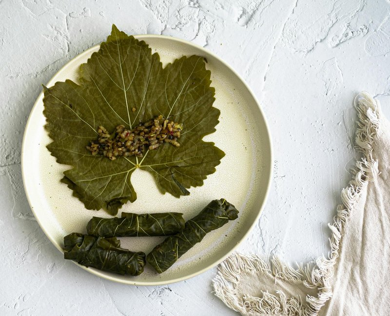

# Dolma Iraqi

*Iraq's mixed stuffed-vegetable feast: vine leaves, peppers, courgettes, aubergines and onions all packed with spiced lamb and rice, slow-simmered in tamarind broth.*

**Serves:** 6

**Prep Time:** 1 hour 30 minutes

**Cook Time:** 1 hour 30 minutes

## Overview
A filling of short-grain rice, lamb mince, onion, parsley, dill, mint, tomato puree, allspice, cumin, cinnamon, salt, pepper, olive oil. Vine leaves blanch; vegetables hollow out (cores reserved as the pot base layer). Each leaf and shell stuffs; arranged tightly in a wide pot lined with sliced tomato and reserved vegetable cores. Tamarind-pomegranate-lemon liquid poured halfway up. Cooked covered 1 hour 15 minutes on lowest heat.

## Ingredients

### Filling
- 400 g short-grain rice (rinsed, not pre-cooked)
- 400 g lamb mince
- 2 onions (very finely chopped)
- 4 tablespoons tomato puree
- 1 (200 g) tin chopped tomatoes
- 4 tablespoons fresh parsley (chopped)
- 3 tablespoons fresh dill (chopped)
- 3 tablespoons fresh mint (chopped)
- 1 ½ teaspoons ground allspice
- 1 teaspoon ground cumin
- ½ teaspoon ground cinnamon
- 1 ½ teaspoons salt
- 1 teaspoon ground black pepper
- 100 ml olive oil

### Vegetables (about)
- 30 fresh (or jarred vine leaves, rinsed)
- 6 peppers (small, capsicums, mix of colours)
- 4 courgettes (small, 5 cm pieces, cored)
- 4 aubergines (small, 4 cm pieces, cored)
- 4 onions (small, cored, layers separated for stuffing)
- 4 tomatoes (small, cored, top reserved as lid)

### Cooking liquid
- 3 tablespoons tamarind paste
- 3 tablespoons pomegranate molasses
- 2 lemons (juice)
- 4 tablespoons olive oil
- 2 garlic cloves (crushed)
- 1 teaspoon salt
- 1.2 litres hot water

## Method

### Stage 1 - Filling
1. Combine all filling ingredients in a wide bowl; mix thoroughly. Cover; rest 20 minutes.

### Stage 2 - Prep vegetables
1. Vine leaves: if fresh, blanch 30 seconds in boiling water. If jarred, rinse.
1. Peppers, courgettes, aubergines, onions, tomatoes: hollow out gently, keeping walls intact. Reserve the pulp.

### Stage 3 - Stuff
1. Each vegetable: pack a tablespoon of filling into the cavity, leaving 1 cm headspace for rice expansion.
1. Vine leaves: lay flat, vein-side up. Place a teaspoon of filling at the stem end; fold sides in; roll tight.

### Stage 4 - Pack
1. Line the bottom of a wide heavy pot with sliced tomato and the reserved vegetable cores (this prevents scorching).
1. Pack the stuffed vegetables and rolls tight in concentric layers. Stem-side or seam-side down.

### Stage 5 - Liquid
1. Whisk tamarind, pomegranate molasses, lemon, olive oil, garlic, salt with the hot water.
1. Pour over the dolma - should come halfway up the layers.

### Stage 6 - Weight and cook
1. Place a heatproof plate directly on the dolma to weight them down.
1. Cover the pot; bring to a simmer.
1. Reduce to the lowest heat; cook 1 hour 15 minutes.

### Stage 7 - Rest
1. Rest 15 minutes covered.

### Stage 8 - Invert and serve
1. (Optional showstopper) Invert the pot onto a wide platter so the layers tip out in a mound. Or lift out individually onto plates.
1. Drizzle some pot liquor over.
1. Eat with yogurt and lemon wedges.

## Notes
- **Pack tight:** Loose packing makes dolma float and unravel. Snug enough to hold each other.
- **Tamarind + pomegranate:** The Iraqi signature. The cooking liquid is sweet-sour-savoury and soaks up through the layers.
- **Weight matters:** The plate keeps everything submerged in the liquid.

## Storage
- Refrigerate 4 days; reheat covered.
- Freezes 2 months.
