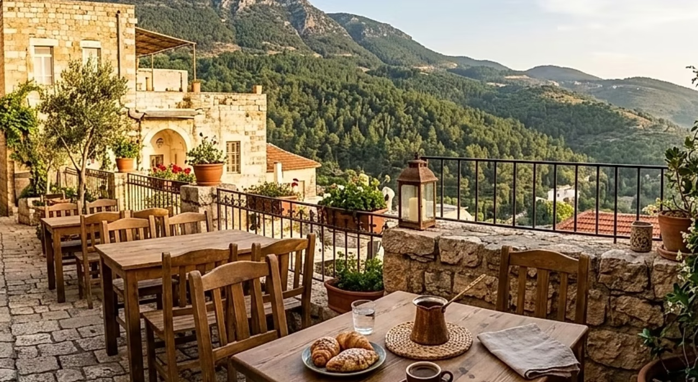

# Iraq Cuisine

Mesopotamian cooking with deep Persian, Ottoman, Bedouin and Levantine layers. Long-grain rice (timman) sits beside slow-cooked lamb (quzi), grilled river fish (masgouf), and stuffed vegetables (dolma). Baharat, dried lime, sumac and fresh herbs season; tahini, dates and pomegranate finish. The kebab and the dolma are universal; the date and the river fish are unmistakably Iraqi.
