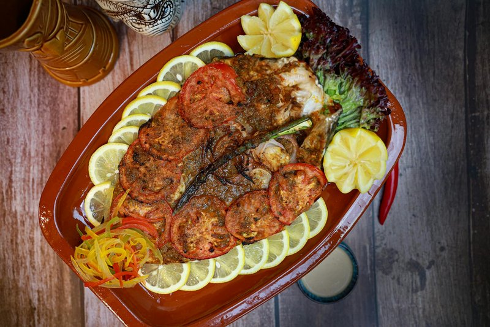

# Masgouf

*Iraq's national fish: a whole butterflied carp marinated in tamarind, olive oil and turmeric, slow-grilled vertically beside an open wood fire.*

**Serves:** 4

**Prep Time:** 25 minutes (plus 1 hour marinating)

**Cook Time:** 35 minutes

## Overview
Whole large fish butterflies open (a long cut down the back, leaving the belly attached). Marinated with olive oil, tamarind paste, lemon, garlic, salt, turmeric. Set skin-side down on a baking tray; grilled / roasted at very high heat 25-30 minutes until the flesh is opaque and the skin charred. Topped with sliced tomato, onion and parsley in the last 8 minutes.

## Ingredients

- 1 whole large freshwater fish (1.4-1.8 kg - carp, perch, sea bass or trout) - butterflied (ask the fishmonger to remove the spine and open it flat, skin still on)
- 4 tablespoons olive oil
- 2 tablespoons tamarind paste (concentrate)
- 1 lemon (juice)
- 6 garlic cloves (crushed)
- 1 teaspoon ground turmeric
- 1 teaspoon ground cumin
- 1 ½ teaspoons salt
- 1 teaspoon ground black pepper
- 1 onion (large, sliced)
- 2 tomatoes (large, sliced)
- 1 small bunch fresh parsley (chopped)
- 1 lemon (cut into wedges)

## Method

### Stage 1 - Marinade
1. Whisk olive oil, tamarind, lemon juice, garlic, turmeric, cumin, salt, pepper in a bowl.

### Stage 2 - Prep fish
1. Pat fish dry. Score the flesh side in a 3 cm crosshatch.
1. Lay flesh-side up on a foil-lined baking tray.
1. Brush the marinade generously over the flesh, into the scores.
1. Rest 1 hour.

### Stage 3 - Grill
1. Heat oven to 240°C (220°C fan) with the top rack high under the grill.
1. Place the tray under the grill 18 minutes.

### Stage 4 - Top
1. Lay the sliced tomato and onion over the surface of the fish.
1. Drizzle with another tablespoon of olive oil.
1. Grill another 8-10 minutes - vegetables soften, fish is fully cooked, skin charred where exposed.

### Stage 5 - Serve
1. Scatter parsley; lemon wedges alongside.
1. Set the whole fish on the table; eat with hot flatbread, picking the flesh in chunks.

## Notes
- **Butterfly properly:** The fishmonger needs to remove the spine and most bones, leaving a flat fish with the skin intact. Without this it's a different dish.
- **Tamarind is signature:** The sour-fruity note distinguishes Iraqi masgouf from any other grilled fish. Don't substitute lemon alone.
- **Open-fire ideal:** A BBQ with offset wood-fire heat (vertical-grill style) gives the most authentic result. Oven grill at full heat is the home compromise.

## Storage
- Best eaten same day. Refrigerate 2 days; eat cold or warm gently.
