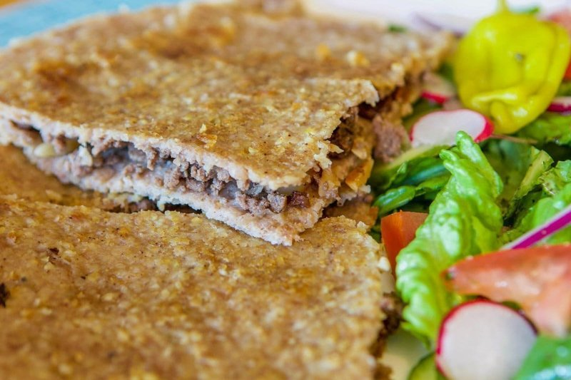

# Kibbeh Mosul

*The Mosul-style kibbeh: large flat disks rather than the small torpedoes of Levantine kibbeh, with a bulgur shell rolled thin and a spiced lamb-and-pine-nut filling inside. Baked on a tray, drizzled with samna, sliced into wedges. Less fiddly than torpedo kibbeh, just as deeply flavoured.*

**Serves:** 6

**Prep Time:** 1 hour (plus 30 minutes bulgur soaking)

**Cook Time:** 35 minutes

## Overview
Fine bulgur soaks for 30 minutes. Lamb mince blends with bulgur, grated onion, allspice, salt to a smooth paste. Filling: lamb mince cooked with onion, garlic, allspice, pine nuts and pomegranate molasses, cooled. Half the shell paste spreads in a wide oiled baking tin; filling spreads over; remaining shell paste tops it. Scored into diamonds; drizzled with samna; baked for 30 minutes.

## Ingredients

### Shell
- 300 g fine bulgur (#1 grade)
- 400 g lamb mince (lean)
- 1 onion (medium, grated, juices reserved)
- 1 ½ teaspoons ground allspice
- ½ teaspoon ground black pepper
- 1 ½ teaspoons salt
- 2-4 tablespoons ice water (as needed)

### Filling
- 250 g lamb mince
- 2 tablespoons olive oil
- 1 onion (medium, finely chopped)
- 3 garlic cloves (crushed)
- 1 ½ teaspoons [Baharat](../../../base-ingredients/spices/baharat.md)
- 40 g pine nuts (toasted)
- 2 tablespoons pomegranate molasses
- 1 teaspoon salt
- ½ teaspoon ground black pepper
- 2 tablespoons fresh parsley (chopped)

### To finish
- 4 tablespoons samna (or melted butter, for drizzling)

## Method

### Stage 1 - Bulgur
1. Rinse fine bulgur; cover with cold water; soak 30 minutes; drain; squeeze dry.

### Stage 2 - Filling
1. Heat oil; brown 250 g lamb mince hard.
1. Add onion; cook 5 minutes.
1. Add garlic and baharat; cook 30 seconds.
1. Splash 60 ml water; simmer 4 minutes until dry.
1. Off heat, stir in pine nuts, pomegranate molasses, salt, pepper, parsley.
1. Cool completely.

### Stage 3 - Shell paste
1. In a food processor, blitz soaked bulgur, 400 g lamb mince, grated onion (with juices), allspice, pepper and salt to a smooth paste. Add ice water 1 tablespoon at a time as needed.
1. Knead briefly by hand into a smooth pliable paste.

### Stage 4 - Layer
1. Heat oven to 200°C (180°C fan).
1. Oil a 25 x 25 cm baking tin.
1. Press half the shell paste in a 1 cm even layer across the base.
1. Spread the cooled filling evenly over.
1. Roll the remaining shell paste between 2 cling-film sheets to a 25 cm square; lay on top.
1. Wet your fingers; press the edges firmly to seal.

### Stage 5 - Score and bake
1. With a sharp knife, score into diamonds (4 cuts horizontally, 4 cuts diagonally - wedge pieces 5 cm wide).
1. Press a pine nut into the centre of each diamond (optional).
1. Drizzle samna over the surface.
1. Bake 30 minutes until deep gold.

### Stage 6 - Rest
1. Rest 10 minutes; cut along the score lines into diamond pieces.

### Stage 7 - Serve
1. Eat warm with yogurt and a salata baladi or fattoush.

## Notes
- **Fine bulgur grade #1:** Coarse bulgur won't make a smooth shell. Look for the very fine grade at Middle Eastern shops.
- **Ice water for paste:** Keeps the meat cold and gives a smooth elastic shell. Don't use warm water.
- **Score before baking:** Cuts through the top layer only - easier to portion later without crushing.

## Storage
- Refrigerate 3 days; reheat at 180°C 10 minutes.
- Freeze (baked) 2 months; reheat from frozen at 180°C 30 minutes.
