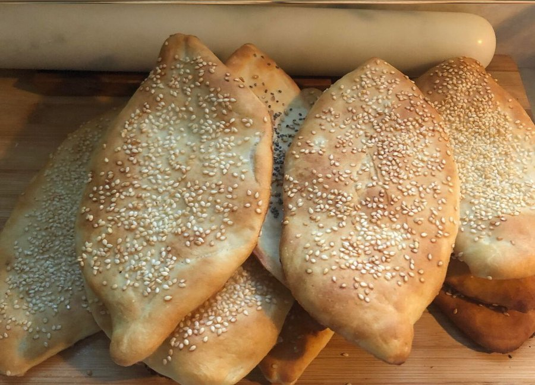

# Samoon

*Iraq's everyday bread: small football-shaped white rolls with a chewy crumb and a crisp gold crust, scored along the length so they split cleanly.*

**Serves:** 6 (makes 8 rolls)

**Prep Time:** 25 minutes (plus 1 hour 30 minutes rising)

**Cook Time:** 18 minutes

## Overview
Samoon is the Iraqi everyday bread, football-shaped pointed-end loaves with a deep slash down the top that opens into a glossy crust during baking, the sandwich bread of Baghdad and Mosul. A yeasted bread dough (bread flour, yeast, sugar, salt, oil, warm water) first-rises for an hour. Divide into eight portions; each rolls into an oval football shape, pointed at both ends. Slash lengthways with a sharp knife or razor. Second rise for twenty-five minutes. Bake at 220°C with steam (a tray of hot water at the bottom of the oven) until deep gold and the slash has opened. Eat warm with hummus, falafel, or stuffed with quzi lamb.

## Ingredients

- 500 g strong white bread flour
- 1 sachet (7 g) fast-action yeast
- 1 ½ teaspoons salt
- 1 tablespoon caster sugar
- 2 tablespoons olive oil
- 320 ml warm water
- 200 ml hot water (for steam in the oven)

## Method

### Stage 1 - Dough
1. Whisk flour, yeast, salt, sugar.
1. Add olive oil and warm water; mix to a soft dough.
1. Knead 10 minutes until smooth and elastic.
1. Cover; rise 1 hour until doubled.

### Stage 2 - Shape
1. Knock back; divide into 8 portions (about 90 g each).
1. Shape each into a football oval - taper both ends.
1. Place on a lined baking tray, spaced 4 cm apart.
1. Slash lengthways down the middle of each with a sharp knife, 5 mm deep.

### Stage 3 - Rise
1. Cover loosely; rise 25 minutes.

### Stage 4 - Heat oven
1. Heat oven to 220°C (200°C fan).
1. Place an empty tray on the bottom rack.

### Stage 5 - Bake with steam
1. Just before putting the bread in, pour 200 ml hot water into the empty bottom tray (creates steam).
1. Slide the bread tray onto the middle rack.
1. Bake 16-18 minutes until deep gold and the slashes have opened.

### Stage 6 - Cool
1. Cool 5 minutes on a wire rack.

### Stage 7 - Serve
1. Eat warm. The slash is the natural opening for stuffing.

## Notes
- **Football shape:** Tapered ends are signature. Round rolls are just bread; samoon is the diamond / lemon shape.
- **Steam in the oven:** Gives the crisp crust. Skip and the crust goes soft.
- **Slash deep enough:** A shallow slash doesn't open in the bake. A deep one (5 mm) blooms nicely.

## Storage
- Best fresh. Wrap and keep 24 hours at room temperature.
- Refresh 3 minutes in a hot oven.
- Freeze 1 month.
