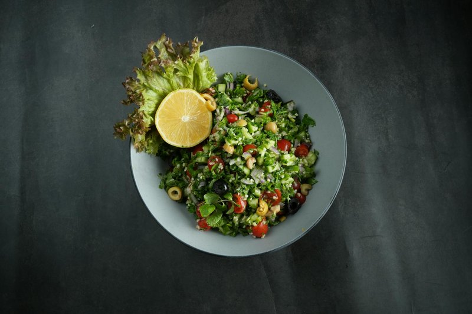

# Tabbouleh Iraqi

*The Iraqi take on tabbouleh: heavier on the bulgur than Lebanese tabbouleh (which is herb-led), with diced tomato, cucumber, parsley, mint, spring onion and a generous pomegranate-lemon dressing. Eat as a side or part of a wider mezze.*

**Serves:** 4 as a side

**Prep Time:** 25 minutes (plus 20 minutes soaking)

**Cook Time:** 0 minutes

## Overview
Iraqi tabbouleh is the Iraqi-Levantine bulgur salad, more grain-heavy than its Lebanese cousin (which is mostly herbs) and dressed with pomegranate molasses for the signature sweet-sour edge. Fine bulgur soaks in just enough boiling water to absorb (no draining). Parsley, mint, tomato, cucumber and spring onion chop fine. Combined with the swollen bulgur. Dressed with olive oil, lemon, pomegranate molasses, salt, allspice and pepper. Eat as a starter or beside any Iraqi main; better the day it's made.

## Ingredients

- 80 g fine bulgur (#1 grade)
- 120 ml boiling water (for soaking)
- 2 tomatoes (medium, deseeded, fine dice)
- 1 cucumber (medium, deseeded, fine dice)
- 4 spring onions (sliced thin)
- 1 large bunch fresh parsley (60 g, very finely chopped)
- ½ small bunch fresh mint (20 g, very finely chopped)
- 4 tablespoons olive oil
- 1 lemon (juice)
- 1 tablespoon pomegranate molasses
- 1 teaspoon salt
- ½ teaspoon ground allspice
- ½ teaspoon ground black pepper

### To finish
- 2 tablespoons pomegranate seeds (optional)

## Method

### Stage 1 - Bulgur
1. Place bulgur in a small bowl.
1. Pour boiling water over; cover; leave 20 minutes until water is absorbed and bulgur is tender.
1. Fluff with a fork. (No need to drain.)

### Stage 2 - Chop
1. Dice tomato and cucumber fine (deseed both).
1. Slice spring onions thin.
1. Chop parsley and mint as fine as you can - the herbs are central.

### Stage 3 - Combine
1. In a wide bowl, combine soaked bulgur, all chopped vegetables and herbs.

### Stage 4 - Dress
1. Whisk olive oil, lemon, pomegranate molasses, salt, allspice, pepper.
1. Pour over the salad; toss thoroughly.
1. Rest 10 minutes for flavours to mingle.

### Stage 5 - Serve
1. Tip into a serving bowl; scatter pomegranate seeds if using.
1. Eat with grilled lamb, kibbeh, or alongside any mezze.

## Notes
- **Bulgur heavier than Lebanese:** Iraqi tabbouleh leans more on bulgur than the herb-led Lebanese version. Both versions are right; this is Iraqi.
- **Fine chop matters:** The herbs and vegetables should be small enough to scoop with a piece of bread.
- **Pomegranate molasses is the signature:** Don't substitute.

## Storage
- Refrigerate 1 day. Better same day; the vegetables soften.
