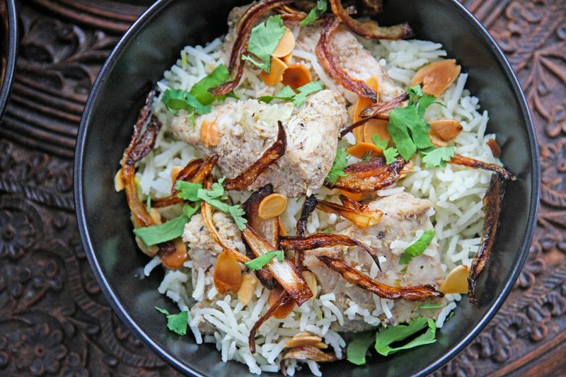

# Timman Bagilla

*Iraq's broad-bean rice: basmati cooked with dill, broad beans, butter and a pinch of saffron. Bright green, fragrant, fluffy. Eaten with grilled lamb, masgouf or any rich Iraqi stew. Distinct from Persian baghali polo (Persian uses long stages of par-boil-then-steam; Iraqi version is simpler absorption-style cooking).*

**Serves:** 4

**Prep Time:** 10 minutes (plus 20 minutes soaking)

**Cook Time:** 25 minutes

## Overview
Basmati rinses and soaks for 20 minutes. Cooked frozen broad beans (or shelled fresh) heat through with butter and a knob of dill. Rice cooks absorption-style in stock with saffron, broad beans, dill folded in halfway through. Rest for 5 minutes; fluff.

## Ingredients

- 400 g basmati rice
- 1 large pinch saffron threads (bloomed in 2 tablespoons hot water)
- 4 tablespoons unsalted butter (or samna)
- 300 g frozen broad beans (no need to thaw - use double-podded for best texture)
- 1 onion (small, finely chopped, optional)
- 1 ½ teaspoons salt
- 750 ml hot stock (or stock substitute)
- 4 tablespoons fresh dill (chopped)
- 3 tablespoons fresh parsley (chopped)
- ½ teaspoon ground black pepper

## Method

### Stage 1 - Rinse and soak rice
1. Rinse rice in 3 changes of cold water; soak 20 minutes; drain.

### Stage 2 - Toast
1. Melt 2 tablespoons butter in a heavy pot.
1. Soften onion (if using) 4 minutes.
1. Add rice; toast 1 minute, stirring.

### Stage 3 - Cook
1. Pour in saffron water and hot stock; add salt.
1. Bring to a boil; stir once; reduce to lowest heat.
1. Cover tightly; cook 8 minutes.

### Stage 4 - Add beans and dill
1. Open the lid briefly; scatter broad beans and half the dill over the top of the rice.
1. Cover; cook another 10 minutes undisturbed.

### Stage 5 - Rest
1. Rest 5 minutes off heat (lid on).

### Stage 6 - Finish
1. Drop in the remaining butter, remaining dill, parsley and pepper.
1. Fluff with a fork to combine.

### Stage 7 - Serve
1. Tip into a wide warm bowl; serve alongside grilled lamb, fish or stew.

## Notes
- **Double-podded beans best:** Frozen beans have a tough outer skin; pinching them out gives a bright-green tender bean. Worth the effort for company.
- **Saffron not turmeric:** Saffron gives the colour and the perfume. Turmeric is wrong here.
- **Fresh dill plenty:** This is a dill-rice. Don't reduce; it's the dominant herb.

## Storage
- Refrigerate 3 days; reheat covered with a splash of water.
