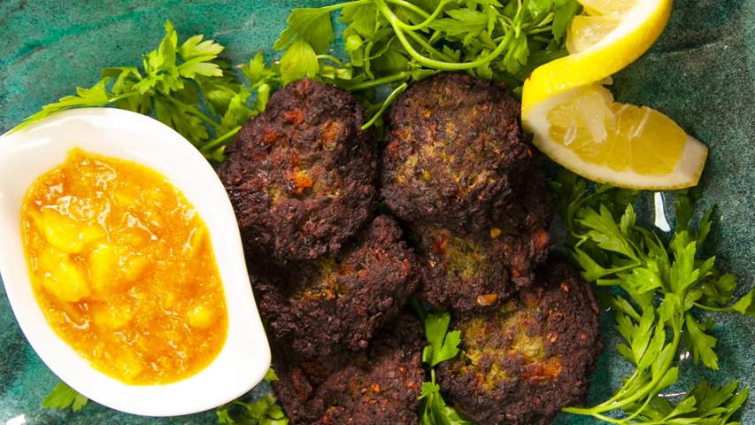

# Aroog

*An Iraqi family-table fritter: fine bulgur soaked, mixed with minced lamb, onion and a heap of herbs, then pan-fried as thin crisp-edged discs.*

**Serves:** 4 (makes 12 aroog)

**Prep Time:** 25 minutes (plus 30 min soaking)

**Cook Time:** 25 minutes

## Overview
Aroog are the Iraqi spiced meat-and-bulgur patties, flat discs of mince, bulgur and herbs cooked on a hot pan, the snack and street food sold from carts across Baghdad and Basra. Fine bulgur (#1 grade) soaks in hot water until soft and fluffy. Lamb or beef mince mixes with the bulgur, grated onion, lots of chopped parsley and coriander, ground baharat, cumin and a pinch of cinnamon. The mixture should be soft enough to spread; if it's too dry the aroog crumble. Press small portions onto a hot oiled pan and flatten to 1 cm thick discs; cook for four to five minutes per side over medium heat until deeply browned and the meat is just cooked through. Lift, drain briefly, eat hot with lemon and yogurt.

## Ingredients

### Aroog
- 200 g fine bulgur (#1 grade; not coarse)
- 250 ml water (just-boiled)
- 400 g lamb (or beef mince, 15-20% fat; leaner gives dry aroog)
- 1 onion (large, grated, with juice)
- 4 garlic cloves (finely chopped)
- 1 small handful flat-leaf parsley (chopped fine, about 25 g)
- 1 small handful coriander leaves (chopped fine, about 25 g)
- 4 spring onions (finely chopped)
- 1 green chilli (deseeded, finely chopped; optional)
- 1 ½ teaspoons [Baharat](../../../base-ingredients/spices/baharat.md) (Iraqi seven-spice mix)
- 1 teaspoon ground cumin
- ½ teaspoon ground coriander
- ¼ teaspoon ground cinnamon
- ½ teaspoon black pepper
- 1 ½ teaspoons salt
- 1 egg (large, lightly beaten)
- 1 tablespoon plain flour (if the mix is loose)

### To pan-fry
- 4-5 tablespoons vegetable oil (or sunflower oil)

### To serve
- Lemon wedges
- Thick yoghurt
- Pickled turnips (or amba)

## Method

### Stage 1 - Soak bulgur
1. Place the bulgur in a bowl; pour over the just-boiled water.
2. Cover with a plate; rest 25-30 minutes until the bulgur has absorbed all the water and softened.
3. Fluff with a fork; cool a few minutes.

### Stage 2 - Mix
1. Combine the mince, grated onion (and its juice), garlic, parsley, coriander, spring onions, chilli, baharat, cumin, coriander, cinnamon, pepper, salt and egg in a large bowl.
2. Add the cooled bulgur.
3. Mix by hand, kneading lightly for 1-2 minutes, the mince should bind smoothly with the bulgur.
4. If the mixture feels loose, add the tablespoon of flour.
5. Test: pinch a small piece into a 1 cm patty between damp palms; it should hold its shape with no cracks. Adjust with a splash of water if dry, or more flour if wet.
6. Rest 10 minutes.

### Stage 3 - Pan-fry
1. Heat 2 tablespoons of the oil in a wide non-stick or cast-iron pan over medium heat.
2. Dampen your hands lightly with cold water.
3. Shape 4 portions per batch into 7-8 cm discs, 1 cm thick.
4. Place straight in the pan.
5. Cook 4-5 minutes undisturbed until the underside is deep brown.
6. Flip carefully (use a spatula; aroog are softer than burgers).
7. Cook the second side 4 minutes.
8. Lift onto kitchen paper.
9. Wipe the pan; add more oil; cook the rest in batches.

### Stage 4 - Serve
1. Pile the aroog on a warm plate.
2. Squeeze lemon over.
3. Serve with thick yoghurt for dipping; pickled turnips and amba alongside.

## Notes
- **Fine bulgur only:** The #1 fine bulgur softens with hot-water soaking and binds the mince. Coarse bulgur (#3 or #4) stays gritty.
- **Grate the onion:** Don't chop. The juice from grated onion seasons and tenderises the meat, while the pulp blends invisibly into the mix. Chopped onion gives bitter wet pockets.
- **Medium heat, full crust:** The mix is wet enough that a high heat sets the outside before the inside cooks; the result is raw centres. Medium for the slow brown.
- **Damp hands:** The mix is sticky. Wet palms prevent it clinging.

## Variations
- **Vegetarian aroog:** Replace the meat with 400 g cooked brown lentils (mashed), 1 grated carrot and an extra tablespoon of flour. The texture is softer but the result is good.
- **Stuffed aroog:** Press a teaspoon of caramelised onion and pine nut into the centre of each disc before sealing. Festive version.
- **Oven-baked:** Place on a lined tray; brush both sides with oil; bake at 220°C for 18 minutes, flipping halfway. Lighter, less crisp.

## Serving
- Serve with: lemon wedges, thick yoghurt, pickled turnips, amba, samoon bread.
- As a meal: folded into samoon with sliced tomato, parsley and tahini-yoghurt sauce.
- Temperature: hot from the pan.

## Storage
- Keeps 2 days refrigerated; reheat at 180°C oven for 6 minutes.
- Cooked aroog freeze 1 month; defrost overnight and reheat as above.
- The raw mix keeps 24 hours refrigerated under cling film.
