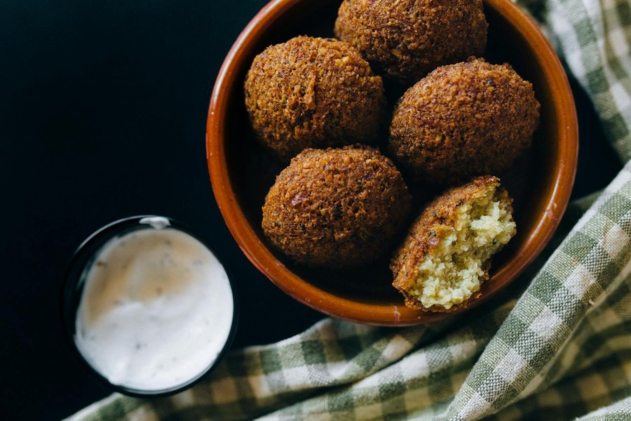

# Iraqi Falafel

*Iraq's lighter falafel: soaked chickpeas blitzed with cardamom and a heap of fresh herbs, deep-fried fluffy and stuffed into samoon bread.*

**Serves:** 4 (makes 16 falafel)

**Prep Time:** 30 minutes (plus 24 hours soaking, plus 30 min chilling)

**Cook Time:** 15 minutes

## Overview
Dried chickpeas soak in cold water 24 hours, the long soak hydrates them fully without cooking. Once drained, they are ground with onion, garlic, fresh coriander, parsley, dill, green chilli, cumin, coriander seed and ground cardamom to a coarse pale-green crumb. Bicarbonate of soda adds at the last minute for the open, fluffy interior. The mix chills for 30 minutes; small patties form; deep-fry at 175°C for 3 minutes until deep gold outside, fluffy and bright green inside. Eaten in warm samoon with the trimmings.

## Ingredients

### Falafel
- 250 g dried chickpeas (soaked in plenty of cold water 24 hours; not tinned)
- 1 medium onion (roughly chopped)
- 4 garlic cloves
- 1 green chilli (deseeded for mild, kept for hot)
- 1 large handful flat-leaf parsley (about 30 g)
- 1 large handful coriander leaves (about 30 g)
- 1 small handful dill (about 15 g)
- 2 teaspoons ground cumin
- 1 teaspoon ground coriander
- ½ teaspoon ground cardamom (the Iraqi signature)
- ½ teaspoon black pepper
- 1 ½ teaspoons salt
- 1 tablespoon sesame seeds (optional, for texture)
- 1 tablespoon plain flour or chickpea flour
- ¾ teaspoon bicarbonate of soda (added just before frying)

### Tahini-yoghurt sauce
- 4 tablespoons tahini
- 4 tablespoons thick yoghurt
- 2 tablespoons lemon juice
- 1 garlic clove (crushed)
- Salt
- A tablespoon or two of cold water (to loosen)

### To serve
- 4 warm samoon (or pita / khobz)
- 2 tomatoes (sliced)
- 1 small cucumber (sliced)
- 1 small red onion (thinly sliced)
- 4 tablespoons amba (Iraqi mango pickle; optional but signature)
- 1 small handful parsley
- 1 teaspoon sumac

### To fry
- 1 litre vegetable or sunflower oil

## Method

### Stage 1 - Soak (the day before)
1. Cover the chickpeas with cold water by at least 5 cm; they more than double in size.
2. Soak 24 hours at room temperature (or 36 in the fridge in summer).
3. Drain and pat dry. Do not cook - cooked chickpeas give a wet, gummy falafel.

### Stage 2 - Process
1. Combine the drained chickpeas, onion, garlic, chilli, herbs, cumin, coriander, cardamom, pepper, salt and sesame seeds in a food processor.
2. Pulse in short bursts, scraping down, until the mixture is fine and even but still has a coarse couscous-like texture (not a paste).
3. Add the flour; pulse once more.
4. Tip into a bowl; cover; chill 30 minutes (firms up; easier to shape).

### Stage 3 - Sauce
1. Whisk the tahini with the lemon juice; it will seize and look broken.
2. Add the cold water a tablespoon at a time, whisking, until smooth and the colour pales.
3. Whisk in the yoghurt, garlic and a generous pinch of salt.
4. Taste; adjust.

### Stage 4 - Shape
1. Sprinkle the bicarbonate of soda over the chilled mix; fold in evenly with a fork.
2. Shape walnut-sized patties (about 35 g each), pressing firmly so they hold.
3. Place on a tray.

### Stage 5 - Fry
1. Heat the oil to 175°C in a deep pan.
2. Lower 4 falafel in at a time.
3. Fry 3-3 ½ minutes, turning once, until deep gold and crisp.
4. Cut one open to check: the inside should be bright green, fluffy and cooked through.
5. Lift onto kitchen paper.

### Stage 6 - Build
1. Slit each warm samoon to open without splitting in half.
2. Spread a spoonful of tahini-yoghurt inside.
3. Stuff with 3-4 falafel; crush gently with a fork.
4. Add sliced tomato, cucumber, red onion.
5. Drizzle with more sauce; spoon over the amba.
6. Scatter parsley and a pinch of sumac.

## Notes
- **Cardamom is the Iraqi marker:** ½ teaspoon ground cardamom is what makes this Iraqi rather than Lebanese or Egyptian falafel. Worth measuring carefully; too much and it tips into sweet.
- **Dried, not cooked, chickpeas:** The long-soaked raw chickpea is non-negotiable. Cooked or tinned chickpeas turn to mush in the fryer.
- **Bicarbonate at the last minute:** Added too early it deflates. Fold in just before shaping.
- **Amba pairing:** Iraqi falafel in samoon without amba is incomplete; the sour-sweet-mango pickle is the signature condiment.

## Variations
**Baked:** Brush with oil; bake at 220°C for 18 minutes, turning once. Lighter but the texture is denser.
**With chickpea flour crust:** Roll each shaped patty in chickpea flour before frying for an extra-crisp crust.
**Green falafel:** Double the parsley and add 50 g spinach for a deep-green Iraqi-style.

## Serving
Serve in: warm samoon (Iraqi bread) with tahini-yoghurt, amba, sliced tomato, cucumber, red onion, parsley, sumac.
Alternative: as a mezze plate with hummus, baba ganoush, pickles, flatbread.
Drink: salted lassi, lemonade with mint, or strong black tea with cardamom.

## Storage
- Best within 30 minutes of frying.
- Uncooked falafel mix keeps 24 hours refrigerated (add bicarbonate of soda only before shaping).
- Shaped raw falafel freeze 2 months; fry from frozen at 170°C for 4 minutes.
- Cooked falafel reheat at 200°C oven for 6 minutes; never microwave.
