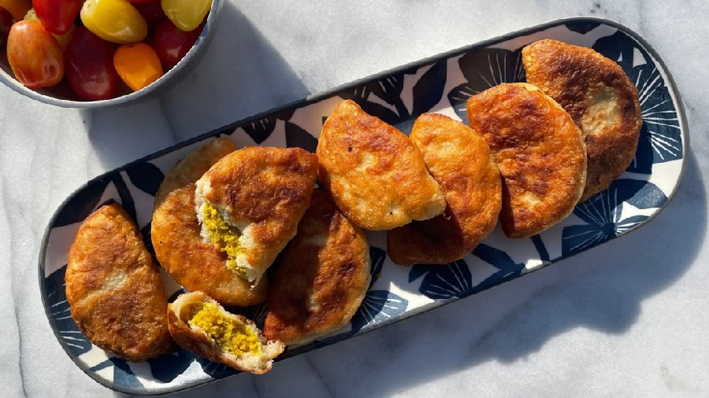

# Sambusak

*The Iraqi-Jewish half-moon: a thin oil dough wrapped around spiced chickpeas and caramelised onion, fried or baked with sesame.*

**Serves:** 6 (makes 18 sambusak)

**Prep Time:** 45 minutes (plus 30 min dough rest)

**Cook Time:** 20 minutes

## Overview
A simple flour-oil-water dough with a little turmeric for colour rests briefly while the filling cooks down. Cooked chickpeas are pulsed (not pureed) with caramelised onion, cumin, sumac and parsley. Dough rolls to 3 mm; cut in rounds; spoon in filling; fold to half-moon; crimp with a fork or twist a rope edge. Either deep-fried at 175°C until amber-gold, or brushed with egg, sprinkled with sesame and baked at 200°C. The texture is half-pastry, half-cracker, and the filling is dry and warmly spiced.

## Ingredients

### Dough
- 350 g plain flour
- ¾ teaspoon salt
- ¼ teaspoon ground turmeric
- 100 ml sunflower oil (or olive oil)
- 130-150 ml warm water

### Filling
- 250 g cooked chickpeas (drained; tinned is fine, rinsed)
- 2 tablespoons olive oil
- 1 onion (large, finely chopped)
- 3 garlic cloves (crushed)
- 1 ½ teaspoons ground cumin
- 1 teaspoon ground coriander
- 1 teaspoon sumac
- ½ teaspoon ground turmeric
- ½ teaspoon black pepper
- A pinch of cinnamon
- 1 teaspoon salt
- 1 small handful parsley (chopped)
- ½ lemon (juice)

### To finish (baked version)
- 1 egg yolk (beaten with 1 tablespoon milk)
- 2 tablespoons sesame seeds

### To fry (alternative)
- 1 litre vegetable oil

## Method

### Stage 1 - Dough
1. Whisk the flour, salt and turmeric in a bowl.
2. Pour in the oil; rub through with your fingertips until the mixture resembles damp sand.
3. Add the warm water gradually, mixing, to a soft but firm dough.
4. Knead 2-3 minutes on the counter until smooth.
5. Wrap; rest 30 minutes.

### Stage 2 - Filling
1. Heat the olive oil in a wide pan over medium heat.
2. Cook the onion 10-12 minutes until deeply caramelised, stirring often.
3. Add the garlic; cook 1 minute.
4. Add the cumin, coriander, sumac, turmeric, black pepper and cinnamon; toast 30 seconds.
5. Add the chickpeas; mash roughly with a fork (or pulse 4-5 times in a processor; keep some texture).
6. Stir in the salt, parsley and lemon juice.
7. Taste; adjust seasoning. Cool fully.

### Stage 3 - Shape
1. Divide the dough into 3 portions; cover the rest while you work.
2. Roll one portion on a lightly floured surface to 3 mm.
3. Cut 9 cm rounds (a small bowl works well).
4. Place a heaped teaspoon of filling on each round.
5. Brush the edge with water; fold to a half-moon; press firmly.
6. Crimp with a fork; or pinch and roll the edge into a small rope.
7. Re-roll scraps once; repeat with the remaining dough.

### Stage 4 - Cook (choose one)
**Baked**:
1. Heat the oven to 200°C (180°C fan).
2. Place on a lined tray; brush with the egg wash; sprinkle generously with sesame seeds.
3. Bake 18-22 minutes until deep golden.

**Fried**:
1. Heat the oil to 175°C.
2. Fry 4-5 at a time, 90 seconds per side, until amber-gold.
3. Lift onto kitchen paper.

### Stage 5 - Serve
1. Cool 5 minutes (the filling is very hot).
2. Eat warm, with a small bowl of lemon wedges and a side of pickled turnips or amba.

## Notes
- **Caramelise the onion deeply:** Iraqi sambusak filling depends on the sweetness of properly browned onion. Pale, soft onion makes a flat filling.
- **Dry filling matters:** A wet filling weeps through the dough and splits the seam. The chickpeas should hold a shape on a spoon.
- **Sumac and cumin:** The signature Iraqi-Jewish flavour. Don't substitute zaatar; it's a different dish.
- **Fried vs baked:** Fried is the traditional festive version; baked is everyday and lighter.

## Variations
**Meat sambusak (sambusak basha):** Replace chickpea filling with 250 g lamb mince browned with onion, baharat and pine nuts. Common in Iraqi Muslim households.
**Cheese sambusak (sambusak jibneh):** Mix 200 g feta with 100 g grated halloumi, an egg yolk and chopped parsley. Lighter, melty.

## Serving
Serve with: pickled turnips (lift), amba (Iraqi mango pickle), or a simple cucumber-tomato salad with lemon.
Temperature: warm, ideally within 1 hour of cooking.
Occasion: Shabbat, brises, Hanukkah, festival mezze.

## Storage
- Keeps 3 days refrigerated; reheat at 200°C oven for 6-8 minutes (never microwave).
- Filled raw sambusak freeze 2 months on a tray then bagged; bake from frozen at 200°C for 25 minutes, or fry from frozen at 170°C for 4 minutes per side.
