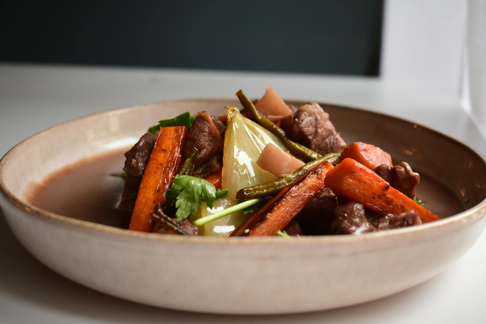

# Beef and Guinness Stew

*The St. Patrick's Day pot. Chunks of beef browned hard, simmered slow in a sauce thickened by stout and sweetened by long-cooked onions, with carrots, potatoes and pearl barley. The smell of malt and bay leaf in the kitchen all afternoon.*

**Serves:** 6

**Prep Time:** 20 minutes

**Cook Time:** 2 hours 30 minutes

## Overview
Chuck steak in big chunks, dredged in seasoned flour and browned in batches in a heavy pot until properly dark. Onions cooked low and slow in the same pot to draw out their sugar. The beef returned, a bottle of Guinness poured over with stock and a spoon of treacle, brought to a simmer and tucked into a low oven for two hours. The last half-hour gets carrots, potatoes and a handful of pearl barley to thicken the broth. Finished with parsley and a chunk of soda bread for mopping.

## Ingredients

- 1 kg beef chuck (cut into 5 cm chunks)
- 3 tablespoons plain flour (seasoned with salt and pepper)
- 3 tablespoons sunflower oil
- 50 g unsalted butter
- 3 large onions (sliced)
- 4 garlic cloves (crushed)
- 2 tablespoons tomato purée
- 1 tablespoon black treacle
- 500 ml Guinness or other stout
- 500 ml beef stock
- 2 bay leaves
- 1 sprig of thyme
- 4 medium carrots (peeled, cut into thick rounds)
- 600 g floury potatoes (peeled, cut into 3 cm chunks)
- 60 g pearl barley (rinsed)
- Fine sea salt and black pepper
- A small handful of flat-leaf parsley (chopped, to finish)

## Method

### Stage 1 - Brown the beef
1. Heat the oven to 150°C fan / 170°C / 340°F.
2. Pat the beef chunks dry with kitchen paper. Toss in the seasoned flour, shaking off the excess.
3. Heat 2 tablespoons of the oil in a heavy ovenproof pot or Dutch oven over a medium-high heat. Brown the beef in 3-4 batches, 4-5 minutes per batch, until each side has a proper dark crust. Crowding the pan steams the meat — leave space and turn each piece. Lift each batch onto a plate as it browns.

### Stage 2 - Cook the onions
1. Drop the heat to medium-low. Add the butter and remaining oil to the pot. When the butter melts, tip in the onions and a good pinch of salt.
2. Cook for 18-20 minutes, stirring every few minutes, until the onions have collapsed and turned a deep golden brown. This step makes the stew; rushed pale onions give a thin-tasting sauce.
3. Add the garlic and tomato purée. Stir for 2 minutes until the purée darkens.

### Stage 3 - Build the stew
1. Return the beef and any resting juices to the pot. Stir in the treacle.
2. Pour over the Guinness — it will foam — and bring to a low boil for 2 minutes. Add the stock, bay leaves and thyme. The beef should be just covered; top up with hot water if not.
3. Cover with the lid and slide into the oven. Cook for 1 hour 30 minutes.

### Stage 4 - Add the vegetables
1. Take the pot out of the oven. Stir in the carrots, potatoes and pearl barley.
2. Return to the oven, uncovered for the last half hour to reduce the broth, for 45 minutes to 1 hour, until the beef is fork-tender, the potatoes and carrots are cooked, and the barley has plumped and thickened the sauce.

### Stage 5 - Finish
1. Fish out the bay leaves and thyme stalk. Taste: the stout brings bitterness, the treacle and onions push back with sweetness — adjust salt to balance.
2. Scatter with chopped parsley just before serving.

## Notes
- Chuck (also called braising or stewing steak) is the right cut: it has the connective tissue that breaks down over the long cook into rich, silky sauce. Lean cuts go dry.
- A handful of dried porcini or chestnut mushrooms, soaked in 100 ml hot water for 20 minutes and added with their strained liquor, gives the stew a deeper umami backbone. Add the mushrooms with the carrots; pour in the liquor with the stock.
- Pearl barley is non-negotiable for the proper texture but takes 45 minutes; if you forget it at the second stage, skip and serve over mash instead. Quick-cook barley is a different product and goes mushy.

## Serving
In wide warm bowls with thick wedges of buttered Irish soda bread for mopping. A bottle of stout alongside.

## Storage
Improves overnight. In a covered container in the fridge for up to 4 days; in the freezer for 3 months. Reheat gently with a splash of water if the sauce has tightened too much.
