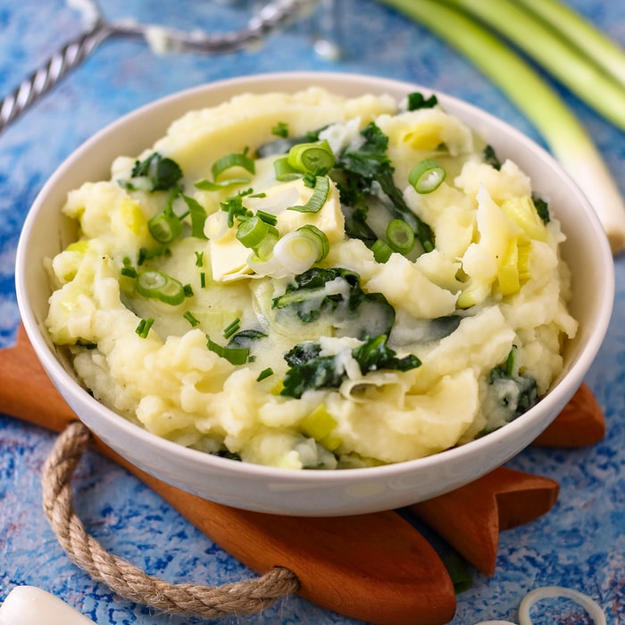

# Colcannon

*Mashed potatoes folded with shredded cabbage or kale that's been wilted in butter, finished with a generous pour of warm milk and a slick of melting butter on top. Irish home cooking at its plainest and best; eats as a main with a fried egg or alongside almost anything.*

**Serves:** 4

**Prep Time:** 10 minutes

**Cook Time:** 25 minutes

## Overview
Colcannon is the Irish potato-and-cabbage mash, traditionally eaten at Halloween with coins or rings hidden inside to predict fortunes, but now a year-round side dish across the island. Floury potatoes boil until tender; shredded cabbage or kale wilts in butter with finely sliced spring onions; the lot mashes together with hot milk and lots of butter. The cabbage softens but keeps a little texture; the mash should be smooth, the green flecks running through. Pile in a wide bowl, score a hollow in the centre for melting butter. Eat beside boiled bacon, a roast or a chunk of soda bread.

## Ingredients

- 1 kg floury potatoes (Maris Piper, King Edward; peeled and cubed)
- 80 g unsalted butter (plus more to melt on top)
- 6 spring onions (sliced; or 1 small leek, white and pale green only)
- 300 g savoy cabbage (or kale, tough stems removed; shredded)
- 200 ml whole milk (warmed)
- salt
- pepper
- A grating of nutmeg

## Method

### Stage 1 - Potatoes
1. Boil the potatoes in salted water 15-18 minutes until completely tender - a knife should slide through with no resistance.
1. Drain and return to the dry pan; cover with a clean tea towel for 5 minutes (draws steam off).

### Stage 2 - Greens
1. While the potatoes cook, melt 30 g of the butter in a wide pan over medium heat.
1. Cook the spring onions or leek 2 minutes.
1. Add the cabbage or kale; cook 5-6 minutes, stirring, until wilted and bright. Add a tablespoon of water if it sticks.
1. Season with salt and pepper.

### Stage 3 - Mash
1. Mash the potatoes with the remaining 50 g of butter and the warm milk; should be smooth and creamy.
1. Fold in the cabbage and spring onions.
1. Grate in nutmeg; taste; adjust salt and pepper.

### Stage 4 - Serve
1. Pile into bowls; press a small well in the centre and drop in a knob of butter to melt.
1. Eat immediately while everything is hot.

## Notes
- **Floury potatoes only:** Waxy ones go gluey when mashed.
- **Warm the milk:** Cold milk turns hot mash into cool mash. Warm in a small pan or microwave first.
- **Kale or cabbage:** Both traditional. Kale gives slightly more bite; savoy cabbage softens more readily.

## Storage
- Best fresh. Leftover colcannon refrigerates 2 days; reheat in a buttered pan over medium heat (panfried colcannon cakes are a worthy second meal).
