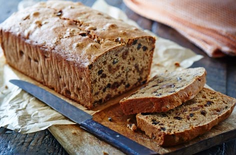

# Barmbrack

*Ireland's tea-soaked fruit loaf: a yeasted (or sometimes tea-based) sweet bread studded with sultanas, raisins and currants steeped overnight in strong tea, baked till the top goes deep mahogany. The Halloween bread that historically hides a ring (and a finder's prophesy of marriage) baked inside.*

**Serves:** 12 slices

**Prep Time:** 25 minutes (plus overnight tea-soaking + 1 hour proving)

**Cook Time:** 1 hour

## Overview
Barmbrack (báirín breac in Irish, "speckled loaf") is Ireland's most iconic sweet bread and a Halloween (Samhain) tradition: a yeasted sweet bread enriched with butter and milk, sweetened with brown sugar, and packed with dried fruit (sultanas, raisins, currants, sometimes mixed peel) that has been steeped overnight in strong black tea, baked till the top goes deep mahogany. Sliced thick and served buttered with strong tea, often at Halloween when the tradition is to bake a ring (or other small object) into the loaf: the finder of the ring is said to marry within the year, the coin foretells wealth, the pea no marriage, the stick a quarrel. The fruit must be soaked overnight in tea; it plumps up and absorbs both sweetness and a faintly bitter tea note, and skipping the soak gives a dry loaf with chewy raw-tasting fruit. Mixed spice (cinnamon, nutmeg, coriander, ginger) is non-negotiable. Both the proper yeasted version (báirín breac) and the easier tea-loaf with baking powder are widely accepted in Ireland today.

## Ingredients

### Fruit soak (the night before)
- 200 g sultanas
- 200 g raisins
- 100 g currants
- 50 g mixed candied peel (orange and lemon; optional but traditional)
- 300 ml strong hot black tea (use 3 tea bags of Irish breakfast or strong English tea)

### Bread
- 500 g plain flour
- 7 g instant dried yeast (1 sachet)
- 100 g caster sugar
- 80 g light brown sugar (in addition to the caster sugar)
- 1 teaspoon fine sea salt
- 2 teaspoons ground [mixed spice](../../../base-ingredients/spices/mixed-spice.md)
- 1 teaspoon ground cinnamon
- ½ teaspoon ground nutmeg
- 60 g unsalted butter (softened)
- 1 large egg
- 200 ml warm milk (less if the fruit absorbed less tea than expected)

### Optional Halloween additions
- A clean coin wrapped in baking parchment (for prosperity)
- A small ring wrapped in baking parchment (for marriage)
- A small dried pea (for spinsterhood/bachelorhood)
- A small stick (for marital quarrels; yes, really)

### To finish
- 1 large egg (beaten with 1 tablespoon milk for the egg wash)
- 1 tablespoon caster sugar (for sprinkling)

## Method

### Stage 1 - Soak the fruit (the night before)
1. Combine the sultanas, raisins, currants and mixed peel (if using) in a wide bowl.
2. Make 300 ml of strong hot tea using 3 tea bags steeped 5 minutes; remove the bags.
3. Pour the hot tea over the fruit.
4. Cover and let stand overnight (8-12 hours) at room temperature.
5. By morning, the fruit will be plump and most of the tea will have been absorbed.

### Stage 2 - Drain the fruit
1. Drain the fruit through a sieve; reserve any remaining liquid (you'll add it back to the dough).

### Stage 3 - Make the dough
1. In a wide bowl, whisk together the flour, yeast, sugars, salt, mixed spice, cinnamon and nutmeg.
2. Rub in the softened butter till the mixture resembles coarse crumbs.
3. Whisk together the egg and warm milk; add the reserved tea liquid (about 50-100 ml depending on how much was absorbed).
4. Pour into the flour; stir to combine.
5. Knead for 8-10 minutes till smooth and elastic.

### Stage 4 - Add the fruit
1. Tip the soaked fruit onto the dough.
2. Knead briefly to distribute the fruit evenly through the dough.
3. If using Halloween additions (ring, coin, etc.), wrap each in a small piece of baking parchment and tuck them into the dough at this stage.

### Stage 5 - First rise
1. Place the dough in an oiled bowl; cover with a damp cloth.
2. Let rise 1.5 hours at room temperature till doubled.

### Stage 6 - Shape and prove
1. Grease a 23 cm round cake tin (or a 900 g loaf tin) with butter.
2. Knock back the dough; shape into a round (or into the shape of your tin).
3. Place in the prepared tin.
4. Cover loosely with a damp cloth; let prove 45 minutes-1 hour till risen slightly above the tin rim.

### Stage 7 - Bake
1. Preheat the oven to 180°C (350°F).
2. Brush the top of the barmbrack with the egg wash.
3. Sprinkle with the tablespoon of caster sugar.
4. Bake for 50-60 minutes till deep mahogany on top and a skewer inserted into the centre comes out clean.
5. If the top is browning too fast, cover loosely with foil at the 30-minute mark.

### Stage 8 - Cool
1. Let cool in the tin for 15 minutes.
2. Turn out onto a wire rack; cool completely before slicing (the bread is properly served the next day, after the flavours have settled).

### Stage 9 - Slice and serve
1. Slice thickly (about 1.5 cm slices).
2. Spread with butter; serve with strong black tea.

## Notes
- **Soak overnight properly:** the fruit must be fully plumped before the dough goes together. 8 hours minimum; overnight is ideal. The fruit should be fat and tea-stained.
- **Strong tea, not weak:** use 3 tea bags or 1 heaped tablespoon of loose-leaf strong tea (Irish breakfast or English breakfast); steep 5 minutes. Weak tea doesn't give enough flavour.
- **Mixed spice is the proper Irish spice mix:** ground mixed spice (a UK/Ireland blend) gives the warm Christmas-spice profile. Use the proper mix if you can find it; substitute with equal parts cinnamon, nutmeg, coriander and ginger if you can't.
- **Yeasted vs baking-powder versions:** the traditional barmbrack is yeasted; the easier modern tea-loaf version uses baking powder (and is properly called a tea brack rather than barmbrack). Both are widely accepted.
- **Best the next day:** like many fruit-spice cakes, barmbrack tastes better after it has settled overnight. The flavours deepen and the texture improves.

## Variations
- **Tea brack (no-yeast version):** swap the yeast for 4 teaspoons of baking powder; mix as a quick bread (no proving needed). Bake the same way. Easier and quicker; the flavour is similar but slightly different texture.
- **Whiskey barmbrack:** add 50 ml of Irish whiskey to the fruit soak alongside the tea; gives a more festive Christmas-tea version.
- **Citrus barmbrack:** add the zest of 1 orange and 1 lemon to the dough; brightens the flavour. Common modern Irish variation.
- **Without candied peel:** for those who don't like mixed peel, simply skip it; the dough still works.

## Serving
- Thickly sliced and buttered with strong tea. At Halloween (October 31st) with the ring tradition. At afternoon tea any time of year. With Irish breakfast or after a Sunday meal. A small glass of Irish whiskey alongside is the autumn tradition.

## Storage
- Keeps in a sealed container at room temperature 1 week; the flavour improves over the first 2-3 days.
- Refrigerate after 5 days to extend the life; keeps refrigerated 2 weeks. Bring to room temperature before serving.
- Freezes 3 months wrapped tightly; defrost at room temperature for 3-4 hours.
- Day-old barmbrack is excellent toasted with butter; reheat slices briefly under a grill (broiler).
