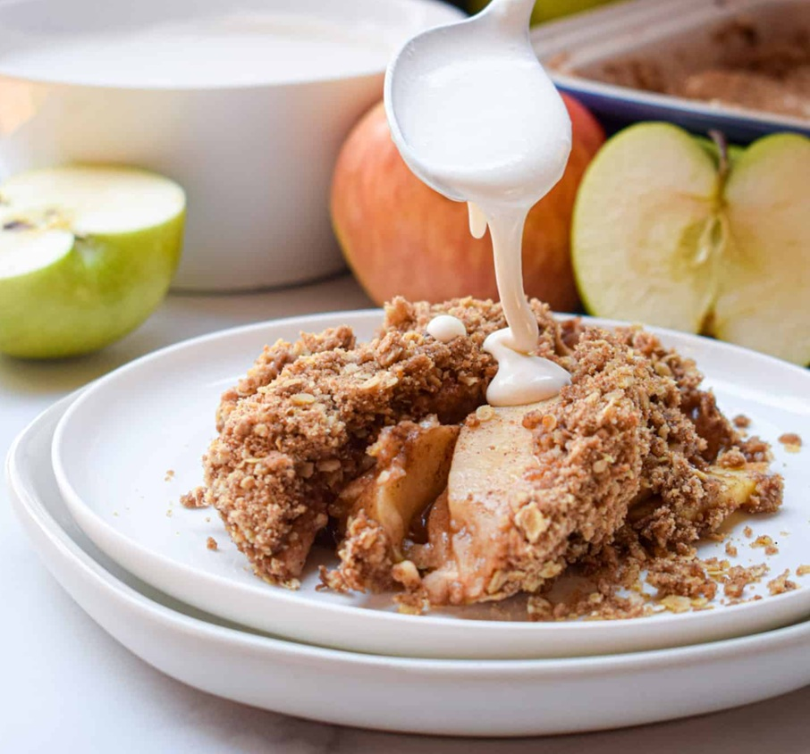

# Irish Apple Crumble

*Ireland's everyday family pudding: Bramley cooking apples sliced and cooked down with brown sugar, lemon and a touch of cinnamon, topped with a rough sweet oat-and-butter crumble and baked till the apples bubble and the topping turns deep golden. The dessert of every Irish Sunday, served warm with hot custard or thick cream.*

**Serves:** 6

**Prep Time:** 20 minutes

**Cook Time:** 50 minutes

## Overview
Apple crumble is Ireland's most beloved family pudding and a Sunday-dinner staple across the country: tart Bramley cooking apples sliced thick and cooked down with brown sugar, a squeeze of lemon, a splash of water and a touch of cinnamon till they soften but keep some shape, topped with a rough sweet crumble of flour, butter, sugar and rolled oats, baked till the apples bubble through and the topping turns deep golden. Served warm with hot custard or thick cream. The Irish version distinguishes itself from the English crumble with the Bramley apples (which break down to a soft purée while keeping enough texture for character) and the oat-heavy crumble (the rolled oats give a more rustic, nuttier topping than the pure flour-sugar-butter version). Bramleys outside Ireland substitute with Granny Smith or a 70:30 mix of cooking and eating apples; don't use only eating apples, they don't break down. The contrast of hot bubbling crumble and hot creamy custard is the proper Irish experience.

## Ingredients

### Apple filling
- 1 kg Bramley apples (or Granny Smith, or Northern Spy; or a mix of cooking and eating apples)
- 80 g light brown sugar (adjust by taste; Bramleys are very tart)
- 1 tablespoon plain flour (to thicken the juices)
- 1 teaspoon ground cinnamon
- ¼ teaspoon ground nutmeg
- Zest of 1 lemon
- Juice of 1 lemon
- 3 tablespoons water
- A pinch of fine sea salt
- 30 g sultanas or raisins (optional, for sweetness)

### Crumble topping
- 200 g plain flour
- 150 g rolled oats (not steel-cut, not quick-cook)
- 150 g unsalted butter (cold, cubed)
- 100 g light brown sugar
- 50 g caster sugar (for a slightly crunchier finish)
- 1 teaspoon ground cinnamon
- ¼ teaspoon ground nutmeg
- ½ teaspoon fine sea salt
- 50 g chopped almonds or hazelnuts (optional, for crunch)

### To serve
- Hot custard (homemade or shop-bought; Bird's custard powder is the proper Irish brand)
- Or thick cream
- Or vanilla ice cream

## Method

### Stage 1 - Prepare the apples
1. Preheat the oven to 180°C (350°F).
2. Peel, core and slice the apples into 5 mm thick slices (or into 1 cm chunks if you prefer).
3. Place in a wide bowl; toss with the lemon juice and zest immediately (prevents browning).
4. Sprinkle in the brown sugar, plain flour, cinnamon, nutmeg, salt and sultanas (if using).
5. Toss to coat evenly.

### Stage 2 - Lightly precook the apples (optional but recommended)
1. Tip the apples into a wide saucepan with the 3 tablespoons of water.
2. Cook over medium heat for 5-7 minutes, stirring occasionally, till the apples soften slightly at the edges and the sugar dissolves into a slight syrup.
3. Don't fully cook; the apples finish cooking in the oven.
4. This step gives a more consistent final texture; skip if you prefer chunkier apple texture, but the precook is the proper Irish way.

### Stage 3 - Transfer to baking dish
1. Choose a wide oven-proof baking dish (about 25 cm × 30 cm; or any 2-litre capacity dish).
2. Tip the apple mixture into the dish; spread evenly.

### Stage 4 - Make the crumble topping
1. In a wide bowl, whisk together the flour, oats, sugars, cinnamon, nutmeg and salt.
2. Add the cold cubed butter.
3. Rub in with your fingertips till the mixture looks like coarse crumbs with some pea-sized lumps of butter still visible. Don't go to a smooth paste; the visible butter lumps give the proper crumble texture.
4. Add the chopped nuts (if using); toss through.

### Stage 5 - Top and bake
1. Spoon the crumble topping over the apples in an even layer; cover the apples completely.
2. Don't press down; leave the crumble loose and craggy on top.

### Stage 6 - Bake
1. Bake at 180°C (350°F) for 35-40 minutes till the topping is deep golden and the apple juices are bubbling around the edges.
2. If the top is browning too fast, cover loosely with foil for the final 10 minutes.

### Stage 7 - Rest briefly
1. Let cool for 10 minutes; the apple juices firm up slightly and the crumble settles.

### Stage 8 - Serve
1. Spoon generously into warm bowls.
2. Ladle hot custard over (or a generous dollop of thick cream, or a scoop of vanilla ice cream).
3. Eat warm; the contrast of hot bubbling crumble and cold or hot custard is the proper experience.

## Notes
- **Bramley or other proper cooking apple:** the Irish Bramley breaks down to a soft purée while keeping some structure. Granny Smith works as a substitute; eating apples (Gala, Fuji, Pink Lady) don't break down enough and stay too firm.
- **Don't oversweeten:** the apples are properly tart and the topping is properly sweet; the contrast is the dish. Resist the urge to add more sugar to the apples.
- **Oats in the crumble:** the rolled oats give the proper Irish texture and a slightly nutty flavour. Pure flour-butter-sugar crumble works but is less Irish.
- **Hot custard is the proper accompaniment:** Bird's custard (the brand) made with milk and a small amount of sugar is the traditional Irish topping. Real custard (sauce anglaise) made with egg yolks is excellent but more luxurious than weekly.
- **Make ahead:** the apple filling can be made and chilled ahead; the crumble can be mixed and chilled. Assemble and bake just before serving.

## Variations
- **Apple and blackberry crumble:** add 200 g of fresh or frozen blackberries to the apple mixture; gives the proper autumn Irish version (when blackberries are wild and free across Irish hedgerows).
- **Apple and rhubarb crumble:** swap 400 g of the apple for 400 g of chopped rhubarb; gives a sharp tangy version. Common in early summer.
- **Pear crumble:** swap the apples for ripe pears (Conference or Williams); cook 5 minutes longer to soften.
- **Spiced apple crumble:** double the cinnamon, add ½ teaspoon of ground cloves and ¼ teaspoon of ground star anise; gives a properly spiced autumn version.

## Serving
- In warm bowls with hot custard ladled over. A glass of Irish whiskey or Baileys alongside for the adults. After Sunday lunch, after a roast dinner, after fish-and-chips for tea, or any time the family is gathered.

## Storage
- Keeps refrigerated 4 days; the topping softens but the flavour is still good.
- Reheat in a covered oven dish at 160°C / 320°F for 20-25 minutes till hot through; or microwave individual portions.
- Freezes 3 months whole or in portions; defrost in the fridge and reheat in the oven.
- The crumble topping alone keeps in the freezer for 3 months in a sealed bag; sprinkle straight from the freezer over fresh apple filling and bake from frozen (add 10 minutes to the bake time).
- Day-old crumble is excellent with porridge for breakfast; spoon over the porridge and add a splash of milk.
