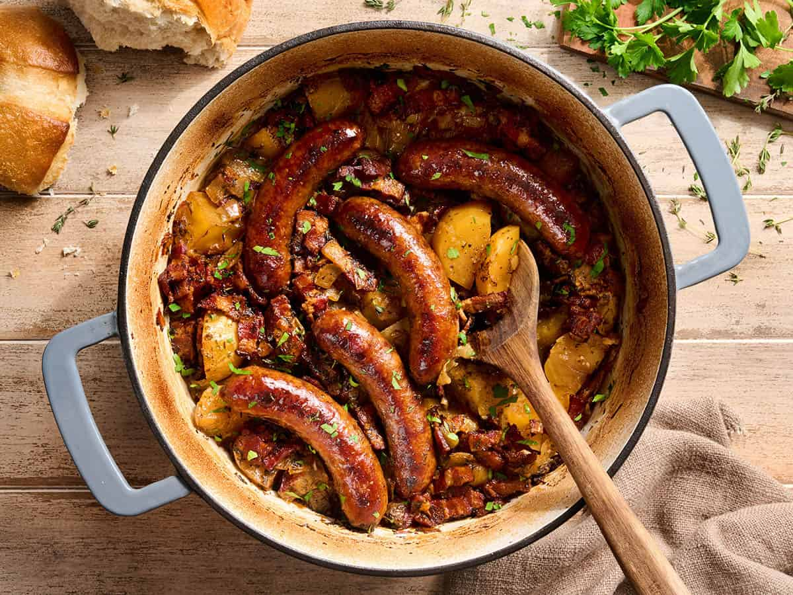

# Dublin Coddle

*Dublin's Saturday-night stew: thick slices of pork sausages and rashers of bacon slow-cooked with potato chunks, onion and parsley in a savoury broth. The pale, slightly anaemic-looking, deeply satisfying one-pot dish that every Dubliner's grandmother made on a Saturday night to clear the fridge before Sunday's roast.*

**Serves:** 6

**Prep Time:** 20 minutes

**Cook Time:** 2 hours (mostly hands-off)

## Overview
Dublin coddle is the iconic Dublin one-pot stew, particular to the Irish capital and rarely seen in other parts of Ireland: thick slices of good-quality pork sausages and rashers of bacon (or back bacon, or streaky bacon, depending on the kitchen) slow-cooked with chunks of potato, sliced onion, fresh parsley and a generous splash of stout or just water-and-stock in a low oven (or on the stovetop) for 90 minutes till the potatoes are tender, the meat has flavoured the broth, and the whole pot has reduced into a pale, slightly anaemic-looking, deeply savoury Dublin classic. The dish is associated with Saturday nights in working-class Dublin: a one-pot meal that could be left simmering while the family went to the pub, came home and ate. Famously eaten by the writers and poets of Dublin's literary tradition (Sean O'Casey mentions it; James Joyce referenced it); supposedly Jonathan Swift was fond of it. The dish has a slightly off-putting reputation among modern eaters because the look is pale and unbrowned; the proper traditional coddle is not seared or browned. The flavour, however, is unexpectedly excellent: clean savoury pork-and-potato broth, slowly developed. Three details define proper Dublin coddle. First, good-quality Irish pork sausages and back bacon are essential. The flavour of the broth comes entirely from these; low-end supermarket sausages give bland coddle. Second, don't brown the meat. Traditional coddle is properly pale; the slow simmer extracts flavour from raw meat into the broth. Modern variations sometimes brown the sausages first (lighter colour, more conventional appeal); both are valid. Third, plenty of parsley. A whole bunch of fresh parsley, half stirred in, half scattered over at the end. The parsley is what cuts through the richness.

## Ingredients

- 12 good-quality Irish pork sausages (or thick beef sausages if you must)
- 400 g rashers of Irish back bacon (or thick-cut streaky bacon; cut into 4 cm pieces)
- 1 kg potatoes (Maris Piper, Russet, or King Edward; peeled and cut into thick rounds or chunks, about 4 cm)
- 3 large onions (peeled, sliced into 1 cm rings)
- 1 large bunch fresh flat-leaf parsley (about 60 g; half chopped, half kept whole for finishing)
- 750 ml chicken stock (or vegetable stock; or half water + half stout for the proper Dublin version)
- 250 ml Guinness or stout (optional but very Dublin)
- 1 tablespoon vegetable oil (only if browning the sausages; skip for the traditional pale version)
- 1 teaspoon fine sea salt (taste before adding; bacon is salty)
- 1 teaspoon ground black pepper
- 2 bay leaves
- 1 tablespoon Worcestershire sauce (optional, not traditional but adds depth)

## Method

### Stage 1 - Prepare the meats (the traditional pale way)
1. If making the traditional Dublin coddle: cut each sausage into 3 thick rounds (don't brown).
2. Cut the bacon rashers into 4 cm pieces.
3. Skip to Stage 3.

### Stage 2 - Brown the sausages (the modern way; optional)
1. Heat the oil in a heavy casserole over medium-high heat.
2. Brown the whole sausages on all sides; 3-4 minutes total.
3. Lift out; cut each into 3 thick rounds.
4. In the same pan, brown the bacon pieces briefly (2-3 minutes till the edges colour).
5. Lift out.

### Stage 3 - Layer in the pot
1. Use a wide heavy casserole or Dutch oven (about 4-litre capacity).
2. Layer the bottom of the pot with half the sliced onions.
3. Add half the bacon pieces, scatter through.
4. Layer half the potato chunks on top.
5. Scatter half of the chopped parsley.
6. Add half the sausage rounds.
7. Repeat: remaining onion, bacon, potato, parsley, sausages.
8. Tuck in the bay leaves.

### Stage 4 - Add the liquid
1. Pour the chicken stock and Guinness (if using) over the layered ingredients; the liquid should come up to about 2/3 of the way (you want the potatoes mostly submerged but not floating).
2. Add the salt (carefully; the bacon is salty), pepper and Worcestershire (if using).
3. The mixture will look pale and somewhat unappetising at this stage; don't worry.

### Stage 5 - Slow-cook
1. Either: bring to a low simmer on the stovetop, then transfer to a 160°C (320°F) oven covered with the lid, and cook 90 minutes.
2. Or: simmer on the stovetop over low heat, covered with the lid slightly ajar, for 90 minutes.
3. The potatoes should be tender (a knife slides through easily); the broth should be reduced by about a third and have absorbed the meat and onion flavours.

### Stage 6 - Finish and serve
1. Take off the heat (or out of the oven).
2. Lift out and discard the bay leaves.
3. Taste; adjust salt and pepper.
4. Scatter the remaining chopped parsley over the top.
5. Ladle generously into warm bowls; the broth should pool around the potatoes and meat.
6. Eat with thick slices of brown bread or Irish soda bread.

## Notes
- **Good-quality Irish sausages are essential:** the broth's flavour comes from the meat. Use proper butcher sausages or good supermarket Irish (or pork) sausages. Low-end pale supermarket sausages give bland coddle.
- **Pale vs browned:** the traditional Dublin coddle is properly pale (no browning step); the modern restaurant version often browns the sausages first for visual appeal. Both are valid. Try traditional once for the authentic experience; many modern Irish cooks prefer the browned version.
- **Floury potatoes:** as with all Irish potato dishes, floury (starchy) potatoes give the proper texture. Maris Piper, Russet, King Edward.
- **Don't lift the lid much during cooking:** the slow simmer needs covered conditions. Check at 60 minutes and add a splash of stock if it looks dry.
- **Lots of parsley:** the parsley is what cuts through the richness. Use a whole large bunch; half stirred in, half over the top at the end.

## Variations
**Vegetable coddle:** swap the sausages and bacon for 400 g of pearl barley and 200 g of dried split peas + 2 tablespoons of vegetable seasoning (Marigold) for umami; use vegetable stock. The dish loses its Dublin character but is excellent in its own right.
**Lamb coddle:** swap the pork sausages for lamb sausages and use lamb stock; the flavour is different but works.
**Chicken coddle:** swap the sausages for chicken thighs (skin-on); cook the same way. Less Dublin but a lovely one-pot meal.
**With cabbage:** add a quartered savoy cabbage to the pot for the last 30 minutes of cooking; gives a proper one-pot meal with a green vegetable.

## Serving
In wide warm bowls with thick slices of brown soda bread or buttered Irish soda bread on the side. A bottle of Guinness (or a glass of stout) alongside is the canonical Dublin pairing. A simple salad of crisp lettuce with a vinaigrette can lighten the meal.

## Storage
- Keeps refrigerated 4 days; the flavour deepens noticeably overnight.
- Reheat in a covered saucepan or oven dish at 160°C / 320°F till hot through (25-30 minutes for a whole pot).
- Freezes 3 months in portioned containers; defrost in the fridge and reheat gently.
- The day-old coddle has firmer potato texture and a richer broth; many Dubliners prefer it the second day.
- Don't aggressively reheat; the bacon can toughen.
