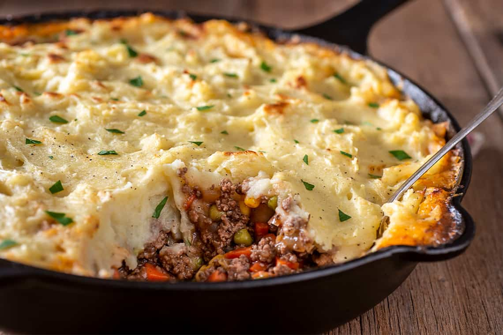

# Irish Shepherd's Pie

*Ireland's mince-and-mash bake: a deeply flavoured filling of minced lamb (the traditional) or beef braised with onion, carrot, garlic, Guinness or stout, Worcestershire and thyme, topped with a thick layer of buttery mashed potato and baked till the top goes craggy-golden. The pub classic and family-Sunday-dinner standard.*

**Serves:** 6

**Prep Time:** 30 minutes

**Cook Time:** 1 hour 20 minutes

## Overview
Shepherd's pie is one of Ireland's (and Britain's) most beloved comfort foods and a Sunday-dinner staple across both countries: a deeply flavoured filling of minced lamb browned with onion, garlic, carrots and frozen peas, simmered in Guinness or stout, beef stock, Worcestershire, tomato paste and thyme, lightly thickened, then topped with a thick layer of buttery mashed potato and baked till the top goes craggy and deep-golden. Lamb is the traditional meat: "shepherd's pie" refers to a lamb-topped potato bake; "cottage pie" is the beef version. Often confused but properly distinct. The filling must be properly simmered down; wet runny filling gives a soggy pie. The Guinness adds depth; without it, substitute with more beef stock plus a teaspoon of molasses. The potato wants floury varieties (Maris Piper, Russet, King Edward) mashed with plenty of butter and warm milk, spread thickly and scored with a fork for the craggy top.

## Ingredients

### Filling
- 800 g minced lamb (or minced beef for cottage pie)
- 2 tablespoons vegetable oil
- 2 large onions (finely chopped)
- 3 large carrots (peeled, finely diced)
- 6 garlic cloves (crushed)
- 2 tablespoons plain flour
- 200 ml Guinness (or any stout, or dark beer)
- 600 ml hot beef stock
- 3 tablespoons tomato paste
- 3 tablespoons Worcestershire sauce
- 1 tablespoon dark soy sauce (for depth)
- 1 tablespoon fresh thyme leaves (or 1 teaspoon dried)
- 2 bay leaves
- 150 g frozen peas (added at the end)
- 1 ½ teaspoons fine sea salt
- 1 teaspoon ground black pepper

### Mashed potato topping
- 1.5 kg floury potatoes (Maris Piper, Russet, or King Edward; peeled and cubed)
- 100 g unsalted butter (plus 30 g for the top of the pie)
- 200 ml whole milk (warmed)
- 1 large egg yolk (optional; for richness and colour)
- 1 ½ teaspoons fine sea salt
- ½ teaspoon ground white pepper
- 50 g grated Irish cheddar cheese (optional; for a slightly cheesier top)

## Method

### Stage 1 - Brown the meat
1. Heat the oil in a large heavy ovenproof pan (or saucepan; you'll transfer later) over medium-high heat.
2. Add the minced lamb (or beef) in a single layer; don't stir for 2-3 minutes so the bottom browns deeply.
3. Break up with a wooden spoon; continue cooking 5-6 minutes till all the meat is browned and any released liquid has evaporated.
4. Transfer the browned meat to a bowl with a slotted spoon; keep the fat in the pan.

### Stage 2 - Soften the vegetables
1. Reduce heat to medium.
2. Add the chopped onions to the pan; cook 6-7 minutes till soft and starting to colour.
3. Add the diced carrots; cook 5 minutes till starting to soften.
4. Add the crushed garlic; cook 30 seconds.

### Stage 3 - Build the sauce
1. Sprinkle the flour over the vegetables; stir to coat.
2. Cook 1 minute (this cooks the raw flour taste out and gives a slight roux).
3. Pour in the Guinness; let bubble 2 minutes to reduce slightly and cook off the alcohol.
4. Add the tomato paste, Worcestershire sauce, dark soy and thyme; stir well.
5. Add the bay leaves.
6. Return the browned meat to the pan.
7. Pour in the hot beef stock; stir to combine.

### Stage 4 - Simmer the filling
1. Bring to a low simmer.
2. Cover with the lid slightly ajar.
3. Simmer 40 minutes till the meat is tender, the carrots are soft and the sauce has thickened to a gravy-like consistency.
4. Stir in the frozen peas; cook 3 minutes more.
5. Season with the salt and pepper; taste and adjust.
6. Take off the heat; lift out the bay leaves.

### Stage 5 - Cook the potatoes
1. Place the cubed potato in a large saucepan; cover with cold water; add 1 teaspoon salt.
2. Bring to a boil; reduce to a simmer; cook 15-18 minutes till the potatoes are properly tender (a knife slides through easily).
3. Drain thoroughly; tip back into the warm pan.
4. Let dry over very low heat for 1-2 minutes (removes excess moisture).

### Stage 6 - Mash and enrich
1. Mash the potatoes with a potato masher till smooth (or push through a ricer for the smoothest finish).
2. Add the 100 g of butter and the warm milk; whisk into the mash with a wooden spoon till silky.
3. Add the egg yolk (if using), salt and white pepper; whisk in.
4. Taste; adjust salt.

### Stage 7 - Assemble and bake
1. Preheat the oven to 200°C (400°F).
2. Transfer the meat filling to a deep oven-proof baking dish (about 25 cm × 35 cm; or any 3-litre capacity dish).
3. Spread the mashed potato over the top in an even layer.
4. Use a fork to score the surface in patterns (this gives the craggy golden top after baking).
5. Dot the surface with the 30 g of butter; scatter the grated cheese if using.

### Stage 8 - Bake
1. Bake for 25-30 minutes till the top is deeply golden and the filling is bubbling around the edges.
2. If the top isn't browned enough, flash under a hot grill (broiler) for 2-3 minutes.

### Stage 9 - Rest and serve
1. Let rest for 10 minutes (the filling firms up and is easier to portion).
2. Spoon onto warm plates.
3. Serve with peas, a green salad, or buttered cabbage.

## Notes
- **Lamb is traditional for shepherd's; beef for cottage:** "shepherd's pie" properly refers to lamb (since shepherds tend sheep); "cottage pie" refers to beef. Both are excellent; just use the right name.
- **Guinness or stout is the proper depth:** the dark beer adds caramel-bitter notes and a deep colour. A non-alcoholic substitute would be more beef stock + 1 teaspoon dark molasses + 1 tablespoon balsamic vinegar.
- **Simmer the filling till properly thick:** wet runny filling gives a soggy pie; the filling should be thick enough that a spoon dragged through it leaves a trail. 40 minutes of simmering should achieve this.
- **Floury potato for the mash:** floury (starchy) potatoes give the proper light mash. Waxy potatoes give a gluey mash. Maris Piper, Russet, King Edward are the right varieties.
- **Score the top for craggy texture:** the fork-scored top gives the iconic shepherd's pie look and creates more surface area for golden browning.

## Variations
**Cottage pie (beef version):** swap the lamb for beef; same recipe otherwise. Slightly different flavour but equally classic.
**Vegetarian shepherd's pie:** swap the meat for 600 g of cooked lentils (or a mix of lentils and mushrooms); add 2 tablespoons of yeast extract (Marmite or Vegemite) for umami depth. Use vegetable stock.
**Sweet-potato-topped shepherd's pie:** use sweet potato (or a 50/50 mix of sweet and regular potato) for the topping; gives a different colour and sweeter flavour. Common modern variation.
**Mash-and-cheese top:** double the cheese on top for a properly cheesy crust; great for kids and for cheese-lovers.

## Serving
On warm plates with a side of peas, buttered cabbage, or a green salad. A glass of Guinness alongside; or a strong cup of tea. Often part of a Sunday family lunch in Ireland.

## Storage
- Keeps refrigerated 4 days; the flavour deepens overnight.
- Reheat in a covered oven dish at 180°C / 350°F for 25-30 minutes till hot through; or microwave individual portions.
- Freezes 3 months whole or in portions; defrost in the fridge and reheat in the oven.
- The filling alone keeps refrigerated 5 days; freeze for 3 months. Top with mash and bake fresh.
- Day-old leftovers reheat better than fresh; the filling absorbs the mash and the flavours meld.
