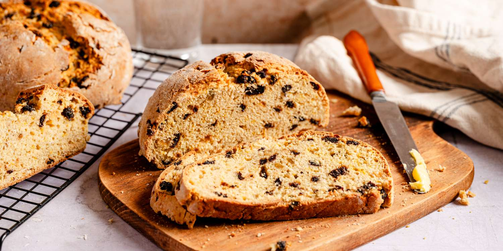

# Irish Soda Bread

*The bread of the Irish cottage. Plain flour, bicarbonate of soda, salt and buttermilk - four ingredients, no yeast, no proving. Mixed in five minutes, in the oven in another five, on the table in under an hour. Dense, crumbly, faintly tangy. Made to be eaten the day it is baked.*

**Serves:** 8 (one round loaf)

**Prep Time:** 10 minutes

**Cook Time:** 40 minutes

## Overview
Wholemeal and white flour mixed dry with bicarbonate of soda and salt. Cold buttermilk poured in, stirred briefly with a wooden spoon and then gathered by hand into a rough ball. Patted onto a tray, scored with a deep cross to let it open in the oven, baked hot until the bottom thumps hollow. The cross is partly practical (helping the bread rise evenly), partly a blessing - "letting the fairies out", as the saying goes.

## Ingredients

- 250 g plain flour (plus extra for dusting)
- 250 g wholemeal flour
- 1 ½ teaspoons bicarbonate of soda
- 1 ½ teaspoons fine sea salt
- 400-450 ml buttermilk (cold, see notes for substitute)
- 1 tablespoon honey (optional, for a slightly sweeter loaf)

## Method

### Stage 1 - Heat the oven
1. Heat the oven to 200°C fan / 220°C / 425°F. Dust a baking tray lightly with flour.

### Stage 2 - Mix dry, then wet
1. In a large bowl, combine the plain flour, wholemeal flour, bicarbonate of soda and salt. Whisk briefly to distribute the bicarb evenly - pockets of unmixed bicarb taste soapy in the finished bread.
2. Make a well in the centre. Pour in 400 ml of the buttermilk (and the honey if using). Mix with a wooden spoon, working from the centre outwards in slow circles, until the mixture comes together into a soft, slightly sticky dough. If it looks dry and crumbly at the edges, add the rest of the buttermilk a tablespoon at a time.

### Stage 3 - Shape
1. Turn the dough out onto a lightly floured worktop. Do not knead - soda bread is a quick bread; kneading develops gluten that makes it tough.
2. With floured hands, gently pat into a round about 5 cm thick. Lift onto the prepared tray.
3. With a sharp knife, cut a deep cross across the top, going down about three-quarters into the dough. This helps the loaf rise evenly and gives it the characteristic four-quarter shape.

### Stage 4 - Bake
1. Bake for 30-35 minutes, until the loaf is well-risen, the top is golden, and the bottom thumps hollow when tapped with the knuckles. If it sounds dull, give it another 5 minutes.
2. Transfer to a wire rack to cool for at least 15 minutes before slicing. Soda bread is hard to slice neatly straight from the oven; let the crumb settle.

## Notes
- No buttermilk? Whisk 400 ml of whole milk with 2 tablespoons of lemon juice and leave for 10 minutes; it will thicken and curdle slightly. Plain unflavoured yogurt loosened with milk to a pourable consistency also works.
- For a fruity tea-bread variant ("spotted dog"), stir 100 g of currants or raisins into the dry mix before adding the buttermilk. Increase the honey to 2 tablespoons.
- Best the day it is baked. Day-old soda bread is at its best toasted - the slight tang plays beautifully against melted butter and marmalade.

## Serving
Hot from the oven, in thick wedges with cold salty butter. Alongside a steaming bowl of beef and Guinness stew, for the mopping. Toasted the next morning under salty butter and orange marmalade.

## Storage
Wrapped in a clean tea towel at room temperature for 24 hours; in a sealed bag for 2 days. Freezes well sliced; toast straight from frozen.
